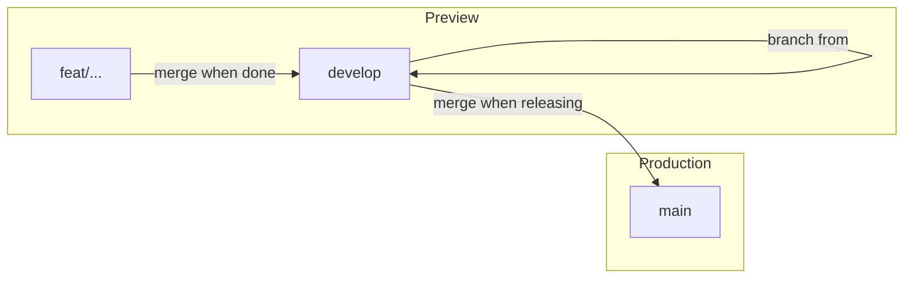

# Agent-Friendly Git Workflow: Main / Develop / Feature Branches

## 1. Branch Strategy and Vercel Mapping

**Branch roles**

| Branch                                 | Role                                                 | Vercel                                    |
| -------------------------------------- | ---------------------------------------------------- | ----------------------------------------- |
| `main`                                 | Production only. No direct development.              | **Production** (deploy on push)           |
| `develop`                              | Integration. All feature work merges here first.     | **Preview** (stable staging URL optional) |
| `feat/*`, `fix/*`, `chore/*`, `docs/*` | Short-lived feature branches. Always from `develop`. | **Preview** (per-branch URLs)             |

**Flow**

- **Start feature**: Create `feat/foo` (or `fix/foo`, etc.) from `develop`, not `main`.
- **Integrate**: Merge feature branch into `develop` (direct merge or PR; see below).
- **Release**: Merge `develop` → `main` when ready for production. Semantic Release keeps running only on `main` ([release.yml](.github/workflows/release.yml)).

**Vercel configuration**

- **Production branch**: `main` only (Project Settings → Environments → Production → Branch Tracking). No change if already `main`.
- **Preview deployments** – two options:

| Option              | Behavior                                                                         | Use when                                                                                                |
| ------------------- | -------------------------------------------------------------------------------- | ------------------------------------------------------------------------------------------------------- |
| **A (recommended)** | **All non‑main branches** → Preview. `develop` and every `feat/*` get a Preview. | You want a Preview per feature branch and a stable staging (`develop`) via an optional assigned domain. |
| **B**               | Only `develop` → Preview. Feature branches do not deploy.                        | You want a single staging environment and no per‑branch Preview URLs.                                   |

For **Option B**, use [Ignored Build Step](https://vercel.com/guides/how-do-i-use-the-ignored-build-step-field-on-vercel): run a script that exits `1` only for `main` and `develop`, and `0` for all other branches. The script can use `VERCEL_GIT_COMMIT_REF` to decide.

**Recommendation:** Use **Option A** (default). You get Preview URLs for every feature branch and for `develop`. Optionally assign a domain (e.g. `staging.yourdomain.com`) to `develop` in Vercel for a fixed staging URL.

---

## 2. Minimizing Human Work: Agent-Driven Flow

Goal: **human does no manual git** when an agent starts or finishes a feature.

| Step              | Human                                              | Agent                                                                                                          |
| ----------------- | -------------------------------------------------- | -------------------------------------------------------------------------------------------------------------- |
| **Start feature** | Says e.g. “Start feature X” or “Work on Issue #42” | Checks out `develop`, pulls, creates `feat/x` (or from issue), switches to it.                                 |
| **Commit**        | Says “Commit” or “Commit as fix: …”                | Stages, writes Conventional Commit message, commits.                                                           |
| **Integrate**     | Says “Integrate” / “Merge to develop”              | Pushes branch, merges into `develop` (locally or via PR), pushes `develop`, optionally deletes feature branch. |
| **Release**       | Says “Release” / “Ship to prod”                    | Merges `develop` → `main`, pushes `main`. Semantic Release runs on `main`.                                     |

**Agent safety**

- The agent must **never** run `git push` or `git merge` unless the user has explicitly said “Integrate”, “Merge to develop”, “Release”, or “Ship to prod”. Avoid implicit or automatic push/merge.

**Fix / chore / docs: branch vs commit on current branch**

| Situation                                                                         | Agent action                                                                                                                          |
| --------------------------------------------------------------------------------- | ------------------------------------------------------------------------------------------------------------------------------------- |
| **New, standalone task** (e.g. “fix login error”, “update deps”, “update readme”) | Create a **new branch** from `develop` (`fix/...`, `chore/...`, `docs/...`). Same workflow as features: work, integrate to `develop`. |
| **Part of current work** (e.g. small fix or chore while on `feat/forms`)          | **Commit on the current branch.** Use `fix:`, `chore:`, or `docs:` in the message as appropriate.                                     |

Encode this in the git rule and skill: “Is this a new task or part of current work?” → new task → new branch; same work → commit on current branch.

**Pull Requests (solo dev)**

- **Optional.** You can:
  - **Direct merge**: Agent merges feature → `develop` locally, then pushes. Fastest, no PR.
  - PR to `develop`: Agent pushes branch, opens PR, you (or agent) merge. Useful for audit trail or “review before staging.”

Recommendation: default to **direct merge** for speed; use PRs only when you want a paper trail.

**Short‑lived feature branches**

- One logical unit of work per branch.
- Merge to `develop` quickly; avoid long‑running branches.
- Document this in rules/workflows so the agent keeps branches small and merges often.

**Release frequency**

- Release when a logical batch is validated on staging (`develop` Preview). Avoid letting `develop` accumulate many weeks of work.

---

## 3. Cursor Rules

**Add a Git branching rule** in `[.cursor/rules/](.cursor/rules/)` (create the directory) so the agent always follows the main/develop/feature model.

- **File**: e.g. `.cursor/rules/git-branching.mdc`
- **Frontmatter**: `alwaysApply: true` (or `globs: **/*` if you prefer) so it applies whenever the agent touches git.
- **Content** (concise, &lt; 50 lines):
  - `main` = production only; never commit directly to `main`.
  - `develop` = integration; all feature work merges here.
  - Feature branches always from `develop`, format `type/short-description` (`feat/`, `fix/`, `chore/`, `docs/`).
  - Conventional Commits (`feat:`, `fix:`, etc.).
  - Short‑lived branches; integrate to `develop` when the logical unit is done.
  - **Fix/chore/docs**: new standalone task → new branch; part of current work → commit on current branch.
  - Reference [docs/git-workflow.md](docs/git-workflow.md) for details.

**Update [.agent/rules.md**](.agent/rules.md) §4 “Git & Version Control”: state that the base branch for features is `develop`, not `main`, and that PRs into `main` are only for releases (from `develop`). Keep Conventional Commits and branch naming.

---

## 4. Skills

**Add a project skill** under `.cursor/skills/` (e.g. `git-workflow/`) to teach the agent the exact workflows.

- **Purpose**: Start feature, commit, integrate to `develop`, release to `main`.
- **Trigger**: User says “start feature”, “commit”, “integrate”, “merge to develop”, “release”, “ship to prod”, or when the agent is about to run git operations.
- **Scope**: Project skill (`.cursor/skills/git-workflow/`) so it’s shared with the repo.

**Skill layout**

- `SKILL.md`: Short description (third‑person, WHAT + WHEN), then step‑by‑step instructions for:
  1. **Start feature**: `git checkout develop && git pull`, then `git checkout -b feat/...` (and optionally “from Issue #N”).
  2. **Commit**: Stage, Conventional Commit message, commit. (Fix/chore/docs as part of current work → commit on current branch.)
  3. **Integrate**: Push branch, merge into `develop` (local or PR), push `develop`, delete feature branch if desired. Only after user says “Integrate” or “Merge to develop”.
  4. **Release**: Merge `develop` → `main` (use **merge**, not squash, so Semantic Release sees `feat`/`fix` commits), push `main`. Only after user says “Release” or “Ship to prod”.
- Optional `reference.md`: Copy or link the relevant parts of [docs/git-workflow.md](docs/git-workflow.md) for branch naming, commit types, etc.

Keep `SKILL.md` under ~500 lines; use `reference.md` for detail.

**Optional – “Work on GitHub Issue”**

- If you use GitHub Issues (or Projects): a small skill or a section in `git-workflow` that tells the agent to:
  - Parse “Work on #42” (or similar),
  - Fetch issue title/description,
  - Create branch from `develop` with a name derived from the issue (e.g. `feat/42-issue-slug`),
  - Optionally link branch to issue in commit messages.

---

## 5. Workflows (Slash Commands) and .agent Workflows

**Two layers:**

1. `**.agent/workflows/**` (existing) – Keep as the canonical step‑by‑step playbooks the agent reads. Update them to use `develop`.
2. `**.cursor/commands/**` (Cursor slash commands) – Optional shortcuts that invoke the same workflows.

**Updates to [.agent/workflows/**](.agent/workflows/)

| File                                                  | Change                                                                                                                                                                                                                                                                                          |
| ----------------------------------------------------- | ----------------------------------------------------------------------------------------------------------------------------------------------------------------------------------------------------------------------------------------------------------------------------------------------- |
| [start-feature.md](.agent/workflows/start-feature.md) | Base branch `develop` (not `main`). Steps: checkout `develop`, pull, create `type/short-description` from `develop`. For new standalone fix/chore/docs tasks, use `fix/...`, `chore/...`, `docs/...`. Optionally derive branch from GitHub Issue.                                               |
| [commit-work.md](.agent/workflows/commit-work.md)     | Keep Conventional Commits. When fix/chore/docs are part of current work, commit on current branch (no new branch).                                                                                                                                                                              |
| [create-pr.md](.agent/workflows/create-pr.md)         | Rename or duplicate to `**integrate-to-develop.md**`: push branch, merge into `develop` (direct merge or open PR to `develop`), push `develop`, delete feature branch. Clarify that PRs to `main` are only for releases. Run push/merge only after user says “Integrate” or “Merge to develop”. |
| **New** `release-to-main.md`                          | Merge `develop` → `main` (**merge, not squash**, so Semantic Release sees `feat`/`fix` commits), push `main`. Remind that Semantic Release runs on `main`. Run only after user says “Release” or “Ship to prod”.                                                                                |

**CI workflow (GitHub Actions)**

- Add a workflow that runs on push to `develop` and `main`: `bun run lint` and `bun run check` only. **Do not** run `bun run build`; Vercel runs the build on deploy, so CI build would be redundant.
- Use `bun` for install and scripts (e.g. `bun install`, `bun run lint`, `bun run check`).

**Cursor Commands (`.cursor/commands/`)**

If you use [Cursor custom commands](https://docs.cursor.com/context/commands), add command files that prompt the agent to run the corresponding workflow, e.g.:

- `/start-feature` → “Follow the start-feature workflow; base branch is `develop`.”
- `/commit` → “Follow the commit-work workflow.”
- `/integrate` → “Follow the integrate-to-develop workflow.”
- `/release` → “Follow the release-to-main workflow.”

Use the same YAML/markdown format as in Cursor’s commands docs. These are thin wrappers over the `.agent` workflows.

---

## 6. Documentation Updates

** [docs/git-workflow.md](docs/git-workflow.md) and [docs/git-workflow.fr.md](docs/git-workflow.fr.md)**

- Describe the **main / develop / feature** model.
- **Creating a branch**: from `develop` (not `main`); keep naming `feat/`, `fix/`, etc.
- **Fix/chore/docs**: new standalone task → new branch; part of current work → commit on current branch.
- **Integrate**: feature → `develop` (merge or PR to `develop`).
- **Release**: `develop` → `main`; Production deploys from `main` only.
- **Vercel**: `main` = Production; Preview = all other branches (Option A) or only `develop` (Option B), with a link to Ignored Build Step if you choose B.
- **PRs**: Optional for solo dev; PRs to `main` only when releasing from `develop`.

**README** – Short note that production deploys from `main`, integration happens on `develop`, and feature branches are short‑lived.

---

## 7. One‑Time Setup

1. Create `develop`: `git checkout -b develop && git push -u origin develop`.
2. **Vercel**: Confirm Production branch = `main`. Choose Preview strategy (Option A or B); if B, add Ignored Build Step script and document it.
3. **Optional**: Assign a staging domain to `develop` (Option A) for a stable Preview URL.
4. **Implement**: Cursor rule, skill, workflow updates, new `release-to-main` workflow, CI workflow (`bun run lint`, `bun run check`; no build), and doc updates above.
5. **Branch protection (optional)**: If you use PRs for releases, consider protecting `main` (e.g. require PR, no direct push). `develop` can stay unprotected for solo use.

---

## 8. GitHub Projects / Issues (Optional)

- **Not required** for this workflow. If you use them:
  - Create issues (or Project cards) for work items.
  - Agent “Work on #N” → create branch from `develop`, implement, then integrate via merge (or PR) to `develop`.
  - Optional skill or workflow section for “Work on GitHub Issue” as in §4.

---

## 9. Summary of Deliverables

| Deliverable          | Action                                                                                                                                                                                                         |
| -------------------- | -------------------------------------------------------------------------------------------------------------------------------------------------------------------------------------------------------------- |
| **Cursor Rule**      | Add `.cursor/rules/git-branching.mdc` (main/develop/feature, Conventional Commits, short‑lived branches, fix/chore/docs branch vs commit).                                                                     |
| **Cursor Skill**     | Add `.cursor/skills/git-workflow/` with `SKILL.md` (and optional `reference.md`) for start / commit / integrate / release; include fix/chore/docs logic and agent safety.                                      |
| **.agent/workflows** | Update `start-feature` (from `develop`), add `integrate-to-develop` and `release-to-main`, refactor `create-pr` as needed. Document merge-not-squash for release, integrate/release only on explicit user say. |
| **CI workflow**      | Add GitHub Actions workflow: `bun run lint` and `bun run check` on push to `develop` and `main`. No `bun run build` (Vercel handles build).                                                                    |
| **.cursor/commands** | Optional `/start-feature`, `/commit`, `/integrate`, `/release` that invoke those workflows.                                                                                                                    |
| **Docs**             | Update `git-workflow.md` and `git-workflow.fr.md` for main/develop/feature, fix/chore/docs, and Vercel. Update `.agent/rules.md` §4.                                                                           |
| **Repo & Vercel**    | Create `develop`, confirm Vercel Production = `main`, set Preview strategy (A or B).                                                                                                                           |

---

## 10. Preview Strategy Decision

**Recommendation:** **Option A – Preview for all non‑`main` branches.**

- Every `feat/*` and `develop` gets a Preview URL.
- You can assign `develop` a dedicated staging domain.
- Aligns with short‑lived feature branches and maximal automation.

Use **Option B** only if you explicitly want a single staging environment and no per‑branch Preview URLs.
