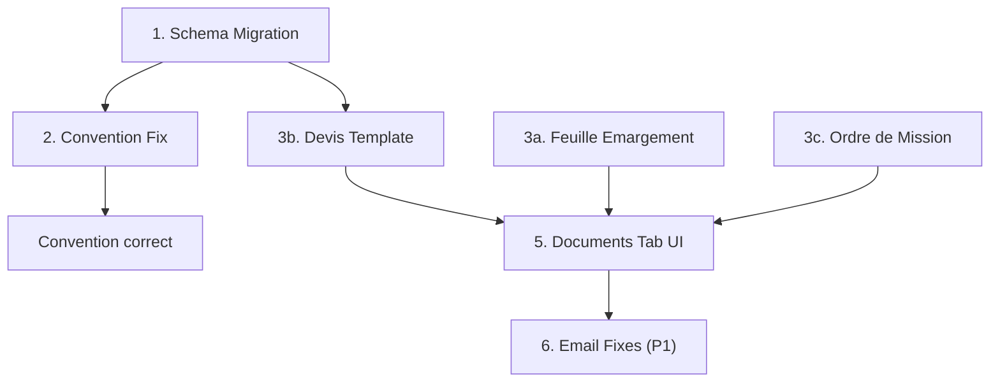

# Chunk 1: Core PDF Templates + Convention Fix

**Branch**: `feat/formations-v2` (existing)
**Design decisions**: [`docs/decisions/2026-04-07-document-generation-system.md`](docs/decisions/2026-04-07-document-generation-system.md)

## Dependency Order

## Phase 1: Schema Migration

**Files to change:**

- [`src/lib/db/schema/formations.ts`](src/lib/db/schema/formations.ts) — add `prixConvenu` (numeric, nullable)
- [`src/lib/db/schema/workspaces.ts`](src/lib/db/schema/workspaces.ts) — add `tvaRate` (numeric, default 20), `defaultPaymentTerms` (text), `defaultDevisValidityDays` (integer, default 30), `defaultCancellationTerms` (text)
- New SQL migration via `bunx drizzle-kit generate`

**Why first**: Every subsequent task reads these fields.

## Phase 2: Convention Bug Fixes

**File:** [`src/lib/services/document-generator.ts`](src/lib/services/document-generator.ts)

Two bugs to fix in the `convention` case:

1. **Participant count** (line ~220): Replace `contacts.findMany({ where: eq(contacts.id, formationId) })` with a query on `formation_apprenants` where `formationId` matches.

2. **Pricing** (line ~225): Replace hardcoded `null` values with:
   - `prixTotal = formation.prixConvenu ?? formation.prixPublic ?? null`
   - Compute `prixParJour` from total / duration if available

Also align `fetchFormationData` select columns with actual Drizzle schema fields (currently references `prixTotal`/`prixParJour` which don't exist — real fields are `prixPublic` + new `prixConvenu`).

## Phase 3: New PDF Templates (parallelizable)

All follow existing patterns from [`src/lib/services/document-templates/convention.ts`](src/lib/services/document-templates/convention.ts) and [`shared.ts`](src/lib/services/document-templates/shared.ts).

### 3a. Feuille d'Emargement (Mode 2: Proof)

- **New file:** `src/lib/services/document-templates/feuille-emargement.ts`
- **Generator update:** `document-generator.ts` — replace throw with `buildFeuilleEmargement` call, load séance + émargements + signatures for the given `seanceId`
- **Data needed:** Séance (date, période AM/PM), formation, formateur, list of apprenants with their signature timestamps
- **Layout:** Table with learner names, AM/PM columns, signature timestamps (per decisions §3)

### 3b. Devis

- **New file:** `src/lib/services/document-templates/devis.ts`
- **Generator update:** `document-generator.ts` — replace throw with `buildDevis` call, load workspace financial defaults + formation pricing
- **Data needed:** Workspace (legal info + financial defaults), formation (prixConvenu/prixPublic, durée, programme summary), client
- **Layout:** Standard quote format with HT/TVA/TTC breakdown, validity period, payment terms, Qualiopi Q1 content (per decisions §4)

### 3c. Ordre de Mission

- **New file:** `src/lib/services/document-templates/ordre-mission.ts`
- **Generator update:** `document-generator.ts` — replace throw with `buildOrdreMission` call, load `formation_formateurs` data for the given `formateurId`
- **Data needed:** Formateur identity, formation summary, TJM, numberOfDays, déplacement/hébergement costs from `formation_formateurs`
- **Layout:** Mission letter format with dates, location, financial terms (per decisions §5)

## Phase 4: Documents Tab UI Updates

**File:** [`src/routes/(app)/formations/[id]/documents/+page.svelte`](<src/routes/(app)/formations/[id]/documents/+page.svelte>)

- Add `'feuille_emargement'` to `GENERATABLE_TYPES`
- Add `NEEDS_SEANCE` constant (`['feuille_emargement']`)
- Add séance `Select` picker (conditionally shown when type needs séance)
- Load séances data from server (may need `+page.server.ts` update to return séances list)
- Verify formateur picker already works for `ordre_mission` (it exists per exploration)

## Phase 5: Email Fixes (P1, if capacity allows)

**Files:**

- [`src/lib/services/email-service.ts`](src/lib/services/email-service.ts) — add `devis_relance`, `convention_relance`, `ordre_mission_relance` to `EMAIL_TYPE_TO_TEMPLATE` (map to correct Postmark template aliases)
- [`src/routes/(app)/formations/[id]/suivi/+page.server.ts`](<src/routes/(app)/formations/[id]/suivi/+page.server.ts>) — add `ctaUrl` to `templateModel` in `sendQuestEmail`, computed from email type (e.g., deep link to Documents tab or external signing URL)
- Update email service tests

## Definition of Done

- All 3 new PDF types generate successfully from the Documents tab
- Convention PDF shows correct participant count and pricing
- Documents tab UI allows selecting séance (for émargement) and formateur (for ordre de mission)
- Existing tests pass; new template builders have unit tests
