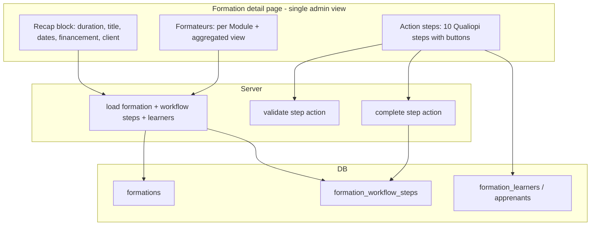

# Formation Administrative Workflow – Full 10-Step MVP

## Context

- **Mentore Manager**: The app is dedicated to managing the **administrative** aspect of Formations. Unlike the Bubble version of Mentore.fr (which had a separate "Admin" tab inside a formation), here the **formation detail page itself is the admin view** – no Admin tab.
- **Source of truth**: [docs/bubble/bubble-admin-workflow.md](docs/bubble/bubble-admin-workflow.md) and [docs/bubble/bubble-admin-workflow-analysis.md](docs/bubble/bubble-admin-workflow-analysis.md). Cross-check with [GitHub Issues](https://github.com/curiousanthony/supabase-sveltekit/issues).
- **Current app**: Formation detail at `/formations/[id]` currently has draft tabs (Aperçu, Informations, Documents, Formateurs, Séances, Paramètres); these will be **removed**. The page becomes one admin view with no tabs (see "Page structure" below). The table [formation_workflow_steps](src/lib/db/schema.ts) and [workflowStepKeys](src/lib/db/schema.ts) exist and are wired in [relations](src/lib/db/relations.ts); no UI or server logic uses them yet.
- **Learners**: [apprenants](src/lib/db/schema.ts) is linked to **clients** (`is_trainee_of`), not to formations. A formation–learner link is required (e.g. `formations_apprenants`).

## Three purposes of the formation slug path (`/formations/[id]`)

The page serves **three goals** in one place:

1. **Action-first progress (Qualiopi)**
   Clearly show the **next action steps** and their **button actions** so the user knows exactly where this Formation stands from a Qualiopi conformity and overall status perspective. The user should be able to **take action very quickly in as few clicks as possible**, and feel **rewarded** for completing steps.
2. **Recap at a glance**
   Show a **recap of the most important formation information** as quickly as possible: duration, title, dates, type de financement, client, and any other info relevant for an administrative person in a Learning Center (e.g. lieu, volume d'heures, format, statut).
3. **Assign or find Formateurs**
   Allow assigning or finding Formateurs from a **Formateur Marketplace** (big feature later, with matching algorithm). Formateurs are assigned to **Modules** of a Formation, not to the Formation itself; the UI can show an **aggregated view** of all Formateurs across the Formation's Modules.

## Target UX (high level)

- **No Admin tab.** The formation detail page **is** the admin dashboard.
- **Layout**: (1) **Recap block** (top) – key formation info at a glance; (2) **Action steps** (main) – the 10 Qualiopi steps as clear next actions with prominent buttons (e.g. Vérifier les infos, Générer la convention, Valider l'étape); progress visible (e.g. 3/10 étapes validées); few clicks; rewarding (checkmarks, micro-celebrations); (3) **Formateurs** – assign/find per Module; aggregated view; Marketplace/matching out of scope for MVP.
- **Tone**: **Fun and playful**, not boring or generic SaaS. Clear user flow that ensures **Qualiopi conformity** while feeling engaging and rewarding (e.g. progress indicators, clear CTAs, optional light gamification or feedback on step completion).

## Page structure (no tabs, what's on screen vs one click)

**No traditional tabs.** The current tabs (Aperçu, Informations, Documents, Formateurs, Séances, Paramètres) are removed. The page is one coherent admin view.

| Element                                                     | On the same page (always visible)?             | Hidden behind a tab? | Hidden behind one click?                            |
| ----------------------------------------------------------- | ---------------------------------------------- | -------------------- | --------------------------------------------------- |
| Recap block                                                 | Yes – top of page                              | No                   | No                                                  |
| Progress (e.g. 3/10 étapes)                                 | Yes                                            | No                   | No                                                  |
| List of 10 steps (label + status + primary button each)     | Yes – compact list or stepper                  | No                   | No                                                  |
| Step content (forms, document actions, learners list, etc.) | No – would make page too long                  | No                   | **Yes** – expand inline, drawer, or main area       |
| Formateurs                                                  | Entry point on page (e.g. "Formateurs (3)")    | No                   | **Yes** – one click expands section or opens drawer |
| Séances                                                     | Entry point on page (e.g. "Séances (5)")       | No                   | **Yes** – one click expands section or opens drawer |
| Paramètres / Modifier                                       | Entry point in Recap (e.g. "Modifier" or gear) | No                   | **Yes** – one click opens modal or drawer           |

**Concrete layout:**

- **Always visible (minimal or no scroll):** Recap block (compact: title, client, dates, financement, statut, duration, Modifier); progress (e.g. "3/10 étapes validées" + bar); compact list of 10 steps – each row/card shows step number, label (FR), status (done / in progress / to do), primary button. Optional: entry points "Formateurs (3)", "Séances (5)" so user can open them with one click.
- **One click to open:** Step content (click step or its button → content appears inline below row, or in drawer, or main area shows only that step); Formateurs panel/section; Séances panel/section; Paramètres/Modifier (modal or drawer from Recap).
- **Optional:** Default main area shows the **first incomplete step's content** so the user can act with zero extra clicks; clicking another step switches the main area to that step's content.

**Do not** add new tabs. Everything is either on the page or one click away (expand/drawer/modal).

## 10 steps (recap from Bubble docs)

| #   | Step key (schema)           | Name (FR)                      | Main actions                                                                            |
| --- | --------------------------- | ------------------------------ | --------------------------------------------------------------------------------------- |
| 1   | info_verification           | Vérifications des informations | Verify/edit formation info; add learners (CSV or manual); audit contacts; validate step |
| 2   | convention_program          | Convention et programme        | Generate/edit convention; fill program; download; validate                              |
| 3   | needs_analysis              | Analyse des besoins            | Schedule digital/instructor needs analysis; participants; validate                      |
| 4   | convocation                 | Convocation                    | Generate convocations for all learners; schedule group send; validate                   |
| 5   | mission_order               | Ordre de mission               | Generate mission order; upload positioning test; validate                               |
| 6   | end_certificate             | Attestation de fin de mission  | Generate certificates for all; schedule send; validate                                  |
| 7   | satisfaction_questionnaires | Questionnaires de satisfaction | Add learners (manual/attendance/admin); schedule hot/cold; validate                     |
| 8   | instructor_documents        | Documents formateur            | Upload CV, diploma, URSAFF, NDA, contract; admin comments; validate                     |
| 9   | billing                     | Facturation                    | Financing mode; payment method; invoice status (company + instructor); validate         |
| 10  | complete_file               | Dossier complet                | Review attendance + instructor docs; final review                                       |

## Architecture (concise)

## 1. Schema and data model

- **Keep and use**: `formation_workflow_steps` (formationId, stepKey, completedAt, completedBy). No change needed for MVP.
- **Formation–learners**: The workflow needs "learners registered for this formation" (Step 1: add; Steps 4/6: generate for all). Right now `apprenants` is client-scoped only. Options:
  - **Option A**: New join table `formations_apprenants` (formationId, apprenantId, role?) and optionally extend `apprenants` with `fonction`, `groupe` if not already present (Bubble Step 1 has prenom, nom, fonction, groupe, email). Prefer this if the same person can be learner in multiple formations.
  - **Option B**: Add `formationId` (nullable) to `apprenants` so an apprenant can belong to a client and optionally to a specific formation. Simpler but less flexible.
- **Documents**: Steps 2, 4, 5, 6, 8 involve "generate" or "upload" documents. For MVP, either:
  - Store minimal metadata only (e.g. "convention generated at", "file X uploaded") in a small `formation_documents` (or `workflow_documents`) table keyed by formation + step or document type, with a `file_url` (Supabase Storage) and optional `version`, or
  - Defer real file storage and only track "step completed" and show placeholder buttons (Générer / Télécharger / Modifier) that don't persist files yet.
- **Billing (Step 9)**: Formation already has `typeFinancement`. Add or reuse fields for payment method and invoice status (e.g. company invoice sent/paid, instructor transfer done) if not already on `formations` or a related table.
- **Audit contacts (Step 1)**: Either a small table (e.g. `formation_audit_contacts`) or a JSON field on formation; MVP can be a simple list + "add all learners" / "add manually".

Recommendation: implement **Option A** (formations_apprenants + optional apprenant fields), a minimal **formation_documents** (or per-step document metadata) for generated/uploaded files, and minimal billing/audit fields so the 10 steps are implementable end-to-end without big schema churn later.

## 2. Formation detail page (single admin view, no tabs)

- **Route**: Reuse [src/routes/(app)/formations/[id]/+page.svelte](<src/routes/(app)/formations/[id]/+page.svelte>) and [src/routes/(app)/formations/[id]/+page.server.ts](<src/routes/(app)/formations/[id]/+page.server.ts>).
- **Page structure:** See **"Page structure (no tabs, what's on screen vs one click)"** above. No tabs (Aperçu, Informations, etc. removed). Always visible: Recap block, progress, compact list of 10 steps. One click: step content (expand/drawer/main area), Formateurs, Séances, Paramètres/Modifier.
- **Server load** (Phase 2+): Load formation with `client` and relations (workflow steps, formation learners, documents); compute step status for each of the 10 `workflowStepKeys`. Phase 1 uses dummy data only.
- **UI** (no tabs; the page is the admin view):
  - **Recap block** (top): Key formation info at a glance – duration, title, dates, financement, client, lieu, format, statut, etc.; "Modifier" entry point (one click → modal/drawer).
  - **Progress**: e.g. "3/10 étapes validées" + progress bar or stepper.
  - **List of 10 steps** (compact): Each row/card shows step number, label (FR), status (done / in progress / to do), primary button. Clicking step or button opens that step's content (inline expand, drawer, or main area). Optional: default main area shows first incomplete step's content.
  - **Entry points**: "Formateurs (3)", "Séances (5)" – one click opens panel/drawer with per-module formateurs, aggregated view; list of séances. Formateur Marketplace out of scope for MVP.
- **Tone**: Fun, playful, clear – not boring or generic SaaS. Qualiopi conformity ensured while the flow feels engaging and rewarding.

## 3. Step content and validation (MVP)

For each step, implement:

- **Content**: The main fields and actions listed in the Bubble doc (forms, lists, buttons: Modifier, Générer, Télécharger, Importer CSV, Ajouter, Programmer envoi, etc.). For "document" steps, MVP can use placeholders (e.g. "Générer" creates a DB record or a stub file and marks the step as completable) so the flow is navigable and validatable.
- **Validation**: Before "Valider l'étape":
  - **Step 1**: At least formation info present and at least one learner added (and optionally audit contacts).
  - **Steps 2–10**: Define minimal rules (e.g. "convention generated", "program filled", "convocation generated for all", etc.) so the button is enabled only when the step is logically complete. If you don't have real document generation yet, "validated" can mean "user clicked validate" after doing the minimal required actions (e.g. upload one file for Step 8).
- **Action**: "Valider l'étape" calls a form action or API that inserts/updates `formation_workflow_steps` (formationId, stepKey, completedAt = now, completedBy = current user). Then re-run load or invalidate so the action steps and progress update.

Keep validation rules light for MVP so you can ship the full 10-step flow; tighten rules in a follow-up.

## 4. Phased implementation (mandatory order)

**Agent instruction:** Work in phases. **Phase 1 only** until the user explicitly approves the UI.

- **Phase 1:** Build the formation [id] page layout and all UI elements with **dummy data only**. No schema changes, no migrations, no real DB queries, no form actions. Iterate with the user (layout, recap, step list, step content area, Formateurs/Séances/Modifier entry points) until they are **completely okay** with how it looks. Do **not** proceed to Phase 2 until the user says they approve.
- **Phase 2:** Only after Phase 1 sign-off: schema, migrations, data layer, load real data.
- **Phase 3:** Only after Phase 2: form actions, validation, persist step completion, polish.

Do **not** implement database queries, schema changes, migrations, or form actions until **Phase 1 is fully signed off** by the user.

### Phase 1: UI validation (mockup with dummy data)

**Goal:** Validate the layout and elements with the user through multiple iterations. No real DB, no schema changes, no form actions.

**Scope:**

- **Route:** [src/routes/(app)/formations/[id]/+page.svelte](<src/routes/(app)/formations/[id]/+page.svelte>) (and optionally +page.server.ts only to pass dummy data from load).
- **Data:** Use **dummy/mock data** in the load (or hardcoded in the page). One formation object, dummy workflow step statuses (e.g. steps 1–3 completed, 4 in progress, 5–10 not started), dummy learners list, dummy modules/formateurs, dummy séances – enough to render the full layout and all entry points.
- **UI to build:**
  - Recap block (top): title, client, dates, financement, statut, duration, "Modifier" entry point.
  - Progress: e.g. "3/10 étapes validées" + progress bar or stepper.
  - Compact list of 10 steps: each row/card with step number, label (FR), status (done / in progress / to do), primary button (e.g. Vérifier les infos, Générer la convention, Valider l'étape). No tabs.
  - Step content area: clicking a step (or its button) opens that step's content – inline expand, drawer, or main area. Build placeholder content per step (e.g. Step 1: formation summary + list of learners + "Ajouter apprenant" / "Importer CSV" / "Valider l'étape"; Step 2: "Générer" / "Modifier" / "Télécharger" convention + program; etc.) so the user can judge layout and flow. Use dummy data only.
  - Entry points: "Formateurs (3)" and "Séances (5)" that on click expand a section or open a drawer with placeholder content (per-module formateurs, aggregated list; list of séances). "Modifier" in Recap opens a modal/drawer with placeholder formation edit form.
- **Iterations:** The Agent implements the mockup; the user reviews and requests changes (layout, density, copy, expand vs drawer vs main area, etc.). Repeat until the user explicitly approves the UI. **Do not** proceed to Phase 2 until the user is completely okay with how it looks.

**Deliverable:** A formation [id] page that looks and behaves as specified (recap, progress, 10 steps, step content on click, Formateurs/Séances/Modifier on click), all with dummy data, and user sign-off.

### Phase 2: Schema and data layer

**Start only after Phase 1 is signed off.**

- Add schema: `formations_apprenants`, minimal `formation_documents` (or equivalent), billing/audit fields; run migration.
- In [src/lib/db](src/lib/db), add relations and queries for formation workflow steps, formation learners, documents.
- Update [src/routes/(app)/formations/[id]/+page.server.ts](<src/routes/(app)/formations/[id]/+page.server.ts>) load to fetch real formation, workflow steps, learners, documents (and modules, formateurs, séances as needed). Remove dummy data; wire UI to loaded data.

### Phase 3: Logic and actions

**Start only after Phase 2 is done.**

- Form actions: validate step (write to `formation_workflow_steps`), add learner, upload file, edit formation, etc.
- Step content: real forms and validation (minimal rules per plan); "Valider l'étape" persists completion and refreshes progress.
- Polish: progress recalculation, optional "block until previous step completed" (or soft warning), RBAC if specified, micro-celebrations or feedback on step completion.

## 5. Files to touch (by phase)

**Phase 1 (UI mockup only):**

- [src/routes/(app)/formations/[id]/+page.svelte](<src/routes/(app)/formations/[id]/+page.svelte>) – redesign as single admin view: Recap block, progress, compact list of 10 steps (no tabs), step content area (expand/drawer/main), entry points Formateurs / Séances / Modifier. Use dummy data (from load or hardcoded).
- [src/routes/(app)/formations/[id]/+page.server.ts](<src/routes/(app)/formations/[id]/+page.server.ts>) – optional: return dummy formation + dummy workflow steps + dummy learners/modules/formateurs/séances so the page can render the full layout. No real DB queries for Phase 1.
- New components (under e.g. `src/lib/components/formations/` or under the route): Recap block, progress indicator, step list (10 rows/cards), step content container (one per step or one container by step key), Formateurs panel/section, Séances panel/section, Modifier modal/drawer. All with dummy data.

**Phase 2 (after Phase 1 sign-off):**

- [src/lib/db/schema.ts](src/lib/db/schema.ts) – new tables/columns; keep `workflowStepKeys` and `formationWorkflowSteps`.
- [src/lib/db/relations.ts](src/lib/db/relations.ts) – relations for new tables and formation → workflow steps / learners / documents.
- New migration under `supabase/migrations/` for `formations_apprenants`, `formation_documents`, and any billing/audit columns.
- [src/routes/(app)/formations/[id]/+page.server.ts](<src/routes/(app)/formations/[id]/+page.server.ts>) – load real formation, workflow steps, learners, documents; remove dummy data.

**Phase 3 (after Phase 2):**

- [src/routes/(app)/formations/[id]/+page.server.ts](<src/routes/(app)/formations/[id]/+page.server.ts>) – form actions for validate step, add learner, upload file, edit formation, etc.
- Step components – wire real forms and validation; "Valider l'étape" persists and refreshes.

## 6. Out of scope for this MVP

- Real document generation (PDF/Word) and templates; MVP can use placeholders or store a single generated file URL per type.
- Full scheduling/email (e.g. "programmer un envoi groupé"); can be stub buttons that only mark "scheduled" in DB.
- Versioning of documents, advanced validation, and analytics dashboard.
- Formateur Marketplace and matching algorithm (big feature later).
- Inbox integration ("Formation X needs your action"): covered by [docs/issues/inbox-feature.md](docs/issues/inbox-feature.md); can be added later and link to the formation page.

## 7. Success criteria

**Phase 1 (UI mockup):**

- User can open a formation [id] page and see: Recap block (top), progress (e.g. 3/10), compact list of 10 steps (label + status + button each), no tabs. Clicking a step or its button opens that step's content (expand/drawer/main area). Entry points "Formateurs", "Séances", "Modifier" open panel/drawer/modal with placeholder content. All with dummy data. User explicitly approves the layout and flow before Phase 2.

**Phase 3 (full MVP):**

- User can open a formation and immediately see recap, next action steps, and progress (no Admin tab to switch to).
- User can complete each step in order (or with soft warning if skipping): perform the minimal actions and click Valider l'étape; progress updates and feels rewarding.
- Completed steps are persisted in `formation_workflow_steps` and reflected in the action steps and progress.
- Formation learners are stored and used for Steps 1, 4, and 6 (and 7 if applicable).
- Formateurs can be assigned per Module with an aggregated view for the formation; Marketplace/matching deferred.

You can align this plan with the issues at [https://github.com/curiousanthony/supabase-sveltekit/issues](https://github.com/curiousanthony/supabase-sveltekit/issues) and split implementation into issues (e.g. Phase 1 UI mockup, Phase 2 schema/data, Phase 3 actions) if you use GitHub project tracking.
