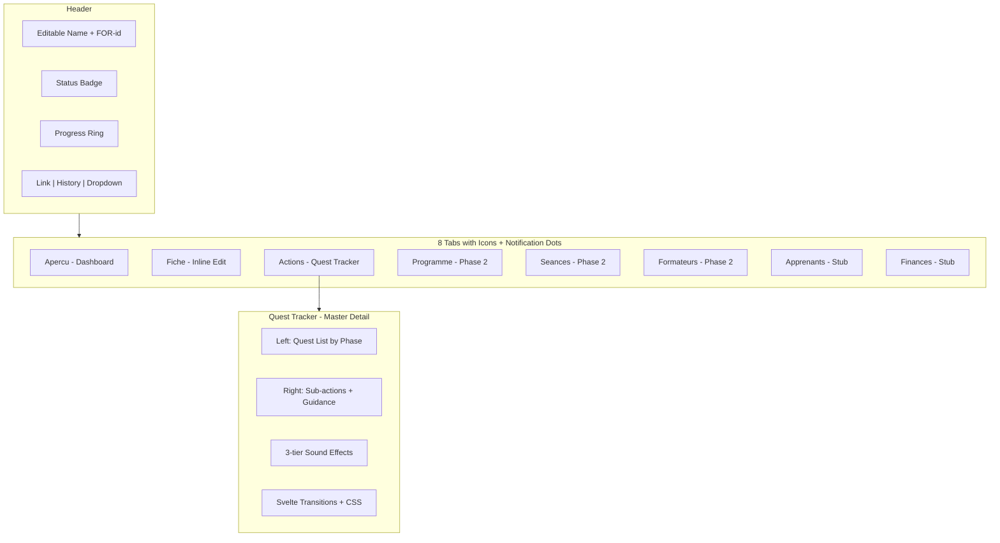

# Formation Details Page — Phase 1

Full specification: `[.cursor/plans/formation-details-phase1.md](.cursor/plans/formation-details-phase1.md)`

## Architecture Overview

## Data Model

Extend `formation_actions` table with `phase` (new `quest_phase` enum), `quest_key`, `assignee_id`, `guidance_dismissed`. Create new `quest_sub_actions` child table. Create `formation_audit_log` table (schema only, populated in Phase 2). See spec sections 1a-1e.

Key files:

- `[src/lib/db/schema/enums.ts](src/lib/db/schema/enums.ts)` -- add `questPhase` enum
- `[src/lib/db/schema/formations.ts](src/lib/db/schema/formations.ts)` -- extend `formationActions`, add `questSubActions`, `formationAuditLog`
- New migration in `supabase/migrations/`

## Quest Template System

New file `src/lib/formation-quests.ts` replaces `[src/lib/formation-workflow.ts](src/lib/formation-workflow.ts)`. Defines 22 Qualiopi-compliant quests across 3 phases (Conception: 9, Deploiement: 4, Evaluation: 9). Each quest has sub-actions, dependencies, due date offsets, and conditional applicability by formation type/funding. Helpers: `getQuestsForFormation()`, `createFormationQuests()`, `getNextQuest()`, `shouldAutoAdvanceStatus()`. Full quest list in spec section 2b.

## Phase 1 Tabs

- **Apercu** -- Dashboard: Next Action hero card, Key Info summary, Participants summary, Upcoming Sessions, Financial Summary (cost/margin/TJM), Recent Activity feed. All read-only with "Voir tout" links.
- **Fiche** (new route) -- 3 inline-editable sections: Informations generales, Logistique, Financement. Uses `InlineEditableField` pattern from contacts. Shows deal link if created from deal.
- **Actions** -- Master-detail layout (~300px quest list left, workspace right). Quests grouped by 3 vertical phases. Phase collapse + reveal animations on completion. Level-up toast. 3-tier sounds (micro/medium/macro). Mobile: stacked with back button.
- **Apprenants** (new stub) -- Move learner list from current overview, add/remove functionality.
- **Finances** (new stub) -- Simple card with TJM, montant accorde, margin.
- **Programme, Seances, Formateurs** -- Keep current behavior.

## Header Redesign

- Editable formation name (click-to-edit in `[site-header.svelte](src/lib/components/site-header.svelte)`)
- `FOR-{idInWorkspace}` prefix (UI-only, numeric stays in DB)
- Small `ProgressRing` showing quest completion %
- Link button (copies URL), History button (placeholder toast)
- Dropdown: "Copier les informations" (plain text to clipboard), "Supprimer" (archive or hard delete dialog)
- Remove: "Modifier la formation", "En discuter avec..."

## NavTabs Enhancement

- Add `dot` property to `[nav-tabs.svelte](src/lib/components/nav-tabs.svelte)` `TabItem` type
- 8 tabs with icons + labels always visible
- Horizontally scrollable on mobile
- Notification dots: overdue quests (Actions tab), missing signatures (Seances tab)
- Dismissal via localStorage "last viewed at" timestamps

## Sound System

New `src/lib/sounds.ts` using Web Audio API (no audio files). Three tiers: micro (sub-action tick), medium (quest chime), macro (phase level-up). Short, non-annoying, toggleable via localStorage preference.

## Enhanced Creation Wizard

Modify `[formations/creer/](<src/routes/(app)`/formations/creer/>) to 4 steps: Basics, Programme, People (formateur + apprenants), Financement. On creation, call `createFormationQuests()` to generate quests + sub-actions, auto-assign to admin/secretary.

## List Page Updates

- `[formationCard.svelte](src/lib/components/custom/formationCard.svelte)`: FOR- prefix, notification dot, mini progress bar
- `[formations/+page.server.ts](<src/routes/(app)`/formations/+page.server.ts>): include quest completion stats in query

## New Files (19)

`src/lib/formation-quests.ts`, `src/lib/sounds.ts`, 12 new components in `src/lib/components/formations/` and `src/lib/components/custom/`, 2 new routes (`fiche/`, `apprenants/`, `finances/`), 1 migration

## Modified Files (16)

Schema files (3), components (3), layout files (2), page files (4), creation wizard (3), list page (2)
