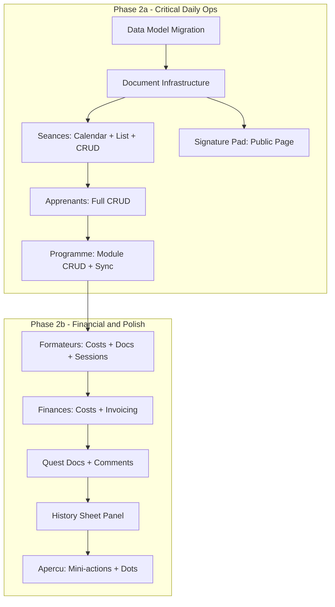

# Formation Details Page -- Phase 2

Full specification: [.cursor/plans/formation-details-phase2.md](.cursor/plans/formation-details-phase2.md)
Phase 1 spec (for reference): [.cursor/plans/formation-details-phase1.md](.cursor/plans/formation-details-phase1.md)

## Phasing

- **Phase 2a** (critical daily ops): Data model, Documents infra, Seances, Signature pad, Apprenants, Programme
- **Phase 2b** (financial + polish): Formateurs, Finances, Quest docs/comments, History, Apercu updates

## Architecture Overview

## Data Model

Extend existing tables + 4 new tables. See spec sections 1a-1i.

- **Extend** `emargements`: `signature_image_url`, `signature_token`, `signer_ip`, `signer_user_agent`
- **Extend** `seances`: `modality_override`
- **Extend** `quest_sub_actions`: `document_required`, `accepted_file_types`
- **Extend** `formation_formateurs`: `tjm`, `number_of_days`, `deplacement_cost`, `hebergement_cost`
- **New** `quest_documents`: one document per sub-action, stored in Supabase Storage
- **New** `quest_comments`: team notes per quest (append-only)
- **New** `formation_invoices`: invoice tracking with PDF upload
- **New** `formation_cost_items`: fixed categories (formateur, salle, materiel, deplacement)

Key files:

- [src/lib/db/schema/seances.ts](src/lib/db/schema/seances.ts) -- extend emargements + seances
- [src/lib/db/schema/formations.ts](src/lib/db/schema/formations.ts) -- extend quest_sub_actions + formation_formateurs, add new tables
- New migration in `supabase/migrations/`

## Document Infrastructure

- 3 Supabase Storage buckets: `quest-documents`, `formation-invoices`, `emargement-signatures`
- New service: `src/lib/services/document-service.ts` (upload, download, delete helpers)
- New component: `src/lib/components/custom/file-upload.svelte` (drag-and-drop + picker, type validation, progress)
- New component: `src/lib/components/custom/signature-pad.svelte` (canvas-based, touch + mouse)

## Seances Tab

Dual view (Calendar + List) with localStorage toggle. Default list, remember preference.

- **Calendar**: custom month grid, click date to create, auto-navigate to next session month. Desktop only.
- **List**: enhanced stub, grouped by date, emargement progress bars
- **Create/Edit dialog**: date, times, module (required), formateur, modality override, location/room (Presentiel only)
- **Emargement**: after session create, "Assign participants" step (all pre-selected). Auto-generate signature tokens.
- **Delete**: hard delete with warning if signatures exist

Key files:

- [src/routes/(app)/formations/[id]/seances/+page.svelte](<src/routes/(app)/formations/[id]/seances/+page.svelte>) -- replace stub
- New `+page.server.ts` -- `createSession`, `updateSession`, `deleteSession`, `updateEmargementParticipants`

## Signature Pad Page

Public standalone route at `/emargement/[token]` (no login required).

- Shows: formation name, session date/time, learner name
- Canvas signature pad, "Signer" button
- Stores: PNG in Supabase Storage, IP + user agent in DB
- Already-signed state shows stored signature

Key files:

- New `src/routes/emargement/[token]/+page.svelte`
- New `src/routes/emargement/[token]/+page.server.ts`

## Apprenants Tab

- Add via combobox search (existing contacts) or create new (full contact form in dialog)
- Per learner: name, email, company, attendance rate, document status badges, test result badges
- Mid-formation add: dialog asking which future sessions to include
- Remove: soft (keep past emargements for Qualiopi compliance)

Key files:

- [src/routes/(app)/formations/[id]/apprenants/+page.svelte](<src/routes/(app)/formations/[id]/apprenants/+page.svelte>) -- replace stub
- New `+page.server.ts` -- `addLearner`, `removeLearner`, `createContact`

## Programme Tab

- Full module CRUD: add, edit inline (title, duration, objectifs), remove, reorder
- Reorder: drag-and-drop (desktop) + up/down buttons (mobile)
- Sync banner when linked programme has local changes: Update source / Create new / Detach
- Module deletion cascade: ask about linked sessions (delete or reassign)
- "Save as programme" button when unlinked

Key files:

- [src/routes/(app)/formations/[id]/programme/+page.svelte](<src/routes/(app)/formations/[id]/programme/+page.svelte>) -- replace read-only
- [src/routes/(app)/formations/[id]/programme/+page.server.ts](<src/routes/(app)/formations/[id]/programme/+page.server.ts>) -- replace empty load

## Formateurs Tab Enhanced

- Add: in-tab combobox search with Mentore Marketplace teaser
- Cost card per formateur: TJM, days, total, optional deplacement/hebergement (Presentiel/Hybride only)
- Document verification badges: CV, diplomes, NDA, URSSAF (from documents_formateur quest)
- Per-session assignment: assign formateur to specific sessions, auto-add to formation

Key files:

- [src/routes/(app)/formations/[id]/formateurs/+page.svelte](<src/routes/(app)/formations/[id]/formateurs/+page.svelte>) -- enhance
- [src/routes/(app)/formations/[id]/formateurs/+page.server.ts](<src/routes/(app)/formations/[id]/formateurs/+page.server.ts>) -- add cost + assignment actions

## Finances Tab Full

3 sections: Revenue (inline-editable from formation record), Costs (fixed categories + auto-calculated formateur totals), Invoices (CRUD with PDF upload).

- Invoice tracking: number, date, amount, recipient, status, due date, payment date, PDF upload, notes
- Notification dot: overdue invoices

Key files:

- [src/routes/(app)/formations/[id]/finances/+page.svelte](<src/routes/(app)/formations/[id]/finances/+page.svelte>) -- replace stub
- New `+page.server.ts` -- `updateCostItem`, `createInvoice`, `updateInvoice`, `deleteInvoice`

## Quest Documents and Comments

- Document upload zones per sub-action in quest workspace (Actions tab)
- Per-sub-action config in quest templates: `documentRequired`, `acceptedFileTypes`
- Required docs block sub-action completion until uploaded
- Quest comments section below sub-actions (append-only, with author + timestamp)

Key files:

- [src/routes/(app)/formations/[id]/actions/+page.svelte](<src/routes/(app)/formations/[id]/actions/+page.svelte>) -- add upload zones + comments
- [src/routes/(app)/formations/[id]/actions/+page.server.ts](<src/routes/(app)/formations/[id]/actions/+page.server.ts>) -- add `uploadDocument`, `deleteDocument`, `addComment`
- [src/lib/formation-quests.ts](src/lib/formation-quests.ts) -- add `documentRequired` + `acceptedFileTypes` to sub-action definitions

## History Panel

- Header History button opens shadcn Sheet from right (replace placeholder toast)
- Timeline: icon per event type, actor avatar + name, relative timestamp, description
- Audit log helper: `src/lib/services/audit-log.ts` -- `logAuditEvent()` called from all server actions
- Events logged: field changes, quest completions, session CRUD, learner/formateur changes, financial updates, document uploads, comments

Key files:

- [src/lib/components/site-header.svelte](src/lib/components/site-header.svelte) -- wire History button
- New `src/lib/components/formations/history-sheet.svelte`
- New `src/lib/services/audit-log.ts`
- [src/routes/(app)/formations/[id]/+layout.server.ts](<src/routes/(app)/formations/[id]/+layout.server.ts>) -- load audit log

## Apercu Updates

- Mini-action buttons on dashboard cards: "+ Ajouter une seance", "+ Ajouter un apprenant"
- Updated summary data: real attendance rates, cost totals, session counts
- 3 new notification dots: Formateurs (missing docs), Apprenants (unsigned emargements), Finances (overdue invoices)

Key files:

- [src/routes/(app)/formations/[id]/+page.svelte](<src/routes/(app)/formations/[id]/+page.svelte>) -- add mini-actions + update cards
- [src/routes/(app)/formations/[id]/+layout.svelte](<src/routes/(app)/formations/[id]/+layout.svelte>) -- add new dot props
- [src/routes/(app)/formations/[id]/+layout.server.ts](<src/routes/(app)/formations/[id]/+layout.server.ts>) -- compute new notification dots

## New Files (18)

- `src/lib/services/document-service.ts`
- `src/lib/services/audit-log.ts`
- `src/lib/components/custom/file-upload.svelte`
- `src/lib/components/custom/signature-pad.svelte`
- `src/lib/components/formations/session-calendar.svelte`
- `src/lib/components/formations/session-list.svelte`
- `src/lib/components/formations/session-dialog.svelte`
- `src/lib/components/formations/emargement-manager.svelte`
- `src/lib/components/formations/module-card.svelte`
- `src/lib/components/formations/module-list.svelte`
- `src/lib/components/formations/formateur-cost-card.svelte`
- `src/lib/components/formations/formateur-search.svelte`
- `src/lib/components/formations/invoice-dialog.svelte`
- `src/lib/components/formations/invoice-list.svelte`
- `src/lib/components/formations/history-sheet.svelte`
- `src/lib/components/formations/history-entry.svelte`
- `src/routes/emargement/[token]/+page.svelte`
- `src/routes/emargement/[token]/+page.server.ts`
- 1 migration in `supabase/migrations/`

## Modified Files (17)

- Schema: `seances.ts`, `formations.ts`, `index.ts`, relations file
- Quest templates: `formation-quests.ts`
- Header: `site-header.svelte`
- Layout: `+layout.svelte`, `+layout.server.ts`
- Pages: `seances/+page.svelte`, `apprenants/+page.svelte`, `programme/+page.svelte`, `formateurs/+page.svelte`, `finances/+page.svelte`, `actions/+page.svelte`
- Server: `seances/+page.server.ts` (new), `apprenants/+page.server.ts` (new), `programme/+page.server.ts`, `formateurs/+page.server.ts`, `finances/+page.server.ts` (new), `actions/+page.server.ts`
- Overview: `+page.svelte`
