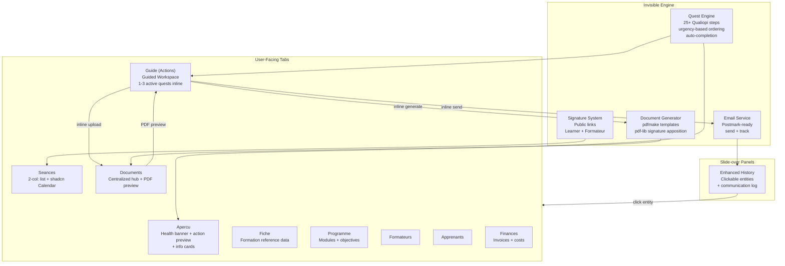

# Unified Formation Redesign — Guided Workspace, Document Engine, and UX Overhaul

## 0. Design North Star

From the [foundation document](docs/foundations/mentore-manager-formations-ux-foundation.md):

> "Mentore Manager is a guide that holds the user's hand through Qualiopi compliance."

> "Could a teenager use this on the first try without knowing anything about professional training or Qualiopi, and still feel guided by the app?"

> Primary Organization: **TIME + URGENCY** — not data domain, not phase, not document type.

> "80% of routine actions completable from main view" — Section 6.1, Metric 2

The current Actions tab violates all of these. This plan fixes that and builds the infrastructure (documents, email, signatures) that makes the fix possible.

---

## 1. The Problem: Why the Current Actions Tab Fails

The current implementation (`[src/routes/(app)/formations/[id]/actions/+page.svelte](src/routes/(app)`/formations/[id]/actions/+page.svelte)) is a 2-column layout: left panel lists ALL 25+ quests grouped by Qualiopi phase (Conception/Deploiement/Evaluation), right panel shows the selected quest's sub-actions as checkboxes with navigate-away CTAs.

**Behavioral psychology violations:**

- **Cognitive Load Theory**: 25+ items across 3 phases exceeds the 4-chunk working memory limit. Marie sees everything at once and feels overwhelmed.
- **Hick's Law**: The left panel presents ALL quests as peer choices, creating decision paralysis about which to work on.
- **Zeigarnik Effect**: All incomplete quests are simultaneously visible, creating diffuse anxiety with no clear resolution path. The foundation explicitly warns: "showing all incomplete items as equal priorities creates overwhelm and paralysis."
- **The Completionist Anxiety anti-pattern** (Foundation 6.2): Every incomplete quest displays a circle/lock icon, making Marie feel behind on everything simultaneously.

**UX violations:**

- CTAs navigate away: "Verify the formation title" sends Marie to `/fiche`, then she must navigate back to check it off. This is 3+ route changes for a 5-second task.
- Manual ceremony: Marie must click "Commencer" before interacting, then manually checkbox each sub-task, then click "Marquer comme termine." The app watches Marie work instead of working with her.
- Phase-based organization: Marie doesn't think "let me check my Conception tasks" — she thinks "what's urgent right now?" (Foundation 5.3).

---

## 2. The Solution: The Guided Workspace

### 2.1 Core Concept

Replace the checklist with a **"one quest at a time" experience** where each action card is a self-contained workspace. The card embeds whatever Marie needs — editable fields, document generation buttons, people selectors, email send prompts — so she never navigates away.

### 2.2 Visual Structure

```
┌──────────────────────────────────────────────────────────────┐
│  Lifecycle: Conception ━━━━━━●━━  Deploiement ───  Eval ─── │
│             11/25 etapes                                     │
├──────────────────────────────────────────────────────────────┤
│                                                              │
│  ┌─ A FAIRE MAINTENANT ─────────────────────────────────┐   │
│  │                                                       │   │
│  │  Convention de formation                              │   │
│  │  Generez et faites signer la convention.              │   │
│  │                                                       │   │
│  │  Step 1/4: Generer la convention                      │   │
│  │  ┌─────────────────────────────────────────────┐      │   │
│  │  │ Centre: Mentore Formation                   │      │   │
│  │  │ Client: Entreprise ABC                      │      │   │
│  │  │ Formation: Introduction au management       │      │   │
│  │  │ Dates: 15-17 avril 2026                     │      │   │
│  │  │                                             │      │   │
│  │  │ [ Generer le PDF ]     [ Voir l'apercu ]    │      │   │
│  │  └─────────────────────────────────────────────┘      │   │
│  │                                                       │   │
│  │  Step 2/4: Relire et personnaliser       ○ A venir    │   │
│  │  Step 3/4: Envoyer au client             ○ A venir    │   │
│  │  Step 4/4: Obtenir la signature          ○ A venir    │   │
│  │                                                       │   │
│  └───────────────────────────────────────────────────────┘   │
│                                                              │
│  ┌─ PROCHAINEMENT (2) ──────────────────────────────────┐   │
│  │  Convocations                      Echeance: 5 avr   │   │
│  │  Demande de prise en charge OPCO   Echeance: 1 avr   │   │
│  └───────────────────────────────────────────────────────┘   │
│                                                              │
│  ┌─ EN ATTENTE (1) ─────────────────────────────────────┐   │
│  │  Accord OPCO    En attente depuis 5j   [Relancer]    │   │
│  └───────────────────────────────────────────────────────┘   │
│                                                              │
│  ▸ COMPLETEES (8)                                            │
│                                                              │
└──────────────────────────────────────────────────────────────┘
```

### 2.3 Key Design Decisions

**Progressive disclosure (video game quest pattern):**

- **A faire maintenant**: 1-3 active quest cards with full inline workspace. This is the focus.
- **Prochainement**: Compact list of upcoming quests (title + due date only). Click to preview but not to work on yet.
- **En attente**: Items blocked on external parties (client signature, OPCO response) with "Relancer" (remind) buttons.
- **Completees**: Collapsed section showing completed items. Click to expand and see proof.

**Urgency-based ordering** (not phase-based):
Quests are sorted by a computed urgency score: `overdue > due_today > due_this_week > due_soon > no_deadline > completed`. Qualiopi phase appears as a subtle badge on each card for implicit education, but does NOT determine the sort order.

**Auto-completion** ("the action IS the confirmation"):

- Verify-fields tasks: When Marie reviews a field (scrolls past it or edits it), the sub-task auto-completes after a brief delay. No manual checkbox.
- Upload tasks: Uploading a file auto-completes the sub-task.
- Generate-document tasks: Generating a PDF auto-completes the sub-task.
- Send-email tasks: Sending an email auto-completes the sub-task.
- Wait-external tasks: Marie clicks "Received" when the external party responds — the only case requiring manual confirmation.
- Manual-confirm tasks (things that happen IRL like "accueillir les apprenants"): Marie clicks a single "Done" button.

When ALL sub-tasks in a quest are complete, the quest auto-moves to "Completees" with a brief celebration moment (sound + animation, per foundation 5.6).

No "Commencer" step. No "Marquer comme termine" button. Marie just does the work and the system tracks her.

### 2.4 Inline Component Types

Each sub-action in `[src/lib/formation-quests.ts](src/lib/formation-quests.ts)` gets an `inlineType` that maps to a Svelte component:

- `**verify-fields`: Renders the formation's actual field values inline, editable in-place. Auto-saves on blur (existing pattern from Fiche tab). Fields specified by `inlineConfig.fields` array mapping to formation columns.
- `**upload-document`: Renders the existing `FileUpload` component inline. Auto-completes on successful upload.
- `**generate-document`: Renders a data preview card + "Generate PDF" button. Calls the document generation engine (Phase 3). Shows the generated PDF inline after creation. Auto-completes on generation.
- `**select-people`: Renders a compact people selector (formateurs or apprenants) with search. Uses existing data from the formation layout loader. Auto-completes when at least one person is selected.
- `**send-email`: Renders a "Send" button with recipient preview and subject line. Integrates with email system (Phase 6). Auto-completes on send.
- `**external-link`: Renders an external link button (e.g., OPCO platform, EDOF). Same as current behavior — this genuinely needs to leave the app.
- `**wait-external`: Renders a "waiting" state with elapsed time and "Received" / "Relancer" buttons.
- `**confirm-task`: Renders a single "Done" button for tasks that happen in the real world.
- `**inline-view`: Renders a compact read-only view of related data (e.g., seance list with signature status) so Marie can check without navigating.

**Example refactored quest template:**

```typescript
{
  key: 'verification_infos',
  phase: 'conception',
  title: 'Verification des informations',
  subActions: [
    {
      title: "Verifier l'intitule et la description",
      inlineType: 'verify-fields',
      inlineConfig: {
        fields: [
          { key: 'name', label: 'Intitule', type: 'text' },
          { key: 'description', label: 'Description', type: 'textarea' }
        ]
      }
    },
    {
      title: 'Confirmer les dates de debut et de fin',
      inlineType: 'verify-fields',
      inlineConfig: {
        fields: [
          { key: 'dateDebut', label: 'Date de debut', type: 'date' },
          { key: 'dateFin', label: 'Date de fin', type: 'date' }
        ]
      }
    },
    {
      title: 'Verifier la modalite et la duree',
      inlineType: 'verify-fields',
      inlineConfig: {
        fields: [
          { key: 'modalite', label: 'Modalite', type: 'select', options: ['Presentiel', 'Distanciel', 'Hybride'] },
          { key: 'duree', label: 'Duree (heures)', type: 'number' }
        ]
      }
    },
    {
      title: 'Confirmer les informations client',
      inlineType: 'verify-fields',
      inlineConfig: { fields: [{ key: 'client', label: 'Client', type: 'company-display' }] }
    }
  ],
  // ...rest unchanged
}
```

```typescript
{
  key: 'convention',
  phase: 'conception',
  title: 'Convention de formation',
  subActions: [
    {
      title: 'Generer la convention',
      inlineType: 'generate-document',
      inlineConfig: { documentType: 'convention' }
    },
    {
      title: 'Relire et personnaliser si necessaire',
      inlineType: 'confirm-task'
    },
    {
      title: 'Envoyer au client',
      inlineType: 'send-email',
      inlineConfig: { emailType: 'convention_send', recipientType: 'client' }
    },
    {
      title: 'Obtenir la signature',
      inlineType: 'wait-external',
      inlineConfig: { waitingFor: 'Client', reminderEmailType: 'convention_reminder' }
    }
  ],
  // ...rest unchanged
}
```

---

## 3. Phase 0: Foundation (Schema + Dependencies)

### 3a. Workspace identity expansion

Add columns to `workspaces` table (`[src/lib/db/schema/workspaces.ts](src/lib/db/schema/workspaces.ts)`):

- `address` text, `city` text, `postal_code` varchar(10)
- `phone` varchar(20), `email` text, `website` text
- `nda` varchar(20) — Numero de Declaration d'Activite
- `signatory_name` text, `signatory_role` text

Update `[src/routes/(app)/parametres/workspace/+page.svelte](src/routes/(app)`/parametres/workspace/+page.svelte) and its `+page.server.ts` to expose these fields. Create Drizzle migration.

### 3b. formation_documents table

```sql
CREATE TABLE formation_documents (
  id UUID DEFAULT gen_random_uuid() PRIMARY KEY,
  formation_id UUID NOT NULL REFERENCES formations(id) ON DELETE CASCADE,
  type TEXT NOT NULL, -- convention, convocation, feuille_emargement, certificat, attestation, facture, devis, ordre_mission, autre
  title TEXT NOT NULL,
  status TEXT NOT NULL DEFAULT 'draft', -- draft, pending_signature, signed, sent, archived
  storage_path TEXT,
  generated_at TIMESTAMPTZ,
  generated_by UUID REFERENCES users(id),
  signed_at TIMESTAMPTZ,
  sent_at TIMESTAMPTZ,
  sent_to TEXT[],
  related_contact_id UUID REFERENCES contacts(id) ON DELETE SET NULL,
  related_formateur_id UUID REFERENCES formateurs(id) ON DELETE SET NULL,
  related_seance_id UUID REFERENCES seances(id) ON DELETE SET NULL,
  metadata JSONB DEFAULT '{}',
  created_at TIMESTAMPTZ DEFAULT NOW() NOT NULL,
  updated_at TIMESTAMPTZ DEFAULT NOW() NOT NULL
);
```

Add Drizzle schema in `src/lib/db/schema/documents.ts`. New storage bucket `formation-documents`.

### 3c. formation_emails table

```sql
CREATE TABLE formation_emails (
  id UUID DEFAULT gen_random_uuid() PRIMARY KEY,
  formation_id UUID NOT NULL REFERENCES formations(id) ON DELETE CASCADE,
  document_id UUID REFERENCES formation_documents(id) ON DELETE SET NULL,
  type TEXT NOT NULL, -- convocation, signature_request, reminder, certificate, invoice, custom
  subject TEXT NOT NULL,
  recipient_email TEXT NOT NULL,
  recipient_name TEXT,
  recipient_type TEXT, -- apprenant, formateur, client, financeur
  status TEXT NOT NULL DEFAULT 'pending', -- pending, sent, delivered, opened, bounced, failed
  sent_at TIMESTAMPTZ,
  postmark_message_id TEXT,
  body_preview TEXT,
  created_at TIMESTAMPTZ DEFAULT NOW() NOT NULL,
  created_by UUID REFERENCES users(id)
);
```

### 3d. Emargement formateur support

Add to `emargements` table (`[src/lib/db/schema/seances.ts](src/lib/db/schema/seances.ts)`):

- `signer_type` enum (`'apprenant'` | `'formateur'`), default `'apprenant'`
- `formateur_id` UUID nullable FK to `formateurs(id)`
- Make `contact_id` nullable
- CHECK: `(signer_type = 'apprenant' AND contact_id IS NOT NULL) OR (signer_type = 'formateur' AND formateur_id IS NOT NULL)`

### 3e. Install dependencies

- `pdfmake` and `@types/pdfmake` — pure JS PDF generation from JSON definitions
- `pdf-lib` — PDF manipulation (signature apposition)
- `bunx shadcn-svelte@latest add calendar` — installs `src/lib/components/ui/calendar/` and `@internationalized/date`

---

## 4. Phase 1: Quest Engine Refactor

### 4a. Extend SubActionTemplate

In `[src/lib/formation-quests.ts](src/lib/formation-quests.ts)`, add `inlineType` and `inlineConfig` to `SubActionTemplate`:

```typescript
export type InlineType =
	| 'verify-fields'
	| 'upload-document'
	| 'generate-document'
	| 'select-people'
	| 'send-email'
	| 'external-link'
	| 'wait-external'
	| 'confirm-task'
	| 'inline-view';

export interface SubActionTemplate {
	title: string;
	description?: string;
	inlineType: InlineType;
	inlineConfig?: Record<string, unknown>;
	// Keep legacy fields for backward compat during migration
	ctaType?: 'navigate' | 'upload' | 'external' | null;
	ctaLabel?: string;
	ctaTarget?: string;
	documentRequired?: boolean;
	acceptedFileTypes?: string[];
}
```

### 4b. Update all 25+ quest templates

Map every sub-action's `ctaType: 'navigate'` to the appropriate `inlineType`. See Section 2.4 for examples. Full mapping:

- `ctaTarget: '/formations/[id]/fiche'` → `inlineType: 'verify-fields'` with relevant field keys
- `ctaTarget: '/formations/[id]/programme'` → `inlineType: 'verify-fields'` or `inlineType: 'inline-view'` for programme data
- `ctaTarget: '/formations/[id]/formateurs'` → `inlineType: 'select-people'` with `{ peopleType: 'formateur' }`
- `ctaTarget: '/formations/[id]/apprenants'` → `inlineType: 'send-email'` or `inlineType: 'inline-view'` depending on context
- `ctaTarget: '/formations/[id]/seances'` → `inlineType: 'inline-view'` with seance summary
- `ctaTarget: '/formations/[id]/finances'` → `inlineType: 'inline-view'` with finance summary
- `ctaType: 'upload'` → `inlineType: 'upload-document'`
- `ctaType: 'external'` → `inlineType: 'external-link'`
- Sub-actions with `title` starting with "Generer" → `inlineType: 'generate-document'`
- Sub-actions with `title` starting with "Envoyer" → `inlineType: 'send-email'`
- All others → `inlineType: 'confirm-task'`

### 4c. Urgency-based ordering

Create `src/lib/formation-quest-urgency.ts`:

```typescript
export function computeUrgencyScore(quest, formation): number {
	// Returns a numeric score; lower = more urgent
	// overdue: -1000 + days_overdue
	// due_today: 0
	// due_this_week: 100 + days_until_due
	// due_soon: 200 + days_until_due
	// no_deadline: 500
	// blocked: 800
	// completed: 1000
}

export function categorizeQuests(
	quests,
	formation
): {
	maintenant: Quest[]; // top 1-3 by urgency, not blocked, not completed
	prochainement: Quest[]; // next 2-5 by urgency
	enAttente: Quest[]; // blocked on external
	completes: Quest[]; // completed
};
```

### 4d. Auto-completion logic

Create `src/lib/formation-quest-auto-complete.ts`:

- Watch for field saves (verify-fields auto-confirm)
- Watch for file uploads (upload-document auto-confirm)
- Watch for document generation (generate-document auto-confirm)
- Watch for email sends (send-email auto-confirm)
- When all sub-actions complete → auto-complete the quest with celebration

---

## 5. Phase 2: Guided Workspace UI

### 5a. Inline context card components

Create `src/lib/components/formations/inline-actions/`:

- `verify-fields-card.svelte` — Renders editable formation fields inline. Uses existing save-on-blur pattern from Fiche. Shows current values, allows editing, auto-confirms on blur/scroll.
- `upload-document-card.svelte` — Wraps existing `FileUpload` component with quest context. Auto-confirms on upload.
- `generate-document-card.svelte` — Shows data preview, "Generate PDF" button, post-generation PDF preview. Calls document generation service (Phase 3).
- `select-people-card.svelte` — Compact people selector with search. Reuses existing formateur/apprenant data.
- `send-email-card.svelte` — Recipient preview, subject, "Send" button. Calls email service (Phase 6).
- `external-link-card.svelte` — External link button with context text.
- `wait-external-card.svelte` — Waiting state with elapsed time, "Received" and "Relancer" buttons.
- `confirm-task-card.svelte` — Simple "Done" button with optional notes.
- `inline-view-card.svelte` — Read-only compact view of related data (seances, finances, programme).

Each component receives formation data + sub-action config and emits completion events.

### 5b. Quest card container

Create `src/lib/components/formations/quest-card.svelte`:

- Renders the active quest with title, description, phase badge, due date
- Shows sub-actions as steps (Step 1/4, Step 2/4...) with the ACTIVE step expanded showing its inline component
- Completed steps show a check mark and collapse
- Upcoming steps show as dimmed compact lines

### 5c. Replace Actions tab

Rewrite `[src/routes/(app)/formations/[id]/actions/+page.svelte](src/routes/(app)`/formations/[id]/actions/+page.svelte):

- Remove the 2-column layout with left quest list
- Use the categorized quest system (maintenant/prochainement/enAttente/completes)
- Render 1-3 quest cards in "A faire maintenant"
- Render compact list in "Prochainement"
- Render waiting items in "En attente"
- Render collapsed section for "Completees"
- Add lifecycle progress indicator at the top (Phase 8)

### 5d. Server-side changes

Update `[src/routes/(app)/formations/[id]/actions/+page.server.ts](src/routes/(app)`/formations/[id]/actions/+page.server.ts):

- Add action for `saveInlineField` — saves a formation field from the inline verify-fields card
- Add action for `generateDocument` — triggers document generation
- Add action for `sendEmail` — triggers email send
- Add action for `markExternalReceived` — marks wait-external as received
- Keep existing `toggleSubAction`, `uploadDocument`, `deleteDocument`, `downloadDocument`

---

## 6. Phase 3: Document Generation Engine

### 6a. Template builders

Create `src/lib/services/document-templates/`:

- `convention.ts` — Convention de formation PDF. Data: workspace identity + formation + client + dates + programme + pricing.
- `convocation.ts` — Convocation per learner. Data: workspace + formation + seance dates + learner + location + programme summary.
- `feuille-emargement.ts` — Attendance sheet per seance. Data: formation + seance + participant list + signature boxes.
- `certificat.ts` — Certificat de realisation per learner. Data: workspace + formation + learner + attendance hours + dates.
- `attestation.ts` — Attestation de fin de formation per learner. Data: workspace + formation + learner + objectives + evaluation results.
- `devis.ts` — Devis (quote). Data: workspace + formation + client + pricing breakdown.
- `ordre-mission.ts` — Ordre de mission formateur. Data: workspace + formation + formateur + dates + conditions.

Each exports a function returning a `pdfmake` `TDocumentDefinitions` object.

All templates include:

- Workspace logo (fetched from Supabase Storage, embedded as base64)
- Legal header block: org name, address, SIRET, NDA
- Document-specific content with proper French legal formatting
- Signature placeholder areas where applicable

### 6b. Generation service

Create `src/lib/services/document-generator.ts`:

```typescript
export async function generateDocument(
	type: DocumentType,
	formationId: string,
	options?: { contactId?: string; formateurId?: string; seanceId?: string }
): Promise<{ documentId: string; storagePath: string }>;
```

Flow: load formation + workspace data → call template builder → generate PDF via pdfmake → upload to Supabase Storage (`formation-documents` bucket) → insert `formation_documents` row → log audit event → return document ID.

### 6c. Signature apposition

Create `src/lib/services/signature-apposition.ts`:

Uses `pdf-lib` to load a generated PDF from storage, overlay a signature image (PNG from emargement) at a specified position, and re-upload the modified PDF.

### 6d. Auto-generation triggers

In the quest engine, when certain conditions are met:

- Formation info verified + formateurs assigned + learners added + devis signed → auto-generate **convention** (draft status, prompt Marie to review)
- Convention signed + seances created → auto-generate **convocations** (one per learner, draft)
- Seance date approaching (T-24h) → auto-generate **feuille d'emargement**
- Formation ended + all emargements signed → auto-generate **certificat** + **attestation** (one per learner)
- Convention signed → auto-generate **ordre de mission** per formateur (if formateur assigned)

Auto-generated documents appear as "A faire maintenant" in the guided workspace: "La convention a ete generee. Relisez-la et envoyez-la au client."

---

## 7. Phase 4: Documents Tab

### 7a. New route

Create `src/routes/(app)/formations/[id]/documents/+page.svelte` and `+page.server.ts`.

### 7b. Navigation tab

In `[src/routes/(app)/formations/[id]/+layout.svelte](src/routes/(app)`/formations/[id]/+layout.svelte), add "Documents" tab (icon: `FileText`) after Apprenants.

### 7c. Documents page UI

- Search bar + type filter dropdown (Convention, Convocations, Emargement, Certificats, Attestations, Factures, Devis, Ordres de mission, Autres)
- Document list: each row shows icon by type, title, status badge (Brouillon/En attente/Signe/Envoye/Archive), date, action buttons
- **"Voir PDF"** button opens an inline preview panel (Sheet or Dialog with `<iframe src={signedUrl}>`)
- **"Generer"** button for document types that haven't been generated yet
- **"Envoyer"** button to send document via email
- Documents auto-generated by the system show a "Genere automatiquement" badge
- Quest-uploaded documents (from `quest_documents` table) also appear here

### 7d. Inline PDF preview

Use a Sheet (slide-over) with `<iframe src={signedUrl} class="w-full h-full">`. The signed URL comes from `supabase.storage.from(bucket).createSignedUrl(path, 3600)`.

This also fixes the existing invoice PDF preview issue: the Finances tab gets a "Voir PDF" button for uploaded invoices using the same mechanism.

---

## 8. Phase 5: Seances Tab Redesign

### 8a. Install shadcn Calendar

`bunx shadcn-svelte@latest add calendar` (already in Phase 0).

### 8b. Two-column layout

Replace the list/calendar toggle in `[src/routes/(app)/formations/[id]/seances/+page.svelte](src/routes/(app)`/formations/[id]/seances/+page.svelte):

- **Left column (~40%)**: Scrollable list of seances grouped by date. Each card: clear time range (e.g., "9h00 - 17h00"), module name, formateur name with avatar, location, emargement progress bar ("3/5 signes"). No underline-on-hover. Click opens edit dialog.
- **Right column (~60%, sticky)**: shadcn `Calendar` component (using `@internationalized/date` for timezone-safe dates — fixes the 1-day offset bug). Session days show colored dots. Clicking a date scrolls the left list. Clicking an empty date opens create dialog pre-filled.
- **Mobile**: Calendar on top (compact), list below. Or calendar hidden behind toggle.

### 8c. Improved emargement UX

Each seance card shows:

- Clear progress bar with fraction: "3/5 signes" with green proportional fill
- Expandable panel: each participant with check (signed) or empty circle (unsigned)
- For unsigned learners: "Copy link" button per participant
- For the assigned formateur: separate "Lien formateur" button (new formateur emargement row)
- Signed entries show timestamp of signature

### 8d. Formateur signature flow

- Auto-create a formateur emargement row when a seance has a formateur assigned (in `createSession` / `updateSession` server actions)
- The existing public signature page (`[src/routes/emargement/[token]/+page.svelte](src/routes/emargement/[token]/+page.svelte)`) works for formateur tokens — update it to show "Formateur" label and fetch formateur name from the `formateur` relation when `signer_type = 'formateur'`

---

## 9. Phase 6: Email System

### 9a. Email service interface

Create `src/lib/services/email-service.ts`:

```typescript
export interface EmailPayload {
	to: string;
	toName?: string;
	subject: string;
	htmlBody: string;
	textBody?: string;
	attachments?: { filename: string; content: Buffer; contentType: string }[];
	tag?: string;
}

export async function sendFormationEmail(
	payload: EmailPayload,
	formationId: string,
	meta: {
		type: string;
		recipientType: string;
		documentId?: string;
		createdBy: string;
	}
): Promise<{ emailId: string }> {
	// Phase 1: Log to formation_emails only (status: 'sent' for now)
	// Phase 2: Call Postmark API, log postmark_message_id
}
```

### 9b. Email trigger points

- Convention ready → prompt "Envoyer au client pour signature"
- Convocations generated → prompt "Envoyer les convocations aux apprenants"
- Seance upcoming (T-48h) → suggest "Envoyer un rappel"
- Emargement unsigned (T+24h after seance) → suggest "Envoyer un rappel de signature"
- Certificat/Attestation generated → prompt "Envoyer aux apprenants"

All sends are prompted, never automatic. Marie confirms via the `send-email-card.svelte` inline component. The UI shows "Envoyer par email" with recipient preview.

### 9c. Communication tracking UI

In the Documents tab or History sheet, a "Communications" section shows:

- List of emails sent for this formation
- Each row: recipient, subject, type badge, status, date
- Click to expand: body preview, attached document link

---

## 10. Phase 7: Enhanced History

### 10a. Clickable entities

In `[src/lib/components/formations/history-sheet.svelte](src/lib/components/formations/history-sheet.svelte)`:

- "a ajoute **Jean Dupont**" → clickable link to contact/CRM profile with avatar
- "a assigne **Marie Martin**" → clickable link to formateur profile
- "a cree une seance **le 15 avril**" → link to Seances tab, highlighting that date
- "a televerse **Convention.pdf**" → opens document in Documents tab preview
- "a envoye un email a **[client@example.com](mailto:client@example.com)**" → expands to show email details

Use `entityType` + `entityId` from audit log to resolve links. Add avatar thumbnails for referenced entities.

### 10b. Communication log filter

Add filter toggle in the sheet header: "Activite | Communications". Communications tab shows `formation_emails` entries.

### 10c. Pagination

Replace the current `LIMIT 50` with infinite scroll or "Load more" button.

---

## 11. Phase 8: Lifecycle + Apercu Enhancement

### 11a. Lifecycle progress indicator

Add to `[src/routes/(app)/formations/[id]/+layout.svelte](src/routes/(app)`/formations/[id]/+layout.svelte), between NavTabs and page content:

```
   Conception ━━━━━━●━━  Deploiement ─────  Evaluation ─────
   11/25 etapes completees
```

- Non-interactive, purely informational
- Reads quest completion data already in layout server load
- Shows completed steps across ALL phases (not linear gate)
- Marker indicates dominant current phase by weight of remaining work
- Subtle: thin bar, muted colors, small text

### 11b. Apercu enhancement

In `[src/routes/(app)/formations/[id]/+page.svelte](src/routes/(app)`/formations/[id]/+page.svelte):

- Replace the current "Next Action Hero Card" with a more informative health banner:
  - Green: "Formation en bonne sante. Prochaine echeance: Seance 1 le 15 avril."
  - Yellow: "1 action en attente. Convention a envoyer au client."
  - Red: "2 actions en retard. Emargements manquants pour la seance du 10 mars."
- Below the banner, show the FIRST active action as a compact preview card with a "Continuer dans le Guide" CTA
- Keep existing info cards (Key Info, Participants, Seances, Finances)

---

## 12. System Architecture



---

## 13. Phase 9: Fiche Tab Redesign

### 13.1 Current problems

The Fiche tab (`[src/routes/(app)/formations/[id]/fiche/+page.svelte](src/routes/(app)`/formations/[id]/fiche/+page.svelte)) has structural and visual issues:

- **"Client (Entreprise)" is in "Logistique"** — a client is not logistics; it belongs in "Informations generales" or its own section.
- **"TJM formateur" is in "Financement"** — this is already set per-formateur in the Formateurs tab (duplication creates confusion about which value is authoritative). Additionally, some OF use hourly rates, not half-day rates.
- **"Lieu de formation" is a single text field** — no modality-awareness. If the formation is "Distanciel," a physical address is irrelevant. If "Presentiel," Marie should be able to select from pre-configured workspace rooms.
- **Visual hierarchy is inconsistent** — some fields are full-width (`sm:col-span-2`), others half-width, with no clear logic. The grid sizing feels arbitrary.

### 13.2 Restructured sections

**Card 1: "Informations generales"**

- Intitule (full width)
- Description (full width, textarea)
- Type (Intra/Inter/CPF) — half width
- Thematique + Sous-thematique — half width each
- Code RNCP — half width (with help text)

**Card 2: "Modalite et duree"**

- Modalite (`CardCheckboxGroup` single) — full width
- Duree (Stepper + presets) — full width
- Conditional location block:
  - If Presentiel or Hybride: show "Lieu" with option to select from workspace rooms (new) OR type a custom address. The workspace rooms come from a new `workspace_rooms` table (simple name + address pairs configured in workspace settings).
  - If Distanciel: show "Lien visio" text field instead
  - If Hybride: show both

**Card 3: "Client et dates"**

- Client (entreprise) — combobox with company search (moved from Logistique)
- Date debut + Date fin — date pickers, side by side
- "Voir la fiche entreprise" link

**Card 4: "Financement"**

- Type financement — combobox
- Montant accorde — number
- Financement accorde — Switch
- **Remove TJM formateur** — this is managed per-formateur in the Formateurs tab. Add a note: "Gerez les tarifs formateurs dans l'onglet Formateurs."

### 13.3 Formateurs tab: hourly rate support

In the Formateurs tab, alongside the existing TJM field, add:

- Rate type toggle: "Taux journalier (TJM)" / "Taux horaire"
- When hourly: show hourly rate + number of hours instead of TJM + number of days
- The cost calculation adapts accordingly

### 13.4 Workspace rooms

New table `workspace_rooms`: `id`, `workspace_id` (FK), `name` (e.g., "Salle A"), `address` (text), `capacity` (integer, optional), `created_at`.

Add to workspace settings (`[src/routes/(app)/parametres/workspace/+page.svelte](src/routes/(app)`/parametres/workspace/+page.svelte)): a new "Salles" section where Marie can add/edit/delete rooms. These rooms appear as selectable options in the Fiche location field when modality is Presentiel/Hybride.

---

## 14. Phase 10: Programme / Bibliotheque / Modules Redesign

### 14.1 Current problems

- **Programme linking is broken**: The "Choisir un programme" button in the Programme tab navigates to `/bibliotheque/programmes` but provides no mechanism to actually link a programme back to the formation. There is no query parameter, no callback, no action.
- **Formation modules are missing fields**: The formation `modules` table only has `name`, `durationHours`, `objectifs`, `orderIndex`. But `biblio_modules` has `contenu`, `objectifsPedagogiques`, `modaliteEvaluation`, `dureeHeures`. The formation modules should match.
- **Auto-fill from programme is not implemented**: When a programme is linked, its data (duree, prix, modalite) should pre-fill the formation fields.
- **Module editing is basic**: No stepper for duration, no modalite, no evaluation modality, no thematique per module.

### 14.2 Programme linking fix

Two approaches to link a programme:

**Option A (recommended): In-page picker**
Replace the "Choisir" button with an inline combobox/dialog that searches and selects from `biblio_programmes` without leaving the page. On selection:

1. Set `formation.programme_source_id`
2. Copy programme modules into formation modules (matching fields)
3. Auto-fill formation fields: `duree` from programme `dureeHeures`, `modalite` from programme `modalite`
4. Show confirmation: "Programme 'Management 101' lie. 5 modules importes."

**Option B: Return-link pattern**
Navigate to `/bibliotheque/programmes?linkTo={formationId}`. The bibliotheque page shows a "Lier a la formation" button per programme. On click, API call links the programme and redirects back. (More complex, less inline.)

### 14.3 Module fields parity

Add columns to formation `modules` table (`[src/lib/db/schema/formations.ts](src/lib/db/schema/formations.ts)`):

- `description` text (maps to biblio `contenu`)
- `modalite` enum (Presentiel/Distanciel/Hybride/E-Learning)
- `objectifsPedagogiques` text (rename existing `objectifs` or add alongside)
- `modaliteEvaluation` enum (matching biblio enum: QCM, Mise en situation, Exercice pratique, etc.)
- `thematique_id` UUID FK to `thematiques`

Create migration for these new columns.

### 14.4 Module editing UX

In `[src/routes/(app)/formations/[id]/programme/+page.svelte](src/routes/(app)`/formations/[id]/programme/+page.svelte):

- Duration: `Stepper` component with increment buttons (+0.5h, +1h) and suggested presets (3.5h = half day, 7h = full day, 14h = 2 days, etc.)
- Modalite: select dropdown
- Description: textarea (expandable)
- Objectifs pedagogiques: textarea
- Modalite d'evaluation: select from enum
- Thematique: combobox from global thematiques table

Module cards should feel like "mini-forms" that are easy to scan and edit. Accordion or expandable card pattern per module.

### 14.5 Sync with Bibliotheque

When a formation has a linked programme (`programme_source_id`):

- Editing a module shows a subtle indicator: "Lie au programme source"
- On save, prompt: "Voulez-vous aussi mettre a jour le programme dans la Bibliotheque?" (opt-in sync)
- When the biblio programme is updated externally, show a notification in the Programme tab: "Le programme source a ete modifie. [Synchroniser] [Ignorer]"

---

## 15. Phase 11: Thematiques and Sous-thematiques Seeding

### 15.1 Current state

The `thematiques` and `sousthematiques` tables exist (`[src/lib/db/schema/thematiques.ts](src/lib/db/schema/thematiques.ts)`) but are global (no `workspace_id`) and likely empty or sparsely populated. They need comprehensive seeding with standard French professional training categories.

### 15.2 Seed data

Create a migration that inserts rows. Categories should cover the major domains of French professional training:

**Thematiques** (top-level, ~20-25 categories):
Management et Leadership, Communication, Ressources Humaines, Comptabilite et Finance, Marketing et Commercial, Informatique et Numerique, Langues, Droit et Juridique, Securite et Prevention, Qualite et Amelioration continue, Logistique et Supply Chain, Environnement et Developpement durable, Sante et Medico-social, BTP et Immobilier, Industrie et Production, Restauration et Hotellerie, Commerce et Distribution, Transport, Agriculture et Agroalimentaire, Art et Culture, Pedagogie et Formation de formateurs, Developpement personnel, Bureautique, Gestion de projet

**Sous-thematiques** (~3-8 per thematique):
Example for "Management et Leadership": Management d'equipe, Leadership, Gestion des conflits, Conduite du changement, Management a distance, Management intergenerationnel, Delegation et responsabilisation

The implementing agent should research and produce a comprehensive list. These are static reference data, not workspace-scoped.

---

## 16. Phase 3 Addendum: Document Template Research and Referral CTA

### 16.1 Legal research requirement

Before building templates, the implementing agent MUST research what is legally required on each document type in France:

- **Convention de formation**: Articles L.6353-1 and R.6353-1 of the Code du Travail. Must include: identite des parties, intitule, objectifs, programme, duree, dates, lieu, modalites de deroulement, moyens pedagogiques, tarif, conditions financieres, delai de retractation.
- **Convocation**: Must include: intitule, dates/horaires, lieu, programme, documents a apporter, contact organisme.
- **Feuille d'emargement**: Must include: intitule, date, horaires (matin/apres-midi), nom prenom de chaque participant, signature par demi-journee, nom formateur.
- **Certificat de realisation**: Art. R.6332-26. Must include: identite, nature de l'action, dates, duree effective.
- **Attestation de fin de formation**: Must include: objectifs, nature, duree, resultats de l'evaluation.

The agent should use web search to verify current legal requirements and produce compliant templates. Use a dedicated `explore` subagent with Qualiopi/legal expert persona for this research.

### 16.2 Referral CTA toggle

Every generated document template includes an optional footer section:

```
┌─────────────────────────────────────────────────────┐
│  Document genere avec Mentore Manager               │
│  [logo]  mentore.app                                │
│  Gerez vos formations et votre conformite Qualiopi  │
│  en toute simplicite.                               │
└─────────────────────────────────────────────────────┘
```

Implementation:

- Add a boolean column `show_referral_cta` to `workspaces` table (default: `true`)
- Add a toggle in workspace settings: "Afficher le bandeau Mentore Manager sur les documents generes"
- The template builders check this flag and conditionally include the footer
- The CTA includes the Mentore Manager logo and a link to `mentore.app`
- Future: this flag will be tied to the user's plan. Free/Solo plans show it by default; Pro/Team plans can hide it.

---

## 17. Phase 4 Addendum: Gallery View for Documents Tab

### 17.1 Design reference

The Documents tab should support two view modes, switchable via a toggle (like Finder's icon/list/column views or Google Drive's grid/list):

**List view** (default): The categorized list described in Phase 4 — rows with icon, title, status, date, actions.

**Gallery view**: A grid of document cards, each showing:

- Document type icon (large, centered)
- Title below the icon
- Status badge (corner)
- Hover: show "Voir", "Telecharger", "Envoyer" actions
- Thumbnail preview for PDFs if possible (generate a thumbnail on upload/generation, store as metadata)

Use the same search/filter controls for both views. Persist view preference in localStorage.

### 17.2 Folder-like categories

Optional enhancement: show document types as "folders" at the top of the gallery view. Click a folder to filter to that type. Visual pattern inspired by Finder's sidebar + main area.

---

## 18. Phase 6 Addendum: Full Postmark Integration

### 18.1 Not placeholders — fully functional

Phase 6 will implement real email sending, not just DB logging. The implementing agent should:

1. **Ask the user for their Postmark Server API Token** and guide them to add it to `.env` as `POSTMARK_API_TOKEN`
2. **Install `postmark`** npm package (`bun add postmark`)
3. **Create email templates in Postmark** programmatically using the Postmark API, or guide the user to create them manually. The existing `[docs/emails/email-templates.json](docs/emails/email-templates.json)` already contains 20+ template definitions with aliases that can be pushed to Postmark.
4. **Implement the email service** using the Postmark SDK:

```typescript
import { ServerClient } from 'postmark';

const client = new ServerClient(process.env.POSTMARK_API_TOKEN);

export async function sendFormationEmail(payload: EmailPayload, ...): Promise<{ messageId: string }> {
  const result = await client.sendEmailWithTemplate({
    From: 'formations@mentore.app', // or workspace email
    To: payload.to,
    TemplateAlias: payload.templateAlias,
    TemplateModel: payload.templateData,
    Tag: payload.tag,
    TrackOpens: true,
    TrackLinks: 'HtmlAndText',
  });
  // Log to formation_emails with postmark_message_id = result.MessageID
  return { messageId: result.MessageID };
}
```

1. **Webhook for delivery tracking**: Set up a webhook endpoint (`/api/postmark/webhook`) that receives delivery/bounce/open events from Postmark and updates `formation_emails.status` accordingly. Guide the user to configure the webhook URL in their Postmark account.

### 18.2 Email templates to create in Postmark

Map from existing `docs/emails/email-templates.json` aliases + new formation-specific templates:

- `formation-convention-envoi` — Convention sent to client for signature
- `formation-convocation` — Convocation sent to learner
- `formation-rappel-signature` — Signature reminder for emargement
- `formation-certificat` — Certificate sent to learner
- `formation-attestation` — Attestation sent to learner
- `formation-facture` — Invoice sent to client/OPCO
- `formation-rappel-general` — General reminder

Each template uses Postmark's template variables (`{{formation_name}}`, `{{learner_name}}`, etc.).

### 18.3 Sender identity

The email sender should be configurable per workspace:

- Add `email_sender_name` and `email_sender_address` to workspace settings
- Default: "Mentore Manager [formations@mentore.fr](mailto:formations@mentore.app)"
- Workspace can override: "Centre Formation ABC [contact@abc.fr](mailto:contact@abc.fr)" (requires Postmark sender signature setup — guide the user)

---

## 19. Execution Strategy

### 19.1 How the implementing agent should work

Each phase should follow this pattern:

1. **Read the plan section** for that phase
2. **Ask the user clarifying questions** (as many rounds as needed) before writing any code. Use the `AskQuestion` tool for structured choices and plain text for open-ended discussion.
3. **Switch personas** depending on the task:

- **UX Designer persona** (via `ux-reviewer` skill or subagent): for all UI decisions, component layouts, interaction patterns. Use before building any new UI component.
- **Qualiopi/Legal Expert persona** (via `explore` subagent with web search): for document template content, legal requirements, compliance validation. Use before building document templates (Phase 3).
- **Database Architect persona**: for schema design, migration planning, data modeling. Use before creating migrations.
- **Frontend Engineer persona** (via `svelte-file-editor` subagent): for all Svelte component creation/editing. Must use the Svelte MCP tools.
- **Backend Engineer persona**: for server-side logic, API design, Postmark integration.

1. **Build incrementally**: implement one sub-section at a time, browser-verify each change, commit before moving to the next.
2. **Never assume** — if the plan says "the agent should research X", actually do the research (web search, documentation lookup) rather than making up content.

### 19.2 Subagent usage guidelines

- `**explore` subagents (fast model): Use for codebase exploration, finding files, understanding existing patterns. Launch multiple in parallel when investigating different areas.
- `**generalPurpose` subagents: Use for complex multi-step tasks like building a complete Svelte component with server actions. Use when the task requires deep context about multiple files.
- `**svelte-file-editor` subagents: MUST be used for any `.svelte` file creation or editing. These have access to the Svelte MCP server for documentation lookup and code validation.
- `**shell` subagents: Use for running migrations, installing packages, running builds/checks.
- `**browser-use` subagents: Use for verifying UI changes after implementation.
- `**best-of-n-runner` subagents: Use for complex implementations where multiple approaches might work — run 2-3 attempts in parallel and pick the best.

### 19.3 Model selection

- `**fast` model: For file exploration, simple edits, running commands, search tasks, quick subagents.
- **Default model (current conversation)**: For complex architectural decisions, multi-file refactors, UX design work, document template creation, quest engine refactoring.

### 19.4 Phase dependencies and parallelization

```
Phase 0 (Foundation)
  |
  +---> Phase 1 (Quest Engine) ---> Phase 2 (Guided Workspace UI)
  |                                      |
  +---> Phase 3 (Doc Engine) -------> Phase 2 (integration)
  |                                      |
  +---> Phase 11 (Thematiques) -----> Phase 9 (Fiche) + Phase 10 (Programme)
  |
  +---> Phase 5 (Seances) [independent after Phase 0]
  |
  +---> Phase 6 (Email) ------------> Phase 2 (send-email cards)
  |
  Phase 2 complete:
    +---> Phase 4 (Documents tab)
    +---> Phase 7 (History)
    +---> Phase 8 (Lifecycle + Apercu)
```

- **Phase 0** is prerequisite for everything
- **Phases 1, 3, 5, 6, 11** can start in parallel after Phase 0
- **Phase 2** depends on Phase 1 (quest engine) and integrates with Phases 3 and 6
- **Phases 4, 7, 8** depend on Phase 2
- **Phases 9, 10** depend on Phase 11 (thematiques) and are independent of the guided workspace

### 19.5 Question rounds per phase

The implementing agent should ask the user before starting each phase:

- **Phase 0**: "I'm about to create migrations for X tables. Here are the columns I plan. Anything to add/change?"
- **Phase 1**: "Here's how I plan to categorize each of the 25 quests by inline type. Does this mapping look right?"
- **Phase 2**: "Here are mockups/wireframes (via canvas) of the guided workspace layout. Does this match your vision?"
- **Phase 3**: "I've researched the legal requirements for [document]. Here's what I plan to include. Missing anything?"
- **Phase 4**: "Here's the gallery view design. Does the card layout feel right?"
- **Phase 5**: "Here's the 2-column layout with the shadcn Calendar. Any adjustments?"
- **Phase 6**: "I need your Postmark API token. Also, should I push templates via API or do you want to create them manually?"
- **Phase 9**: "Here's the restructured Fiche layout. Does the section grouping make sense?"
- **Phase 10**: "Here's how I plan to implement programme linking. Option A (inline picker) or Option B (return link)?"
- **Phase 11**: "Here's the list of thematiques and sous-thematiques I plan to seed. Missing any categories?"
