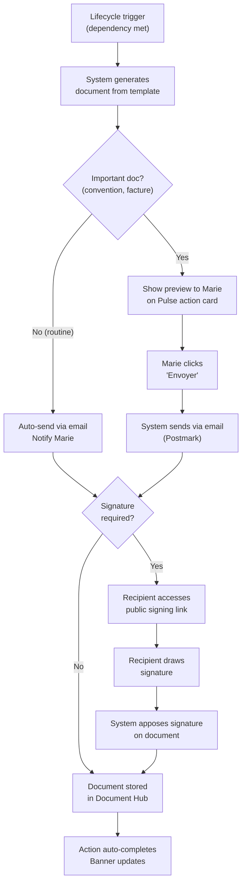
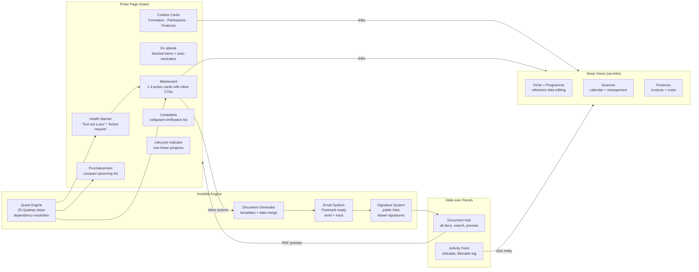

# Formation Detail Page — Ground-Up UX Redesign

## 1. Why the current design fails

The current `/formations/[id]` organizes information by **data domain**: 8 peer tabs (Aperçu, Fiche, Actions, Programme, Seances, Formateurs, Apprenants, Finances). This is a developer's mental model — it mirrors the database schema, not Marie's brain.

The foundation document is explicit:

> "When a formation manager opens a specific formation, they have ONE primary question: 'Is this formation okay or do I need to do something?' The interface must answer this question in less than 3 seconds."

> Primary Organization: **TIME + URGENCY** — not data domain, not phase, not document type.

The "Actions" tab, originally conceived as a quest tracker, became a checklist of 25+ items organized by phase — the exact anti-pattern the foundation warns against:

> "They're organized around audit structure, not user workflow — Force users to navigate by phase when they're thinking 'what's urgent?'"

**Behavioral psychology diagnosis:**

- **Hick's Law**: 8 tabs = measurable decision paralysis ("which tab has what I need?")
- **Cognitive Load**: Aperçu shows 5 blocks simultaneously (hero + 4 cards); Actions tab shows 25+ items in 3 collapsible phases
- **Zeigarnik Effect**: Showing all incomplete quests at once creates **diffuse anxiety** with no clear resolution path
- **Emotional Contagion**: Tab dots on 5/8 tabs communicate "everything is a problem" even when most issues are minor

---

## 2. The redesign principle: "The Living Pulse"

Replace 8 tabs with a **single scrolling page** organized by what matters to Marie **right now**. The page is a living pulse of the formation — it breathes with the formation's lifecycle, showing only what's relevant at this moment.

```
                    The Newspaper Metaphor (from foundation)
     ┌─────────────────────────────────────────────────┐
     │  HEADLINE: "Is this formation okay?"            │  ← 3 seconds
     │  Status banner: one sentence, one color         │
     ├─────────────────────────────────────────────────┤
     │  LEAD: "What's the story today?"                │  ← 10 seconds
     │  Maintenant section: 1-3 actionable cards       │
     ├─────────────────────────────────────────────────┤
     │  ARTICLE: "What's coming up?"                   │  ← on demand
     │  Prochainement: compact list of upcoming items  │
     │  En attente: items blocked on external parties  │
     ├─────────────────────────────────────────────────┤
     │  CONTEXT: "Quick reference data"                │  ← glanceable
     │  Formation summary, participants, finances      │
     ├─────────────────────────────────────────────────┤
     │  ARCHIVE: "What's done"                         │  ← collapsed
     │  Completed items (verify for audit)             │
     └─────────────────────────────────────────────────┘
```

**Progressive Disclosure layers (from behavioral-psychology.md):**

- **Layer 1**: Status + primary action (always visible, above fold)
- **Layer 2**: Progress details (on scroll: timeline, upcoming items)
- **Layer 3**: Full data / configuration (via links to dedicated views)

---

## 3. Information architecture

### 3.1 Route structure (4 routes, not 9)

```
/formations/[id]           → The Pulse (the main experience)
/formations/[id]/fiche     → Full formation details (reference/edit)
/formations/[id]/seances   → Session management (calendar + CRUD)
/formations/[id]/finances  → Financial management (invoices, costs)
```

**What disappeared:**

- `/actions` — Absorbed into the Pulse's "Maintenant / Prochainement / Complété" stream
- `/programme` — Absorbed into Fiche (it's reference data about the formation's content)
- `/formateurs` — Absorbed into a "Participants" section (people are people, not two tabs)
- `/apprenants` — Same: merged with formateurs into one "Participants" concept

**Why 4 routes instead of 1?**

- Fiche: Has 15+ editable fields — too much for inline editing on the Pulse
- Séances: Has a calendar/list with CRUD, emargement management — a genuinely separate workflow
- Finances: Has invoice CRUD, cost breakdowns, PDF uploads — complex enough to deserve its own space
- These 3 are **reference/management views** that Marie visits occasionally, not every day

### 3.2 Navigation between routes

No tab bar. Instead, **contextual links** from the Pulse page lead to each deep view:

- "Voir la fiche" link in the formation summary section
- "Voir toutes les seances" link in the upcoming sessions area
- "Voir le detail financier" link in the finance summary

Each deep view has a clear **"Retour a [Formation name]"** breadcrumb. This is progressive disclosure: Marie only enters a deep view when she actively wants it.

### 3.3 Why no tabs?

The foundation is clear:

> "**80% of screen space = What matters right now.** Health indicator, primary attention zone, quick actions."
>
> "**20% of screen space = Access to everything else.** Links to detailed views, secondary information."

Tabs give equal visual weight to 8 destinations. Links give 80% weight to the current view and 20% to exits. The Pulse IS the formation — the deep views are just tools Marie reaches for when needed.

---

## 4. The Pulse page — section by section

### 4.1 Header

```
← Formations                              [...] (menu)
Formation name                    [Badge: En cours]
```

- **Back navigation**: "Formations" breadcrumb link, always visible
- **Formation name**: Large, editable inline (click to rename)
- **Status badge**: The lifecycle status (A traiter / En cours / Terminee / Archivee)
- **Overflow menu** ("..."): Archive, Delete, History — destructive and rare actions hidden per Fitts's Law (small target, distant = intentional friction)

No icons competing for attention. No header action bar. Just name + status + escape route.

### 4.2 The Health Banner (answers "is it okay?" in 3 seconds)

A single full-width element immediately below the header. One sentence, one background color, one optional CTA.

**State mapping (from foundation section 5.2):**

| Formation state               | Banner copy                                               | Color        | CTA                   |
| ----------------------------- | --------------------------------------------------------- | ------------ | --------------------- |
| On track, nothing to do       | "Tout est a jour. Prochaine echeance : [item] le [date]." | Soft green   | None                  |
| Action required (not overdue) | "1 action a traiter — [Action name]"                      | Soft amber   | "Traiter"             |
| Multiple actions required     | "[N] actions a traiter — la plus urgente : [name]"        | Amber        | "Voir ci-dessous"     |
| Overdue item(s)               | "[N] action(s) en retard depuis [duration]"               | Soft red     | "Traiter maintenant"  |
| Blocked / waiting             | "En attente — [what] demande le [date]"                   | Neutral gray | "Relancer" (optional) |
| All complete                  | "Formation terminee — Dossier pret pour l'audit."         | Green        | "Voir le dossier"     |

**Design rules:**

- Never show multiple colors simultaneously (the foundation says: "The interface should feel as stressed or calm as the user should be about that item")
- The worst active state wins: overdue > action required > waiting > on track
- Copy follows French convention: verb-first, specific, no false urgency
- The banner is **the emotional anchor** of the page — it sets Marie's stress level for this formation

**Psychological grounding:**

- **Loss Aversion**: "En retard" framing only for genuinely overdue items — not for "could be improved"
- **Emotional Contagion**: Green banner = calm arrival. The page "smells" reassuring before Marie reads a word
- **Peak-End Rule**: This banner is Marie's first impression (peak) — make it honest and calming when things are fine

### 4.3 "Maintenant" — What needs doing NOW

Directly below the health banner. Shows **only items that need Marie's action today or are overdue**. If nothing needs doing, this section doesn't appear (foundation: "If nothing needs doing, confirmation is the feature").

Each item is an **action card** — not a checklist line. An action card contains:

```
┌─────────────────────────────────────────────────────┐
│  Convention a signer                                │
│  Qualiopi ind. 6 — Formalise l'engagement client    │
│                                                     │
│  [Televerser le document]        [Marquer comme fait]│
└─────────────────────────────────────────────────────┘
```

**Card anatomy:**

- **Title**: The action in plain French (not quest terminology)
- **Context line**: Why this matters — one sentence connecting to Qualiopi indicator. This teaches Qualiopi through use (foundation 4.7). Uses muted text, not a badge grid.
- **Inline CTA(s)**: The actual thing Marie can do — upload, mark done, navigate to the relevant deep view. **No more than 2 CTAs per card** (Hick's Law).
- **Due date** if approaching or overdue: "Echeance : 5 avril" or "En retard de 3 jours" in amber/red

**What qualifies for "Maintenant"?**

- Items with status "En cours" or "Pas commence" whose dependencies are met AND whose due date is within 7 days or past
- Overdue items (always)
- Items the system has flagged (e.g., missing emargement for a past session)

**Maximum items shown**: 3. If more exist, show top 3 by urgency + a subtle "+N autres actions" expandable. This directly addresses cognitive load — Marie can hold 3-4 chunks, not 8.

**Inline actions — key innovation:**
Instead of "click Faire → navigate to Actions tab → find the quest → read the detail → find the sub-task → do it," the Pulse lets Marie **do the thing right here**:

- Upload a document? File picker appears inline.
- Mark as done? One click, with a brief confirmation animation.
- Need to go somewhere (assign a formateur, plan a seance)? The CTA is a link to the specific deep view, not to a generic tab.

This cuts the typical flow from 4 clicks to 1-2.

### 4.4 "Prochainement" — What's coming

A compact list of upcoming items (next 2-4 weeks). Not action cards — just **scannable lines**:

```
Prochainement
─────────────────────────────────────────
  Envoi des convocations                    dans 12 jours
  Seance 1 — Module Introduction            15 avr.
  Test de positionnement a envoyer          dans 18 jours
```

- Minimal: title + relative or absolute date
- Click to expand for detail (title, one-line description, who's responsible)
- No CTAs unless the item can be started early
- If empty: section doesn't appear (no "Aucun element" — that's noise)

**Purpose**: Reduces Zeigarnik anxiety by showing Marie the future is under control, without creating premature open loops. Items here are **informational**, not actionable yet.

### 4.5 "En attente" — Blocked items

Items where Marie has done her part and is waiting on someone else (client, OPCO, formateur, stagiaire):

```
En attente
─────────────────────────────────────────
  Accord OPCO                 demande le 10 mars (13 jours)
  ↳ Auto-rappel envoye le 20 mars. [Relancer manuellement]
```

- Shows what's blocked, since when, and any automated follow-up the system has done
- Optional manual action: "Relancer" (send reminder)
- Foundation section 5.2: "User need: Know it's not their fault + know when to follow up"
- Emotional valence: gray/neutral color — this is not Marie's problem, the UI communicates patience

### 4.6 Formation context cards (glanceable reference)

Below the action stream, a row of **minimal summary cards** providing key reference data. These replace the Apercu's 4-card grid but with even less information — just enough to glance at.

```
┌─────────────────┐ ┌─────────────────┐ ┌─────────────────┐
│ Formation       │ │ Participants    │ │ Finances        │
│ Presentiel      │ │ 4 apprenants    │ │ 5 200 EUR        │
│ 14h · 2 jours   │ │ 1 formateur     │ │ Marge: 35 %     │
│ 15-16 avr.      │ │                 │ │ Financement OK  │
│ [Voir la fiche] │ │ [Gerer]         │ │ [Detail]        │
└─────────────────┘ └─────────────────┘ └─────────────────┘
```

**Design rules:**

- Maximum 3 cards, 3 data points each + 1 link
- No empty dashes ("—") — if data is missing, show a gentle prompt: "Lieu non renseigne" with a link to Fiche
- Participants merges formateurs + apprenants into one card (they're "people involved in this formation")
- Finance card shows the number Marie cares about (montant + marge), not a breakdown
- Each card links to the relevant deep view

### 4.7 "Completed" — Audit verification (collapsed)

At the bottom, a **collapsed** section showing what's been done:

```
Completes (8/15)                              [Deployer ▾]
```

When expanded:

```
Completes (8/15)                              [Replier ▴]
─────────────────────────────────────────
  ✓ Reception de la demande          12 janv.
  ✓ Analyse des besoins              15 janv.
  ✓ Programme valide                 20 janv.
  ✓ Devis envoye et accepte         25 janv.
  ✓ Convention signee                1 fevr.
  ...
```

**Purpose**: Marie almost never needs this — but when audit anxiety strikes ("Am I sure everything is done?"), she can verify in one scroll. The collapsed state respects foundation principle 4.5 (progressive disclosure) and reduces Zeigarnik tension by not showing completed items by default.

Each completed item can be expanded to show the proof (uploaded document, completion date, who did it). This is the "archive" layer of the newspaper metaphor.

### 4.8 Lifecycle progress indicator (subtle, educational)

A thin, horizontal progress bar or step indicator somewhere above the action stream (below the banner, or integrated into it):

```
   Conception ━━━━━━●━━  Deploiement ─────  Evaluation ─────
```

- Shows where the formation is in its lifecycle
- Not interactive, not clickable — purely informational
- Teaches Qualiopi structure implicitly (foundation 4.7)
- Thin and subtle — it's context, not a navigation element
- Updates automatically as quests complete

---

## 5. The deep views

### 5.1 Fiche (formation reference data + programme)

Currently split across Fiche + Programme tabs. In the redesign, these merge into one "Fiche" view because they're both **reference data about what this formation is**.

**Layout**: A clean form-like page with sections:

1. Informations generales (nom, type, modalite, duree, description, thematique)
2. Programme et modules (programme source + module list with CRUD)
3. Logistique (dates, lieu, client)
4. Financement (type, montant, statut)

All fields editable inline. No submit button — save on blur (current pattern, which works).

**Navigation**: `← Retour a [Formation name]` at the top.

### 5.2 Seances (session management)

Keeps its calendar/list dual view. This is a genuinely complex management interface that deserves its own space.

**Key improvement**: When Marie navigates here from a Pulse action card (e.g., "Emargement manquant pour la seance du 15 avril"), the relevant session should be pre-highlighted or scrolled to.

### 5.3 Finances (invoices and costs)

Keeps its current structure (revenue, costs, invoices). Marie visits this occasionally for invoicing or to check margins.

**Key improvement**: The Pulse finance card already shows the key numbers. This view is for when Marie needs to create an invoice, upload a PDF, or review cost details.

### 5.4 People management

Instead of two separate tabs (Formateurs, Apprenants), people are managed through:

- The **Participants card** on the Pulse (quick view: names + count)
- A **slide-over panel or modal** for adding/removing people (not a full-page route)
- For formateur cost management, link to Finances or an expanded formateur section

This reduces the number of "places" Marie has to remember. People are an attribute of the formation, not a separate destination.

---

## 6. User flow comparisons

### Flow 1: "Is this formation okay?" (Marie's daily check)

| Step      | Current (8 tabs)                                             | Redesign (Pulse)                      |
| --------- | ------------------------------------------------------------ | ------------------------------------- |
| 1         | Open formation, land on Apercu                               | Open formation, land on Pulse         |
| 2         | Scan hero card (next action)                                 | Read health banner: "Tout est a jour" |
| 3         | Scan 4 info cards                                            | Done. Close and move on.              |
| 4         | Notice dots on 3 tabs                                        | —                                     |
| 5         | Wonder what each dot means                                   | —                                     |
| 6         | Mental assembly: "probably okay but let me check Actions..." | —                                     |
| **Total** | **~10-15 seconds, 6 mental steps**                           | **~2-3 seconds, 1 mental step**       |

### Flow 2: "Do the next thing" (Convention a signer)

| Step      | Current                              | Redesign                              |
| --------- | ------------------------------------ | ------------------------------------- |
| 1         | Land on Apercu, read hero            | Land on Pulse, read banner            |
| 2         | Click "Faire"                        | See action card in "Maintenant"       |
| 3         | Navigate to Actions tab              | Click "Televerser" on the card        |
| 4         | Quest tracker loads, action selected | Upload dialog opens inline            |
| 5         | Read action detail panel             | Select file, upload                   |
| 6         | Find the sub-task with upload        | Action auto-completes, banner updates |
| 7         | Click upload button                  | Done.                                 |
| 8         | Select file                          | —                                     |
| 9         | Upload completes                     | —                                     |
| **Total** | **9 steps, 2 navigations**           | **4 steps, 0 navigations**            |

### Flow 3: "Audit check — is everything in order?"

| Step      | Current                                    | Redesign                                 |
| --------- | ------------------------------------------ | ---------------------------------------- |
| 1         | Land on Apercu                             | Land on Pulse                            |
| 2         | Check hero for overall status              | Read banner (overall health)             |
| 3         | Click Actions tab                          | Scroll to "Completes" section            |
| 4         | Expand each phase                          | Expand, scan all checkmarks              |
| 5         | Scan 25+ items across 3 phases             | Click any item to see uploaded proof     |
| 6         | Click individual items for proof           | Done.                                    |
| **Total** | **6+ steps, 1 navigation, heavy scanning** | **4 steps, 0 navigations, focused scan** |

---

## 7. Edge cases (per ux-reviewer skill)

### Empty state: brand new formation (zero data)

```
┌─ Health banner ─────────────────────────────────────┐
│  Commencez par completer la fiche de la formation.  │
│  [Completer la fiche]                               │
└─────────────────────────────────────────────────────┘

Maintenant
  ┌────────────────────────────────────────────────┐
  │  Completer les informations de base            │
  │  Renseignez le programme, les dates et la      │
  │  modalite pour demarrer le suivi Qualiopi.     │
  │  [Ouvrir la fiche]                             │
  └────────────────────────────────────────────────┘
```

No scary empty tables, no "Aucune donnee" repeated 8 times across 8 tabs. One clear path forward.

### Error state: upload fails

Toast notification (not inline error): "Le fichier n'a pas pu etre televerse. Reessayez." with a retry button. The card remains in its current state — no jarring layout shift.

### Blocked state: waiting on OPCO

The "En attente" section clearly says: **what** is blocked, **since when**, and **what the system has done** (auto-reminder). Marie sees this is not her fault. Foundation 5.2: "User need: Know it's not their fault."

### Mobile: thumb zone compliance

- Health banner: full-width, tappable CTA in thumb zone
- Action cards: full-width, CTAs at bottom of card (thumb-reachable)
- No horizontal tab bar to scroll
- "Prochainement" items: tall enough for 44px touch targets
- Overflow menu: top-right (reachable but intentionally distant for destructive actions)

### Interruption recovery

Marie leaves mid-task and returns. The Pulse shows exactly where she left off — the "Maintenant" section reflects the current state. No need to remember which tab she was on.

---

## 8. What the quest system becomes

The 25 Qualiopi workflow steps from [docs/qualiopi-formation-workflow.md](docs/qualiopi-formation-workflow.md) remain as the **invisible engine**. They:

- Power the "Maintenant / Prochainement / En attente / Complete" categorization
- Determine which actions are available (dependency resolution)
- Calculate the health banner state
- Drive the lifecycle progress indicator
- Generate contextual Qualiopi indicator references on action cards

But the user **never sees** "Quest Q05" or "Phase Conception." They see: "Convention a signer — Qualiopi exige ce document (ind. 6)." The machine complexity is hidden; the human experience is simple.

The "level up toast" when a phase completes? Replace with something subtler and more meaningful: a brief inline message — "Phase Conception terminee. La formation passe en Deploiement." — that appears in the action stream and fades after acknowledgement. Not gamification, but **recognition of progress** (foundation 4.4).

---

## 9. Visual language summary

| Element             | Treatment                                                                            |
| ------------------- | ------------------------------------------------------------------------------------ |
| Health banner       | Full-width, background color communicates state (green/amber/red/gray), one sentence |
| Action cards        | White cards with subtle border, generous padding, max 2 CTAs                         |
| Prochainement items | Compact rows, muted text, date aligned right                                         |
| Context cards       | 3-column grid, minimal data, one link each                                           |
| Completed section   | Collapsed by default, expandable, checkmark + title + date                           |
| Progress indicator  | Thin horizontal bar, subtle, non-interactive                                         |
| Deep view links     | Inline text links (not buttons), subordinate to action CTAs                          |
| White space         | Generous everywhere — the foundation says "success is less time in the app"          |

**Color palette:**

- Green (#22c55e family): on track, completed — used sparingly, communicates calm
- Amber (#f59e0b family): attention needed — used for approaching deadlines
- Red (#ef4444 family): overdue — used rarely and only for genuine urgency
- Gray/neutral: waiting, informational, secondary — the dominant color
- No color: most of the page. White space is confidence.

---

## 10. How this respects every foundation principle

| Foundation principle            | How the Pulse delivers it                                                             |
| ------------------------------- | ------------------------------------------------------------------------------------- |
| 4.1 Status-first                | Health banner is the first thing, always                                              |
| 4.2 Proactive intelligence      | "Maintenant" surfaces what needs attention before Marie asks                          |
| 4.3 Context-appropriate urgency | Color + urgency sections (Maintenant vs Prochainement) reflect actual urgency         |
| 4.4 Reward completion           | Phase transitions acknowledged; "Completes" section grows; green banner when on track |
| 4.5 Progressive disclosure      | Banner → Actions → Timeline → Context → Archive (5 layers of depth)                   |
| 4.6 Smart defaults              | One page, zero configuration, no tabs to choose from                                  |
| 4.7 Educational through use     | Qualiopi indicator references on action cards teach compliance naturally              |
| 4.8 Peace of mind               | Green banner + "nothing to do" = Marie closes and goes home                           |
| 5.1 "Is this okay?" in 3s       | Banner answers in 1 sentence                                                          |
| 5.2 Three states                | Mapped directly to banner states (On track / Needs attention / Blocked)               |
| 5.3 Time + urgency primary      | Maintenant / Prochainement / En attente / Completes                                   |
| 5.5 80/20 visual hierarchy      | 80% = banner + action stream. 20% = context cards + links                             |
| 6.2 No dashboard fallacy        | No charts, no metrics grid — one health indicator + actions                           |
| 6.2 No completionist anxiety    | Only "Maintenant" items shown as actionable; future hidden                            |
| 6.2 No expert assumption        | Plain French, Qualiopi references as context not jargon                               |

---

## 11. The Document Generation Engine

### 11.1 Philosophy: "Near-zero upload"

The foundation's magic wand test asks: "If the user had a magic wand, would they want the app to do this for them?" For every document in the Qualiopi lifecycle, the answer is yes. Marie should almost never need to find a file on her computer and upload it. The app knows the formation data, the people, the org info — it can generate the document itself.

**What the app generates:**

| Document                           | Qualiopi quest | Data sources                                                   | Trigger                                                  |
| ---------------------------------- | -------------- | -------------------------------------------------------------- | -------------------------------------------------------- |
| Convention de formation            | Q05            | Formation fiche + client info + org settings                   | Programme + devis validated                              |
| Convocation                        | Q08            | Formation dates/lieu + apprenants list + org settings          | Convention signed + learners added                       |
| Reglement interieur                | Q08b           | Org-level static template + org settings                       | With convocation                                         |
| Test de positionnement             | Q09            | Programme objectives + template                                | Convocations sent                                        |
| Feuilles d'emargement              | Q11            | Session date/time + apprenants list + formateur + org settings | Per session, generated automatically before session date |
| Certificat de realisation          | Q17            | Formation info + apprenant + emargement data + org settings    | All sessions completed                                   |
| Attestation de fin de formation    | Q18            | Formation info + apprenant + evaluation results + org settings | Evaluation completed                                     |
| Facture                            | Q19            | Formation financials + client/OPCO info + org settings         | Certificats generated                                    |
| Questionnaire satisfaction a chaud | Q16            | Formation + template                                           | Last session day                                         |
| Questionnaire satisfaction a froid | Q21            | Formation + template                                           | 1-3 months post-formation                                |

**What Marie might still upload manually (rare cases):**

- External documents from third parties (OPCO accord letter, if no API)
- Supplementary materials the system can't generate (custom evaluation grids, specialized course materials from the formateur)
- Scans of legacy paper-signed documents

### 11.2 Document lifecycle on the Pulse

An action card for a generatable document looks fundamentally different from an upload card:

**Step 1 — Ready to generate:**

```
Convention a generer
Toutes les informations necessaires sont reunies.
Qualiopi ind. 6 — Formalise l'engagement contractuel.
[Generer et previsualiser]
```

**Step 2 — Generated, awaiting review (for important docs):**

```
Convention generee — a verifier
Generee le 15 mars a partir des donnees de la fiche.
[Previsualiser]  [Envoyer au client pour signature]
```

**Step 3 — Sent, awaiting signature:**

```
Convention envoyee — en attente de signature
Envoyee a Marie Durand (Client SAS) le 15 mars.
[Voir le document]  [Relancer]
```

**Step 4 — Signed, complete:**

```
✓ Convention signee le 18 mars
   par Marie Durand (Client SAS)
   [Voir le document signe]
```

For routine documents (convocations, emargements), steps 1-2 are automatic:
the system generates and sends without requiring Marie's review, then notifies her.

### 11.3 The generation flow



### 11.4 Workspace settings (prerequisite)

Document generation requires org-level information. Since workspace settings partially exist, they need to be completed with:

- **Legal identity**: Nom legal, SIRET/SIREN, numero de declaration d'activite, adresse du siege
- **Contact**: Telephone, email general, site web
- **Branding**: Logo (used on all generated documents)
- **Signataire par defaut**: Nom + titre du dirigeant (for conventions, certificats)
- **Reglement interieur**: The full text (used as-is in the generated document)
- **Templates de questionnaire**: Questions for satisfaction a chaud / a froid (fixed best-practice defaults, but the org may want to review them once)

The first time Marie tries to generate a document and required org info is missing, the Pulse action card shows:

```
Convention a generer
⚠ Informations manquantes pour generer ce document.
   Completez les parametres de l'organisme.
   [Completer les parametres]
```

This links to the workspace settings page. Once filled, it's never asked again.

### 11.5 Fixed templates

Templates are built into the app — one per document type, following legal best practices. Marie does not customize them. The system fills them with:

- Org info (from workspace settings)
- Formation info (from fiche: dates, duree, modalite, programme, objectifs)
- People info (from formation participants: names, companies, roles)
- Financial info (from fiche/finances: montant, conditions)
- Dynamic content (emargement lists generated per session, evaluation results per apprenant)

---

## 12. The Document Hub (slide-over panel)

### 12.1 Design

Instead of a 5th route, the Document Hub is a **slide-over panel** accessible from any formation view via a persistent button in the formation header:

```
← Formations
Formation name    [Badge]    📄 Documents    🕐 Historique    [...]
```

Both Documents and Historique are slide-over panels, always accessible regardless of which view Marie is on.

### 12.2 Document panel content

```
┌──────────────────────────────────────────────┐
│ Documents (12)                        [×]    │
│──────────────────────────────────────────────│
│ 🔍 Rechercher...                             │
│                                              │
│ Contractuels                                 │
│  ✓ Convention de formation                   │
│    Signee le 18 mars · PDF · 2 pages         │
│  ✓ Devis #D-2026-015                         │
│    Accepte le 10 mars · PDF                  │
│                                              │
│ Pedagogiques                                 │
│  ✓ Programme de formation                    │
│    Valide · PDF · 4 pages                    │
│  ○ Test de positionnement                    │
│    Genere · envoye le 22 mars                │
│                                              │
│ Suivi                                        │
│  ✓ Convocation (4 apprenants)                │
│    Envoyee le 20 mars                        │
│  ◐ Emargement — Seance 1 (15 avr.)          │
│    3/4 signatures recueillies                │
│  ○ Emargement — Seance 2 (16 avr.)          │
│    Pas encore genere                         │
│                                              │
│ Financiers                                   │
│  ✓ Facture #F-2026-042                       │
│    Payee le 25 mars · 5 200 EUR              │
│  ✓ Certificat de realisation (x4)            │
│    Generes le 20 mars                        │
│                                              │
│ Autres (televersements manuels)              │
│  ✓ Accord OPCO — scan                        │
│    Televerse le 5 mars                       │
└──────────────────────────────────────────────┘
```

**Interactions:**

- Click any document → **PDF preview modal** (inline viewer, not a download)
- Each document shows: name, status (genere / envoye / signe / archive), date, quick metadata
- Search filters by name, type, or status
- "Televerser un document" button at the bottom for rare manual uploads

### 12.3 PDF preview

When Marie clicks any document (generated or uploaded), a modal opens with:

- Full PDF preview (rendered inline, scrollable)
- Document metadata: type, generation date, recipients, signature status
- Actions: Download, Regenerer (if data changed), Envoyer/Renvoyer
- For signed documents: signature overlay visible on the PDF

---

## 13. Email communications & tracking

### 13.1 Communication types and approval rules

| Communication             | Trigger                                      | Auto or Review?    | Recipients             |
| ------------------------- | -------------------------------------------- | ------------------ | ---------------------- |
| Convocation               | Convention signed + learners confirmed       | Auto (routine)     | Each apprenant         |
| Reglement interieur       | With convocation                             | Auto               | Each apprenant         |
| Test de positionnement    | After convocation                            | Auto               | Each apprenant         |
| Rappel emargement         | Session J-1                                  | Auto               | Formateur + apprenants |
| Convention pour signature | Marie clicks "Envoyer"                       | Review (important) | Client signataire      |
| Facture                   | Marie clicks "Envoyer"                       | Review (important) | Client / OPCO          |
| Relance OPCO              | Marie clicks "Relancer" or auto after N days | Configurable       | OPCO contact           |
| Satisfaction a chaud      | Last session day                             | Auto               | Each apprenant         |
| Satisfaction a froid      | +60 jours post-formation                     | Auto               | Each apprenant         |
| Certificat de realisation | Generated post-formation                     | Review             | Client / OPCO          |
| Attestation de fin        | Generated post-formation                     | Review             | Each apprenant         |

### 13.2 How communications appear on the Pulse

On action cards, the most recent communication status shows inline:

```
Convocation envoyee
Envoyee a 4 apprenants le 20 mars.
Jean Dupont a ouvert le lien · 2 en attente de lecture.
```

This gives Marie confidence that things are happening without her having to dig.

### 13.3 Communication log in History

All emails are logged in the enhanced History panel (section 14). Marie can filter the History to show "Communications seulement" to see a full list of everything the system sent on behalf of this formation.

### 13.4 Designing for Postmark (future-ready)

The UX design assumes:

- **Send tracking**: "Envoye le [date] a [heure]"
- **Delivery tracking**: "Delivre" (Postmark webhook)
- **Open tracking**: "Ouvert par [nom]" (Postmark open tracking — optional, with privacy consideration)
- **Bounce handling**: "Echec d'envoi a [email] — adresse invalide" → surface as an alert on the Pulse

Even before Postmark integration, the app records the intent ("Convocation envoyee a 4 apprenants") so the tracking foundation is in place.

---

## 14. Enhanced History (Activity Feed)

### 14.1 Design

The History slide-over (accessible from the formation header alongside Documents) becomes a rich, clickable activity feed:

```
┌──────────────────────────────────────────────┐
│ Historique                            [×]    │
│──────────────────────────────────────────────│
│ Filtrer: [Tout ▾] [Actions ▾] [Documents ▾] │
│          [Communications ▾] [Personnes ▾]   │
│                                              │
│ Aujourd'hui                                  │
│                                              │
│ 14:32  Convention signee                     │
│        par Marie Durand (Client SAS)         │
│        📄 Voir le document signe             │
│        👤 Marie Durand                       │
│                                              │
│ 11:15  Convocation envoyee                   │
│        a 4 apprenants                        │
│        ✉ Voir l'email                        │
│        👥 J. Dupont, L. Martin, +2           │
│                                              │
│ Hier                                         │
│                                              │
│ 16:45  Jean Dupont ajoute comme formateur    │
│        TJM: 650 EUR · 2 jours prevus         │
│        👤 Voir le profil                     │
│                                              │
│ 10:20  Programme valide                      │
│        3 modules · 14 heures                 │
│        📄 Voir le programme                  │
│                                              │
│ 15 mars                                      │
│                                              │
│  9:00  Formation creee                       │
│        depuis le deal #D-042                 │
│        🔗 Voir le deal                       │
│                                              │
└──────────────────────────────────────────────┘
```

### 14.2 Clickable entities

Every history entry that references an entity provides a clickable link:

| Entity type                                   | Click action                                                      |
| --------------------------------------------- | ----------------------------------------------------------------- |
| Person (formateur, apprenant, client contact) | Navigate to their profile/CRM fiche                               |
| Document                                      | Open PDF preview modal                                            |
| Email/Communication                           | Show email content in a modal (subject, body, recipients, status) |
| Deal                                          | Navigate to deal page                                             |
| Session/Seance                                | Navigate to seances view, scrolled to that session                |
| Formation field change                        | Show before/after values inline                                   |

### 14.3 Entry types and what they log

- **Status changes**: Formation status transitions, action completions
- **People changes**: Formateur/apprenant added or removed (with name + avatar)
- **Document events**: Generated, sent, signed, uploaded, downloaded
- **Communications**: Every email sent, with recipients and status
- **Data edits**: Field changes on the fiche (with before/after)
- **Financial events**: Invoice created, payment received, OPCO accord
- **Phase transitions**: "Formation passee en Deploiement" with brief celebration

---

## 15. Emargement — formateur signing

### 15.1 Current gap

The current system provides public signing links for apprenants (learners) only. Formateurs must also sign emargement sheets — both legally and for Qualiopi compliance. Each emargement sheet requires **two sets of signatures**: all attending apprenants + the formateur, per half-day.

### 15.2 Redesign

For each session, the system generates an emargement sheet with:

- Session metadata (date, time, module, location)
- List of apprenants with signature slots (AM + PM)
- Formateur signature slot (AM + PM)
- Org info + logo from workspace settings

**Public links:**

- One link per apprenant per session: `emargement.mentore.app/s/{token}` — the apprenant draws their signature for AM and PM
- One link per formateur per session: `emargement.mentore.app/f/{token}` — the formateur draws their signature

**The generated emargement PDF** shows all collected signatures composited onto the official sheet. As signatures come in, the document updates automatically.

**On the Pulse:**

```
Emargement — Seance du 15 avril
3/4 apprenants ont signe · Formateur: en attente
[Voir la feuille]  [Envoyer un rappel]
```

**Auto-reminders:**

- J-1 before session: email to formateur + apprenants with their signing links
- J+1 after session: reminder to anyone who hasn't signed
- J+3: escalation to Marie via the Pulse ("Emargement incomplet depuis 3 jours")

---

## 16. Lifecycle progress — embracing chaos

### 16.1 The real-life problem

The Qualiopi lifecycle diagram suggests a clean linear flow: Conception → Deploiement → Evaluation. In reality, Marie's work is messier:

- She might assign a formateur (Q09c, Conception) while already scheduling sessions (Deploiement)
- An OPCO accord might arrive late, after sessions have started
- A learner might be added mid-formation
- A document from Phase 1 might need to be regenerated because data changed

### 16.2 The design response

The lifecycle indicator is **not a strict gate**. It's an orientation tool showing the **dominant phase** and **overall progress**:

```
   Conception ━━━━━━━━●   Deploiement ━━━━━━━   Evaluation ━━━━━
                         ↑ mostly here
   11/15 etapes completees
```

- The filled portion represents completed steps across ALL phases (not just sequential)
- The marker shows where the **majority of current work** falls
- Items from any phase can appear in "Maintenant" — the system doesn't block Marie from working out of order
- Dependencies are soft: "Convention a signer" is suggested before "Envoyer les convocations," but if Marie has a reason to reorder, the system allows it with a gentle note: "La convention n'est pas encore signee — les convocations seront envoyees sans reference contractuelle."

### 16.3 Phase transitions

When a phase's core items are complete, a brief inline celebration appears in the action stream:

```
┌─────────────────────────────────────────────────────┐
│  ✓ Phase Conception terminee                        │
│  9 etapes completees. La formation entre en         │
│  phase de Deploiement — prochaine echeance :        │
│  Seance 1 le 15 avril.                              │
│                                           [Compris] │
└─────────────────────────────────────────────────────┘
```

This is not a popup or a toast — it's a card in the "Maintenant" stream that Marie acknowledges and then it moves to "Complete." The Peak-End rule: make the transition feel like a small victory, not just a status change.

---

## 17. Updated route structure

```
/formations/[id]           → The Pulse (main experience)
/formations/[id]/fiche     → Formation reference data + programme (merged)
/formations/[id]/seances   → Session management (calendar + CRUD + emargement)
/formations/[id]/finances  → Financial management (invoices, costs)
```

**Plus two persistent slide-over panels (accessible from any route):**

- **Documents panel**: Centralized document hub with search, categories, PDF preview
- **History panel**: Enhanced activity feed with clickable entities and communication log

**People management** (formateurs + apprenants): Handled via the Participants context card on the Pulse, with add/remove in modals. Formateur cost details accessible from Finances. No dedicated route — people are an attribute of the formation, not a separate destination.

---

## 18. The complete system map


