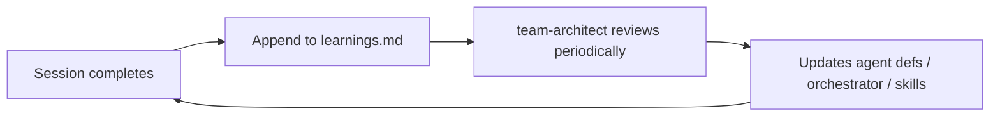

# Project Tracking Refactor for Agent Efficiency

## Problem

Agents read ~2,500 tokens across 4 files just to find the next work item. There are no ticket IDs, no agent assignment, no plan-to-ticket linking, and the orchestrator has no concept of "what to work on next." Agents can also silently ignore soft instructions ("only read the frontmatter") leading to token waste and drift.

## Architecture Principles

These principles govern every design choice in this system:

1. **Mechanical constraints > instructional constraints.** Don't tell agents "only read X" -- give them a script that physically returns only X. Don't tell agents "keep board in sync" -- derive the board from ticket files via a script. Deterministic scripts eliminate AI interpretation errors.

2. **Progressive disclosure.** Information is layered by cost. Each layer is only read when needed:
   - Layer 0: `board.md` (~50 tokens) -- "what exists?"
   - Layer 1: `tickets/T-N.md` (~100 tokens) -- "what is this ticket?"
   - Layer 2: Plan frontmatter (~50 tokens, extracted by script) -- "what's the progress?"
   - Layer 3: Full plan body (~500 tokens) -- "what's the implementation approach?"
   - Layer 4: Decision doc (~1,000-4,000 tokens) -- "what were the design decisions?"
   Agents must not jump layers. The orchestrator reads Layer 0-1 at pickup. Layers 2+ are read only during the relevant phase.

3. **Single source of truth.** Every fact lives in exactly one place. Ticket YAML is authoritative for status, priority, and all ticket fields. The board is a **derived artifact** regenerated by script -- never edited manually. No sync, no drift.

4. **Lean orchestrator, rich skill.** The orchestrator rule is `alwaysApply: true` (~1,140 tokens loaded into every conversation). Detailed ticket operations live in the `project-tracker` skill (loaded on-demand). The orchestrator adds ~15 lines of references, not ~60 lines of logic.

## Design Decisions

Validated through 4 rounds of questions:

1. **Format**: Machine-first, minimal tokens. YAML frontmatter for structured fields, minimal Markdown body.
2. **File structure**: Two-tier -- derived board index + individual ticket files.
3. **Plan location**: Cursor-native (`~/.cursor/plans/` for Cursor 3, `.cursor/plans/` for legacy). Ticket `plan` field stores the filename slug (location-agnostic).
4. **Autonomous scope**: Orchestrator auto-picks highest-priority ticket, pauses with one-line confirmation, then runs autonomously with pauses only at existing phase gates.
5. **Migration**: Full migration of backlog items. Shipped items get `T-S` prefix IDs and go to `done/`. Selective plan linking.
6. **Agent writes**: Orchestrator runs `scripts/board.sh` after ticket changes. Subagents append to ticket `## log`. Project-manager handles ticket creation/archival/changelog.
7. **Team artifacts**: Keep `docs/team-artifacts/`, link via ticket IDs in filenames, orchestrator passes specific artifact paths to subagents. English language, preserving French user-facing terms.

## File Structure

```
docs/project/
  board.md              # DERIVED -- regenerated by scripts/board.sh, never edited manually
  changelog.md          # append-only shipped history
  roadmap.md            # ultra-compact, ~15 lines
  learnings.md          # append-only, one line per session learning (self-improvement loop)
  tickets/
    T-1.md ... T-N.md   # one file per actionable ticket (source of truth)
    done/               # completed tickets (T-N.md moved here, plus T-S*.md for historical)
  _archive/             # old backlog.md, current-sprint.md, shipped.md

scripts/
  board.sh              # regenerates board.md from ticket YAML (deterministic)
```

## board.md (derived artifact, ~50 tokens)

Generated by `scripts/board.sh`. Agents read this; agents never write to it directly. After any ticket status change, the agent runs `scripts/board.sh` to regenerate.

```markdown
# Board

## sprint
T-1 P1 Fix price formatting on documents
T-2 P1 Add timezone to date formatting
T-3 P2 Exhaustive switch for DocumentType
T-4 P2 Type pdfmake import
T-5 P2 Optimize certificat emargements query

## backlog
T-9 P1 Document lifecycle states
T-10 P1 Contextual generation prompts
T-6 P2 RLS: scope formation_documents to workspace
T-7 P2 RLS: scope formation-documents bucket to workspace
T-11 P2 Phase grouping in Documents tab
T-8 P3 Logo WebP/SVG to PNG conversion
```

Sorted by priority within each status group. No legends, no tables, no separators. If board exceeds 40 lines, P3 backlog items are excluded (they exist in ticket files but not on the board).

### scripts/board.sh

```bash
#!/usr/bin/env bash
set -euo pipefail
root="$(git rev-parse --show-toplevel)"
dir="$root/docs/project/tickets"
out="$root/docs/project/board.md"

emit() {
  local status="$1"
  for f in "$dir"/T-*.md; do
    [ -f "$f" ] || continue
    local id s p t
    id=$(awk -F': ' '/^id:/{print $2; exit}' "$f")
    s=$(awk -F': ' '/^status:/{print $2; exit}' "$f")
    p=$(awk -F': ' '/^priority:/{print $2; exit}' "$f")
    t=$(awk -F': ' '/^title:/{print $2; exit}' "$f")
    [ "$s" = "$status" ] && printf '%s %s %s\n' "$id" "$p" "$t"
  done | sort -t' ' -k2,2
}

{ echo "# Board"
  echo ""
  echo "## sprint"
  emit sprint
  echo ""
  echo "## backlog"
  emit backlog
} > "$out"
```

This eliminates board-to-ticket drift entirely. The script is fast (reads only YAML frontmatter lines via `awk`, not full files).

## Ticket File Format

Example: `docs/project/tickets/T-1.md`

```yaml
---
id: T-1
title: Fix price formatting on documents
status: sprint
priority: P1
type: bug
estimate: small
chunk: 1
blocked_by: []
plan: null
decision: "2026-04-07-document-generation-system"
created: 2026-04-08
assignee: null
artifacts: []
---
Amounts display "2/ 600€" instead of "2 600,00 €" in devis and convention pricing.

## acceptance
- Prices format as "2 600,00 €" on all generated PDFs
- Verified on devis, convention, and all price-displaying templates

## log
```

### Fields

- `status`: `sprint`, `backlog`, `in_progress`, `done`
- `type`: `bug`, `feature`, `tech-debt`, `security`, `docs`
- `estimate`: `small` (1 session), `medium` (2-3 sessions), `large` (full feature cycle). Set during brainstorm. Helps orchestrator decide batching.
- `blocked_by`: list of ticket IDs (e.g., `[T-1, T-2]`). Orchestrator skips blocked tickets during pickup.
- `plan`: filename slug (e.g., `chunk_1_implementation_4fd2722e`). Location-agnostic.
- `decision`: slug of decision doc in `docs/decisions/`. Metadata for traceability -- NOT read at pickup (only read during Phases 1-2).
- `assignee`: set by orchestrator at pickup (e.g., `"session-2026-04-08"`).
- `artifacts`: paths to team-artifact files for this ticket.
- `## acceptance`: top 5-7 criteria inline. For complex features, reference a spec file.
- `## log`: append-only. `- {date} {agent}: {summary}`

## Plan-to-Ticket Linking

In plan frontmatter (wherever Cursor stores it), add:

```yaml
ticket: T-1
```

Bidirectional:
- Ticket -> Plan: `plan` field in ticket YAML
- Plan -> Ticket: `ticket` field in plan YAML
- Full chain: **Ticket -> Plan -> Todo -> Agent/Session**

## changelog.md

```markdown
# Changelog

## 2026-04-08
- T-S1 Convention fix: participant count + pricing
- T-S2 3 new PDF templates (feuille_emargement, devis, ordre_mission)
- T-S3 Email relance templates + ctaUrl
```

Shipped items use `T-S` prefix IDs to keep the main `T-N` sequence clean.

## roadmap.md (~15 lines)

```markdown
# Roadmap

## Current: Bug Fixes + Chunk 2 Prep
Branch: feat/formations-v2. Sprint tickets: see board.md.

## Upcoming
- Chunk 2: Document lifecycle + Documents tab UX (requires brainstorm)
- Chunk 3: Auto-generation triggers (requires Chunk 2)
- Chunk 4: Deal devis + formation inheritance (requires Chunk 1)
- Chunk 5: Attestation + evaluation tracking (requires evaluation feature)

## Parallel
- Postmark webhooks
- RLS hardening
```

## learnings.md (self-improvement loop)

```markdown
# Learnings

Append-only. One line per insight discovered during development.

- 2026-04-08 T-S1: Locale-aware number formatting needed for French currency (not just toFixed)
- 2026-04-08 T-S2: pdfmake CJS via createRequire works but needs typed wrapper
```

The `team-architect` agent periodically reviews this file to propose improvements to agent definitions, orchestrator rules, or skill instructions. Enables the system to learn from its own mistakes.

## Team Artifacts (updated)

Filenames include ticket IDs: `docs/team-artifacts/qa/2026-04-08-T-1-price-formatting.md`

Orchestrator passes **specific artifact paths** from the ticket's `artifacts` array to subagents. Subagents never scan directories.

All future artifacts in **English** (preserving French terms for user-facing app concepts).

## Orchestrator Changes

The orchestrator rule ([`.cursor/rules/team-orchestrator.mdc`](.cursor/rules/team-orchestrator.mdc)) stays lean. Only ~15 lines added. All detailed logic lives in the project-tracker skill.

### Additions to the rule (~15 lines total)

**Phase 0: Ticket Pickup** (add before Phase 1):

```markdown
### 0. Ticket Pickup
Read `docs/project/board.md`. If user specified a task, find or create a matching ticket.
If no task specified, select highest-priority sprint item (skip tickets with non-empty `blocked_by`
where blockers aren't `done`). Read the ticket file. Use the `project-tracker` skill for all
ticket operations. Confirm with user: "Picking up T-{id}: {title}. Phases: {list}. Proceed?"
On confirmation, set assignee and status via skill operations.
```

**Phase 7b: Close Ticket** (add after Phase 7):

```markdown
### 7b. Close Ticket
Use the `project-tracker` skill to close the ticket: update status, move to done/,
regenerate board, update changelog, append learning to learnings.md if applicable.
```

**Updated Task Classification** (replace existing table):

```markdown
| Ticket type | Phases |
|-------------|--------|
| `feature` | 0-1-2-3-4-5-6-7-7b |
| `bug` (UI impact) | 0-1(quick)-3-4-6-7b |
| `bug` (no UI) | 0-3-4-5-7b |
| `tech-debt` | 0-4-5-7b |
| `security` | 0-4-5(security-analyst)-7b |
| `docs` | 0-7-7b |
```

**Updated Subagent Context Passing** (replace Artifact Protocol section):

```markdown
## Subagent Context
When launching any subagent, include in the prompt:
- The ticket ID and full ticket file content
- Specific artifact paths from the ticket's `artifacts` array (never "read the whole directory")
- The plan slug if one exists
Subagents write artifacts with ticket ID in filename: `{date}-T-{id}-{slug}.md`
Subagents append to the ticket's `## log` when done: `- {date} {agent}: {summary}`
All artifacts in English (preserve French for user-facing app terms).
```

### What stays unchanged in the rule
- Skip Conditions (handle directly for simple tasks)
- Available Subagents table
- How to Launch Subagents section
- Phases 1-7 descriptions
- Phase Gates
- Synthesis Protocol

### What's removed from the rule
- Old Artifact Protocol section (replaced by Subagent Context above)

## project-tracker Skill (the operations hub)

Rewrite [`.cursor/skills/project-tracker/SKILL.md`](.cursor/skills/project-tracker/SKILL.md) as the central operations hub. This is where all detailed, deterministic ticket logic lives. Agents invoke this skill for any ticket operation.

### Skill structure

```markdown
# Project Tracker

## File Structure
(brief reference to board.md, tickets/, changelog.md, learnings.md)

## Progressive Disclosure
- Layer 0: board.md (~50 tok) -- always read first
- Layer 1: ticket file (~100 tok) -- read when picking up work
- Layer 2: plan frontmatter (~50 tok) -- check progress (use script below)
- Layer 3: full plan (~500 tok) -- only during implementation
- Layer 4: decision doc (~1-4K tok) -- only during brainstorm/design phases
Never jump layers. Each layer is gated by the previous.

## Operations

### Read plan progress (deterministic)
To check plan status without reading the full body:
  awk '/^---$/{c++; next} c==1' <PLAN_FILE>
This returns only the YAML frontmatter (todos with statuses).

### Regenerate board (deterministic)
After ANY ticket status/priority change, run:
  bash scripts/board.sh
Never edit board.md manually. It is a derived artifact.

### Create ticket
1. Find next ID: ls docs/project/tickets/T-*.md | sort -t- -k2 -n | tail -1 (extract N, add 1)
2. Create docs/project/tickets/T-{N}.md with YAML frontmatter template
3. Run: bash scripts/board.sh

### Update ticket status
1. Edit the `status:` line in the ticket's YAML frontmatter
2. Run: bash scripts/board.sh

### Close ticket
1. Set status: done in ticket YAML
2. Move file: mv docs/project/tickets/T-{N}.md docs/project/tickets/done/
3. Run: bash scripts/board.sh
4. Append one line to docs/project/changelog.md under today's date
5. Append to docs/project/learnings.md if a reusable insight was discovered

### Board cap
If board.md exceeds 40 lines after regeneration, P3 backlog items are automatically
excluded by the script. They still exist as ticket files.

## Ticket YAML Template
(the full template with all fields and descriptions)

## ID Assignment
Next sequential integer after the highest existing T-N in docs/project/tickets/.
Shipped historical items use T-S prefix (T-S1, T-S2...) and live in done/.
```

### Why this works
- **Deterministic scripts** for board regeneration and plan frontmatter reading eliminate AI interpretation errors
- **Progressive disclosure rules** prevent agents from reading 4,000-token decision docs at startup
- **Operations as recipes** -- agents follow steps, not vague instructions
- **Skill is on-demand** -- only loaded when ticket operations are needed (not every conversation)

## Agent Definition Updates

### All 10 agents -- add one compact paragraph:

```markdown
## Ticket Tracking
When working on a ticket, append one line to its `## log`: `- {date} {agent}: {summary}`.
Name artifact files with ticket ID: `{date}-T-{id}-{slug}.md`. Write artifacts in English
(preserve French for user-facing terms like formation, émargement, séance).
```

This is ~3 lines per agent. No detailed logic -- just behavior rules.

### project-manager.md -- rewrite

- Reference new file structure (board.md as derived, tickets/, changelog.md, learnings.md)
- Ticket lifecycle via project-tracker skill (create, update, close)
- Owns changelog.md and roadmap.md
- Can create tickets directly (no need to invoke self via orchestrator for simple additions)
- Runs `scripts/board.sh` after any ticket change

### qa-tester.md, security-analyst.md, reviewer.md -- update

- Replace hardcoded artifact directory reads with: "Read artifact paths provided by the orchestrator in your prompt"
- Include ticket ID in output artifact filenames

### Orchestrator can also create simple tickets

For discovered issues during a session (user reports a bug, reviewer finds an issue), the orchestrator creates tickets directly using the project-tracker skill template. No need to launch the PM subagent for single-ticket creation.

## Migration Plan

### Sequencing (data first, behavior second, archive last)

**Phase A: Data layer**
1. Create directory structure (`docs/project/tickets/`, `done/`, `_archive/`, `scripts/`)
2. Create `scripts/board.sh`
3. Create all ticket files from current backlog.md (see mapping below)
4. Create shipped ticket files in `done/` with `T-S` prefix
5. Run `scripts/board.sh` to generate `board.md`
6. Create `changelog.md` from `shipped.md`
7. Create `learnings.md` (empty starter)
8. Rewrite `roadmap.md` to ~15 lines
9. **Verify**: board.md matches expected output, all tickets have valid YAML

**Phase B: Behavior layer**
10. Rewrite `project-tracker` SKILL.md
11. Update `team-orchestrator.mdc` (~15 lines added)
12. Rewrite `project-manager.md`
13. Update all 10 agent definitions (one paragraph each)

**Phase C: Cleanup**
14. Archive old files to `docs/project/_archive/`
15. Link 2-3 still-relevant plans to tickets

### Ticket mapping from current backlog.md

**Sprint (status: sprint):**
- T-1: Price formatting broken on documents (P1, bug, chunk 1)
- T-2: Add timeZone Europe/Paris to date formatting (P1, bug, chunk 1)
- T-3: Exhaustive switch for DocumentType (P2, tech-debt, chunk 1)
- T-4: Type the pdfmake import (P2, tech-debt, chunk 1)
- T-5: Optimize certificat emargements query (P2, tech-debt, chunk 1)

**Backlog -- bugs/security:**
- T-6: RLS: scope formation_documents to workspace (P2, security)
- T-7: RLS: scope formation-documents bucket to workspace (P2, security)
- T-8: Logo WebP/SVG to PNG conversion (P3, tech-debt, chunk 1)

**Chunk 2 (status: backlog):**
- T-9: Document lifecycle states (P1, feature, chunk 2)
- T-10: Contextual generation prompts (P1, feature, chunk 2)
- T-11: Phase grouping in Documents tab (P2, feature, chunk 2)
- T-12: Regeneration prompt (P2, feature, chunk 2)
- T-13: Error states with fix paths (P2, feature, chunk 2)
- T-14: Batch generation for per-learner documents (P2, feature, chunk 2)

**Chunk 3 (status: backlog):**
- T-15: Auto-generate emargement_blank J-1 (P2, feature, chunk 3)
- T-16: Auto-generate emargement_proof post-signatures (P2, feature, chunk 3)
- T-17: Scheduled job infrastructure (P2, tech-debt, chunk 3)
- T-18: Notification UX for auto-generated documents (P3, feature, chunk 3)

**Chunk 4 (status: backlog):**
- T-19: Add devis generation to Deal detail page (P2, feature, chunk 4)
- T-20: Schema: add nullable dealId to formation_documents (P2, feature, chunk 4)
- T-21: closeAndCreateFormation inherits devis (P2, feature, chunk 4)
- T-22: Hérité du deal badge in Documents tab (P3, feature, chunk 4)

**Chunk 5 (status: backlog):**
- T-23: Design per-learner evaluation results schema (P2, feature, chunk 5)
- T-24: Implement evaluation tracking feature (P2, feature, chunk 5)
- T-25: Implement attestation PDF template (P2, feature, chunk 5)
- T-26: Questionnaire system evolution (P3, feature, chunk 5)

**Email (status: backlog):**
- T-27: Webhook Postmark delivery/bounce tracking (P2, feature)
- T-28: Remove or wire sendFormationEmail (P3, tech-debt)
- T-29: Unify workspace invite emails on Postmark (P3, feature)

**Other (status: backlog):**
- T-30: Auto-send reglement_interieur (P2, feature)
- T-31: Signature overlay on PDF via pdf-lib (P3, feature)

**Shipped (in done/, T-S prefix, for changelog):**
- T-S1: Convention fix (participant count + pricing)
- T-S2: 3 new PDF templates (feuille_emargement, devis, ordre_mission)
- T-S3: Email relance templates + ctaUrl
- T-S4: Documents tab UI (séance picker, formateur picker)
- T-S5: Schema migration (prixConvenu + workspace financial defaults)

## Token Impact

| Scenario | Before | After |
|---|---|---|
| Find next ticket | ~1,630 tokens (backlog + sprint) | ~50 tokens (board.md, derived) |
| Understand a ticket | included in above | ~100 tokens (ticket file) |
| Check plan progress | ~500-1,200 tokens (full plan) | ~50 tokens (frontmatter via awk script) |
| Full session startup | ~2,520 tokens (all 4 files) | ~150 tokens (board + 1 ticket) |
| Orchestrator rule overhead | +0 (no ticket concept) | +~150 tokens (~15 lines added) |
| Per-conversation cost of alwaysApply rule | ~1,140 tokens | ~1,290 tokens (+13%) |

**~10-17x reduction** in tokens to start a session. Orchestrator rule grows only 13%, not 60%.

## Self-Improvement Loop



After each session, the orchestrator appends one line to `learnings.md` if a reusable insight was discovered. The `team-architect` agent periodically reviews this file (e.g., every 5-10 sessions) and proposes concrete improvements to agent definitions or skill instructions. This closes the feedback loop.
