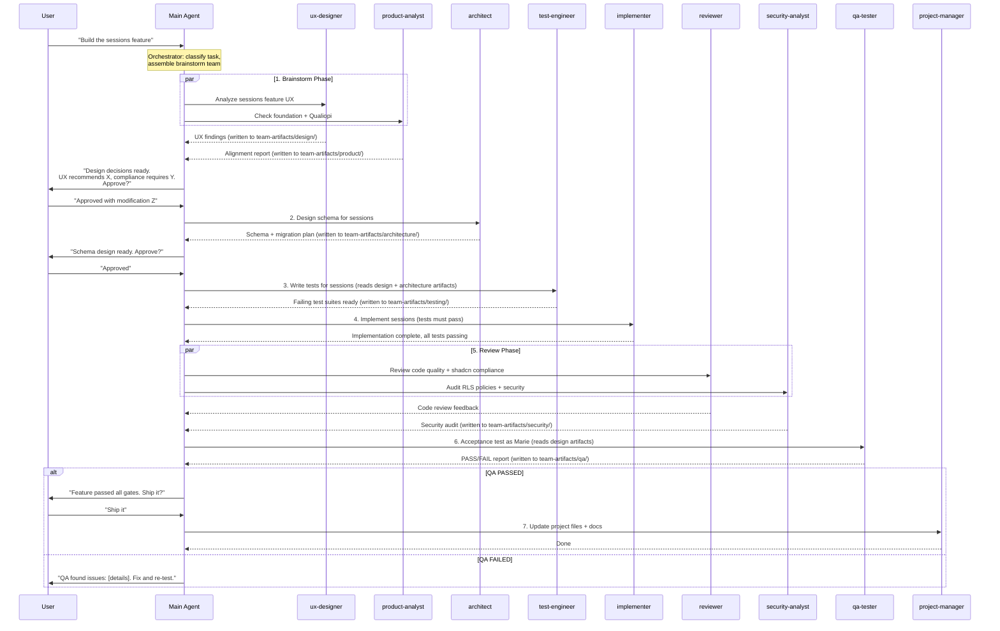

# Subagent Ecosystem for Mentore Manager

## Problem

The current system has 17 skills totaling 1,700+ lines. Three orchestration skills (`team-driven-development`, `design-brainstorm`, `implement-with-team`) overlap and try to simulate subagents by embedding inline prompts. Two UX skills (`ux-reviewer` at 322 lines, `ui-ux-design-review` at 147 lines) do essentially the same thing. When the main agent loads these, it consumes massive context -- and the Superpowers plugin adds further overhead by forcing skill-checking on every message.

Additionally, project management via Notion MCP is extremely token-expensive (3+ API calls returning heavy JSON for simple status updates). There is no test-driven development, no security review process, and no persona-based acceptance testing to validate features actually work for end users.

The result: confused agents, wasted tokens, inconsistent behavior, and no quality gates before shipping.

## Plugins Assessment (Superpowers, cursor-team-kit, cq)

**Superpowers** (~100 lines, hooks-level, always loaded): Keep. Cannot be disabled project-level. With only 2 active skills remaining (`project-runtime`, `find-skills`), the per-message overhead of its "check all skills" flow becomes negligible. The orchestrator rule takes priority for task delegation.

**cursor-team-kit** (12 skills + ci-watcher agent): Keep. All skills are `agent_requestable` (not auto-invoked). Useful utilities (`fix-merge-conflicts`, `loop-on-ci`, `check-compiler-errors`) serve as fallbacks for situations our subagents don't cover. No conflict.

**cq** (always-applied rule): Keep. Cross-project knowledge commons is complementary to project-specific subagents. Subagents can use cq tools internally.

**Net impact**: No plugins need disabling. The real fix is archiving/disabling project skills so the main agent's decision surface is tiny.

## Architecture

```mermaid
graph TD
    User[User] -->|"build feature X"| MainAgent[Main Agent]
    MainAgent -->|reads| OrchestratorRule["Orchestrator Rule<br/>.cursor/rules/team-orchestrator.mdc<br/>~80 lines, always loaded"]

    subgraph brainstormPhase [1. Brainstorm -- Parallel]
        UXDesigner["ux-designer"]
        ProductAnalyst["product-analyst"]
    end

    subgraph designPhase [2. Design]
        Architect["architect"]
    end

    subgraph testPhase [3. Test Writing -- TDD]
        TestEngineer["test-engineer"]
    end

    subgraph buildPhase [4. Build]
        Implementer["implementer"]
    end

    subgraph reviewPhase [5. Review -- Parallel]
        Reviewer["reviewer"]
        SecurityAnalyst["security-analyst"]
    end

    subgraph qaPhase [6. Acceptance -- Mandatory Gate]
        QATester["qa-tester"]
    end

    subgraph managePhase [7. Document]
        ProjectManager["project-manager"]
    end

    subgraph metaPhase [Meta -- On Demand]
        TeamArchitect["team-architect"]
    end

    MainAgent -->|launches| brainstormPhase
    MainAgent -->|launches| designPhase
    MainAgent -->|launches| testPhase
    MainAgent -->|launches| buildPhase
    MainAgent -->|launches| reviewPhase
    MainAgent -->|launches| qaPhase
    MainAgent -->|launches| managePhase
    MainAgent -->|launches| metaPhase

    UXDesigner -->|writes| DesignArtifacts["docs/team-artifacts/design/"]
    ProductAnalyst -->|writes| ProductArtifacts["docs/team-artifacts/product/"]
    Architect -->|writes| ArchArtifacts["docs/team-artifacts/architecture/"]
    TestEngineer -->|writes| TestArtifacts["docs/team-artifacts/testing/"]
    Reviewer -->|reads| DesignArtifacts
    SecurityAnalyst -->|writes| SecurityArtifacts["docs/team-artifacts/security/"]
    QATester -->|reads| DesignArtifacts
    QATester -->|writes| QAArtifacts["docs/team-artifacts/qa/"]
    ProjectManager -->|writes| MgmtArtifacts["docs/team-artifacts/management/"]
    ProjectManager -->|manages| ProjectFiles["docs/project/"]
```



## Token Impact

**Current worst case**: A single "build feature X" task loads `team-driven-development` (130 lines) which triggers `design-brainstorm` (151 lines) which inlines `ux-reviewer` (322 lines) + Notion MCP calls (heavy JSON)... total: **1,000+ lines in main agent context + thousands of tokens from Notion API**.

**New system**: Main agent loads only the orchestrator rule (~80 lines). Each subagent loads its own system prompt (~40-70 lines) + its specific knowledge files in **isolated context windows**. Project management is file-based (markdown read/write, no API calls). Main agent context reduction: **~85%**. Notion token cost: **eliminated**.

## The Subagent Roster (10 agents)

All files in [.cursor/agents/](.cursor/agents/).

### 1. `ux-designer.md` (~70 lines)

- **Role**: Senior UI/UX Designer grounded in behavioral psychology
- **When launched**: Brainstorm phase for any feature touching UI, user flows, or interaction patterns
- **Knowledge loaded**: `docs/foundations/mentore-manager-formations-ux-foundation.md`, `.cursor/skills/_archived/ux-reviewer/references/`
- **Absorbs**: `ux-reviewer` (322 lines) + `ui-ux-design-review` (147 lines) = 469 lines compressed to ~70
- **Writes to**: `docs/team-artifacts/design/`
- **Output**: Structured UX findings (severity, friction type, psychological mechanism, recommendations)
- **Key persona**: Marie, 34, administrative manager, manages 10-20 formations, latent audit anxiety
- **Psychology toolkit**: Hick's Law, Fitts's Law, Cognitive Load Theory, Peak-End Rule, Zeigarnik Effect

### 2. `product-analyst.md` (~60 lines)

- **Role**: Product foundation guardian + Qualiopi compliance analyst (merged)
- **When launched**: Brainstorm phase, parallel with ux-designer
- **Knowledge loaded**: `docs/foundations/mentore-manager-formations-ux-foundation.md`, `docs/qualiopi-formation-workflow.md`
- **Absorbs**: Foundation Reader + Qualiopi Analyst (previously inline prompts in `design-brainstorm`)
- **Writes to**: `docs/team-artifacts/product/`
- **Output**: Foundation alignment report (ALIGNED/NEEDS WORK per principle) + compliance assessment (indicator numbers, quest IDs, gaps)
- **Why merged**: Both are "evaluate feature against criteria" tasks. Merging saves a subagent launch AND forces the agent to reconcile compliance with UX (compliance that creates friction = bad)

### 3. `architect.md` (~50 lines)

- **Role**: Database schema and API architect
- **When launched**: Design phase, before implementation (when task touches DB or creates new entities)
- **Knowledge loaded**: `.cursor/skills/supabase-database-migration/SKILL.md`, `.cursor/skills/crud-services/SKILL.md`, explores `src/lib/db/schema/`
- **Absorbs**: Schema Analyst role from `team-driven-development`
- **Writes to**: `docs/team-artifacts/architecture/`
- **Output**: Schema design (tables, columns, relations), migration plan, API surface recommendations, whether to extract a service

### 4. `test-engineer.md` (~60 lines)

- **Role**: TDD specialist -- writes failing tests BEFORE implementation
- **When launched**: Test Writing phase, after design is approved, before implementation begins
- **Tools**: Vitest (unit/component/server logic tests) + Playwright (E2E browser tests)
- **Edge case mandate**: First step is always to enumerate edge cases (empty states, boundary values, concurrent access, error recovery, invalid input, permission denied, interruption recovery)
- **Writes to**: `docs/team-artifacts/testing/` (test plans), `src/` (actual test files)
- **Output**: Failing test suites that define the acceptance criteria. Tests cover happy path + edge cases.
- **TDD flow**: Write tests -> run -> confirm they fail -> hand off to implementer -> tests must pass

### 5. `implementer.md` (~60 lines)

- **Role**: Senior SvelteKit 5 full-stack developer
- **When launched**: Build phase, after tests are written (TDD) or after plan is approved (non-TDD)
- **Knowledge loaded**: `.cursor/skills/svelte5-stack/SKILL.md`, `.agents/skills/svelte-code-writer/SKILL.md`, `.cursor/skills/playground-pages/SKILL.md` (when building components)
- **Absorbs**: Implementation aspects of `implement-with-team`
- **shadcn-svelte mandate**: Every UI element MUST use a shadcn-svelte component. Before building any UI, use the `shadcn-svelte` MCP tools (`search_components`, `generate_component`) to find the right base component. Extend if needed, never build raw HTML elements.
- **Output**: Working code (components, routes, server actions, forms), following the plan exactly. All tests must pass.
- **Quality gates**: Svelte 5 runes only, shadcn-svelte components, strict TypeScript, linter-clean

### 6. `reviewer.md` (~50 lines)

- **Role**: Senior code reviewer with fresh perspective
- **When launched**: Review phase, after implementation, parallel with security-analyst
- **shadcn-svelte audit**: Uses `audit_with_rules` MCP tool to verify all UI code uses shadcn-svelte components correctly
- **Output**: Prioritized feedback (Critical/Warning/Suggestion) covering quality, patterns, accessibility, type safety, shadcn-svelte compliance
- **Key benefit**: Isolated context = no bias from having written the code

### 7. `security-analyst.md` (~50 lines)

- **Role**: Security specialist for Supabase/SvelteKit applications
- **When launched**: Review phase, parallel with reviewer (when task touches auth, RLS, data access, or new tables)
- **Focus areas**:
  - RLS policies: every new table must have appropriate policies, no bypasses
  - Auth flows: token handling, session management, OAuth security
  - Data access patterns: no leaking data across workspaces, proper authorization checks
  - Input validation: server-side validation on all mutations, SQL injection prevention
  - Secrets: no exposed API keys, proper env var usage
- **Writes to**: `docs/team-artifacts/security/`
- **Output**: Security audit report with severity levels (Critical/High/Medium/Low), specific RLS policy recommendations, and required fixes before shipping

### 8. `qa-tester.md` (~70 lines)

- **Role**: Persona-based acceptance tester -- embodies the end user to validate features in the browser
- **When launched**: Acceptance phase -- MANDATORY GATE before any feature is considered done
- **CRITICAL**: No feature ships without passing QA. The orchestrator enforces this.
- **Persona knowledge**: Reads persona specs. Embodies Marie (administrative manager, not tech-savvy, manages 10-20 formations, often interrupted, latent audit anxiety)
- **Workflow**:
  1. Read the feature plan/spec and UX design artifacts from `docs/team-artifacts/design/`
  2. Form hypotheses: "Marie wants to do X. She would expect to find it by doing Y."
  3. Use Browser MCP to navigate the running app (navigate, snapshot, click, fill, etc.)
  4. Test intuitively -- as if encountering the app for the first time. No prior knowledge of where things are.
  5. Test happy path first, then edge cases (empty states, errors, back button, direct URL)
  6. Report: PASS/FAIL with evidence (click counts, friction points, screenshots if needed)
- **Scope (orchestrator decides)**:
  - UI-facing changes: QA ALWAYS mandatory
  - Backend with user-visible impact: QA mandatory
  - Pure backend refactoring / migrations with no visible change: QA optional
  - Typos, variable renames, config changes: skip QA
- **Writes to**: `docs/team-artifacts/qa/`

### 9. `project-manager.md` (~70 lines)

- **Role**: Agile PM, documentation specialist, file-based project manager
- **When launched**: Document phase (after feature ships), on-demand for project tracking, or via `/digest-meeting` command
- **Knowledge loaded**: `.cursor/skills/project-tracker/SKILL.md` (for doc formats and decision recording patterns)
- **Absorbs**: `suivi-de-projet`, `project-tracker`, `session-recap`, `feature-documentation` = 4 skills totaling ~700+ lines
- **Project management**: File-based in `docs/project/` (replaces Notion for all tracking):
  - `backlog.md` -- all work items tagged by status
  - `current-sprint.md` -- active sprint items and progress
  - `shipped.md` -- completed and deployed items (changelog)
  - `roadmap.md` -- high-level product direction
- **Meeting digest workflow** (triggered by `/digest-meeting` or natural language):
  1. Read transcript from `meetings/` folder
  2. Extract: decisions made, action items, priority changes, contradictions to existing plans
  3. Update `docs/decisions/` with new design decisions
  4. Update `docs/project/backlog.md` and `current-sprint.md` with priority/scope changes
  5. Review active `.plan.md` files -- flag or update any that are contradicted
  6. Write summary to `docs/team-artifacts/management/meeting-digest-YYYY-MM-DD.md`
  7. Flag contradictions with ongoing agent plans and ask user to resolve
- **Writes to**: `docs/team-artifacts/management/`, `docs/project/`, `docs/decisions/`
- **Output**: Updated project files, decision docs, meeting digests, feature documentation (in French)

### 10. `team-architect.md` (~50 lines)

- **Role**: Meta-agent that maintains and improves the subagent ecosystem
- **When launched**: On explicit request, or when user says "improve the team", "update agents", "review agent performance"
- **Has write access to**: `.cursor/agents/*.md`, `.cursor/rules/team-orchestrator.mdc`
- **Workflow**:
  1. Reads current subagent definitions in `.cursor/agents/`
  2. Reads recent session transcripts from `agent-transcripts/`
  3. Identifies patterns (subagent underperformance, missing specialists, recurring friction)
  4. Updates subagent system prompts to address issues
  5. Proposes new subagents when patterns emerge
  6. Logs all changes to `docs/team-changelog.md` with rationale
- **Auto-improvement**: Can update subagent definitions autonomously. Commits changes separately for easy revert.
- **Guardrails**: Never deletes subagents without user approval. Always explains WHY changes were made.

## Orchestrator Rule: [.cursor/rules/team-orchestrator.mdc](.cursor/rules/team-orchestrator.mdc)

~80 lines. Always loaded via `alwaysApply: true`. Replaces `team-driven-development` (130 lines), `design-brainstorm` (151 lines), and `implement-with-team` (144 lines) = **425 lines replaced by ~80**.

The rule contains:

- **Task classification**: How to analyze a task and decide which subagents to launch
- **Phase sequence** (7 phases):
  1. **Brainstorm**: ux-designer + product-analyst (parallel) -- design exploration
  2. **Design**: architect -- schema and API design
  3. **Test Writing**: test-engineer -- TDD, write failing tests
  4. **Build**: implementer -- make tests pass, follow the plan
  5. **Review**: reviewer + security-analyst (parallel) -- code quality + security
  6. **Acceptance**: qa-tester -- MANDATORY persona-based browser testing
  7. **Document**: project-manager -- update project files, decisions, artifacts
- **Phase gates**: Decision-gated -- user must approve design decisions before implementation. QA gate is mandatory for UI-facing work.
- **Subagent team recipes** (which subagents to launch for common task types):
  - **New feature with UI**: all 7 phases, full team
  - **Schema-only change**: architect + implementer + security-analyst + reviewer
  - **Bug fix with UX impact**: ux-designer (quick) + test-engineer + implementer + qa-tester
  - **Small bug fix (no UI)**: test-engineer + implementer + reviewer
  - **Documentation/project update**: project-manager only
  - **Meeting digest**: project-manager via `/digest-meeting`
  - **Team improvement**: team-architect
- **Synthesis protocol**: After parallel subagents return, main agent synthesizes findings, surfaces tensions, presents structured choices via AskQuestion
- **Skip conditions**: Single-file fixes, typos, running commands -- handle directly without subagents
- **Artifact protocol**: Each subagent writes findings to its `docs/team-artifacts/<team>/` directory. Subsequent subagents read relevant artifacts before starting.

## Artifact-Based Inter-Team Communication

Subagents don't talk directly to each other. Collaboration happens through the main agent (coordinator) and **shared artifacts** -- files that one team writes and another team reads.

```
docs/team-artifacts/
├── design/           # ux-designer: UX reviews, design specs, friction analysis
├── product/          # product-analyst: foundation alignment, compliance reports
├── architecture/     # architect: schema designs, ADRs, API specs
├── testing/          # test-engineer: test plans, test results, edge case analysis
├── qa/               # qa-tester: acceptance reports, browser test results
├── security/         # security-analyst: RLS audits, vulnerability reports
└── management/       # project-manager: meeting digests, status updates
```

**How it works**: After each phase, the responsible subagent writes its findings as a dated markdown file (e.g., `docs/team-artifacts/design/2026-04-06-sessions-ux-review.md`). The next phase's subagents are instructed to read relevant artifacts before starting. For example: the qa-tester reads `docs/team-artifacts/design/` to understand what the feature should do before testing it in the browser.

**Human benefit**: The non-tech team can browse these directories (in GitHub or locally) to see what each "department" is producing. Everything is markdown, readable, version-controlled. No domain expertise required.

## File-Based Project Management (replaces Notion)

Notion MCP for project tracking is fully retired. All sprint/ticket/backlog management moves to markdown files:

```
docs/project/
├── backlog.md            # All work items, tagged by status and priority
├── current-sprint.md     # Active sprint items with progress
├── shipped.md            # Completed and deployed items (release changelog)
└── roadmap.md            # High-level product direction and upcoming waves
```

**Status tags in backlog.md**: Items use inline status markers:
- `[BACKLOG]` -- not yet scheduled
- `[SPRINT]` -- in current sprint
- `[IN PROGRESS]` -- actively being worked on
- `[DONE]` -- completed, not yet deployed
- `[SHIPPED]` -- deployed to production
- `[CANCELLED]` -- no longer needed

The project-manager subagent manages these files. A status update is a simple markdown edit instead of 3 Notion API calls.

## Meeting Transcript Digest System

```
meetings/                 # .gitignored -- transcripts never committed
├── 2026-04-06-team-sync.md
├── 2026-04-03-design-review.md
└── ...
```

**Trigger**: User drops a transcript into `meetings/` and runs the `/digest-meeting` slash command (or says "process the latest meeting" / "digest the meeting").

**Workflow** (executed by project-manager subagent):
1. Read the transcript
2. Extract: decisions, action items, priority changes, contradictions
3. Update `docs/decisions/` with new design decisions
4. Update `docs/project/` with priority/scope changes
5. Review active `.plan.md` files -- flag or update contradicted plans
6. Write digest to `docs/team-artifacts/management/meeting-digest-YYYY-MM-DD.md`
7. Flag any contradictions with ongoing agent plans to the user

**Slash command**: `.cursor/commands/digest-meeting.md` -- triggers the project-manager to process the latest unprocessed transcript in `meetings/`.

## Inter-Subagent Collaboration Flow



## Skills Strategy

### Archive (9 skills -> `.cursor/skills/_archived/`)

Skills fully absorbed into subagents or retired entirely. No longer needed.

| Skill | Absorbed By / Reason |
| --- | --- |
| `team-driven-development` | Orchestrator rule |
| `design-brainstorm` | Orchestrator + ux-designer + product-analyst |
| `implement-with-team` | Orchestrator + implementer + architect |
| `ux-reviewer` | ux-designer subagent (keep `references/` dir accessible at archived path) |
| `ui-ux-design-review` | ux-designer subagent |
| `feature-documentation` | project-manager subagent |
| `session-recap` | project-manager subagent |
| `suivi-de-projet` | FULLY RETIRED -- Notion project management replaced by file-based system |
| `mentore-manager-notion` | FULLY RETIRED -- Notion prototype is obsolete vs actual production app |

### Add `disable-model-invocation: true` (6 skills)

These remain in place as knowledge bases for subagents. The flag prevents the main agent from auto-loading them.

- `svelte5-stack` (loaded by implementer)
- `supabase-database-migration` (loaded by architect)
- `crud-services` (loaded by architect, implementer)
- `playground-pages` (loaded by implementer)
- `git-workflow` (loaded by main agent for simple ops)
- `project-tracker` (loaded by project-manager for doc format patterns)

### Keep as-is (2 skills)

- `project-runtime` -- tiny, universally needed ("use bun")
- `find-skills` -- utility for discovering new skills

## AGENTS.md Update

Add a section documenting the subagent ecosystem:

- List of 10 available subagents with one-line descriptions
- Pointer to the orchestrator rule
- 7-phase development sequence with QA gate
- Artifact-based communication system description
- File-based project management (docs/project/)
- Meeting transcript digest workflow
- Note that knowledge skills have `disable-model-invocation: true` and are only for subagents
- Superpowers/plugin compatibility note

## File Structure (final state)

```
.cursor/
├── agents/                          # NEW - Custom subagents (10 files)
│   ├── ux-designer.md
│   ├── product-analyst.md
│   ├── architect.md
│   ├── test-engineer.md
│   ├── implementer.md
│   ├── reviewer.md
│   ├── security-analyst.md
│   ├── qa-tester.md
│   ├── project-manager.md
│   └── team-architect.md
├── commands/
│   └── digest-meeting.md            # NEW - Slash command for meeting processing
├── rules/
│   └── team-orchestrator.mdc        # NEW - Always-on orchestrator (~80 lines)
├── skills/
│   ├── _archived/                   # NEW - Retired skills (9 skills)
│   │   ├── team-driven-development/
│   │   ├── design-brainstorm/
│   │   ├── implement-with-team/
│   │   ├── ux-reviewer/             # references/ dir stays accessible
│   │   ├── ui-ux-design-review/
│   │   ├── feature-documentation/
│   │   ├── session-recap/
│   │   ├── suivi-de-projet/
│   │   └── mentore-manager-notion/
│   ├── svelte5-stack/               # disable-model-invocation: true
│   ├── supabase-database-migration/ # disable-model-invocation: true
│   ├── crud-services/               # disable-model-invocation: true
│   ├── playground-pages/            # disable-model-invocation: true
│   ├── git-workflow/                # disable-model-invocation: true
│   ├── project-tracker/             # disable-model-invocation: true
│   ├── project-runtime/             # KEEP as-is
│   └── find-skills/                 # KEEP as-is
docs/
├── team-artifacts/                  # NEW - Inter-team communication artifacts
│   ├── design/                      # ux-designer outputs
│   ├── product/                     # product-analyst outputs
│   ├── architecture/                # architect outputs
│   ├── testing/                     # test-engineer outputs
│   ├── qa/                          # qa-tester outputs
│   ├── security/                    # security-analyst outputs
│   └── management/                  # project-manager outputs (meeting digests, etc.)
├── project/                         # NEW - File-based project management
│   ├── backlog.md
│   ├── current-sprint.md
│   ├── shipped.md
│   └── roadmap.md
├── decisions/                       # EXISTING - Design decisions
├── foundations/                     # EXISTING - Product foundation
└── team-changelog.md                # NEW - team-architect change log
meetings/                            # NEW - .gitignored, meeting transcripts
```

