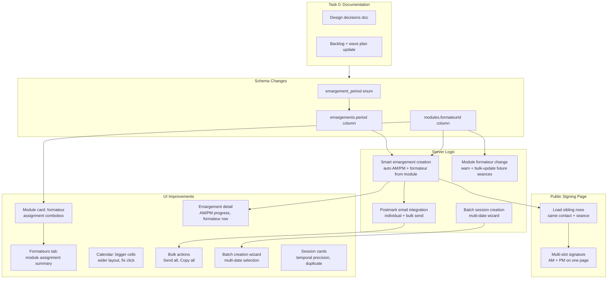
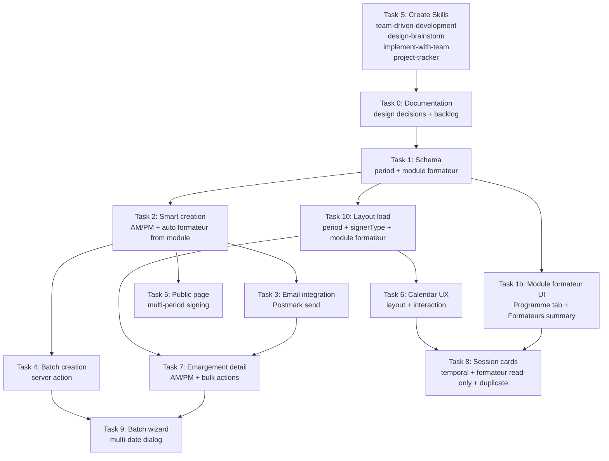

# Wave 2: Séances + Émargement -- Implementation Plan

**Goal:** Transform the Séances tab from a functional-but-basic session manager into a compliance-first, anxiety-reducing experience that Marie depends on. Every session should feel "handled" and every attendance sheet should feel automatic.

**Design Decisions (validated this session):**

- [Programme linking model](docs/decisions/2026-03-25-programme-linking-model.md) -- Wave 1, not revisited
- [UX Foundation](docs/foundations/mentore-manager-formations-ux-foundation.md) -- active reference
- [Backlog items 6+7](docs/backlog-2026-03-24.md) -- primary scope
- [Wave plan](/.cursor/plans/formation-backlog-wave-plan_66ed39c5.plan.md) -- umbrella context
- Wave 2 design decisions (to be created in Task 0) -- demi-journee splitting, module-formateur linking, emargement email integration

---

## Execution Methodology: Team-Driven Development

**This plan MUST be implemented using the team-of-agents approach, not as a single-agent sequential execution.**

### How Every Task Should Be Executed

1. **Before starting any task**, the main agent launches parallel subagents to gather context:
   - A **UX senior designer** subagent that reads and applies the `ux-reviewer` skill and its references (behavioral psychology, French UX conventions)
   - A **product foundation** subagent that reads [`docs/foundations/mentore-manager-formations-ux-foundation.md`](docs/foundations/mentore-manager-formations-ux-foundation.md) and evaluates alignment
   - **Domain-specific subagents** dynamically chosen based on the task (e.g., schema explorer for DB tasks, component inventory for UI tasks, email service analyzer for Postmark integration)

2. **During implementation**, the main agent:
   - Synthesizes insights from all subagents before writing code
   - Asks the user interactively when a design decision is ambiguous or when a subagent surfaces a question
   - Ensures every UI component, server action, and data model change aligns with the UX foundation principles and persona needs
   - Never produces "generic feature implementation" -- every detail is intentional

3. **After completing each task**, the main agent:
   - Updates project documentation (backlog, decisions, wave plan status) using the `project-tracker` skill
   - Runs a quick UX alignment check: "Does this implementation pass the magic wand test? Would Marie feel guided?"

### Checkpoint Pattern

Between major tasks (especially between schema/server and UI phases), the main agent should:
- Summarize what was built and what's next
- Ask the user if they want to validate, adjust, or continue
- Surface any design tensions or edge cases discovered during implementation

### Skill References

After Task S is completed, the following project skills will guide the workflow:
- `.cursor/skills/team-driven-development/` -- orchestrator skill (triggers on any significant work)
- `.cursor/skills/design-brainstorm/` -- design/ideation phase with specialized subagents
- `.cursor/skills/implement-with-team/` -- implementation phase with parallel subagents and checkpoints
- `.cursor/skills/project-tracker/` -- documentation and backlog updates at every stage

---

## TASK S: Create Reusable Cursor Skills (MUST RUN BEFORE ALL OTHER TASKS)

**Goal:** Codify the team-of-agents workflow as reusable Cursor Skills so it becomes the default way of working in every future conversation, not just this Wave 2 implementation.

**Location:** `.cursor/skills/` (project-level, shared with anyone using the repo)

**Process:** This task is INTERACTIVE. The implementing agent must:
1. Think deeply about each skill's purpose, trigger scenarios, and content
2. Ask the user questions to refine the skill design
3. Create the skills using the `create-skill` SKILL.md methodology
4. Validate that the skills will trigger correctly in future conversations

### Skill 1: `team-driven-development` (Orchestrator)

**Purpose:** The master workflow skill. Triggers on any significant feature work. Analyzes the task and dynamically decides which specialist subagents to launch and which stage skills to invoke.

**Must cover:**
- How to analyze a task and decide which specialists are needed (dynamic team assembly)
- The full stage sequence: Brainstorm -> Plan -> Document -> Implement -> Verify
- When to invoke each stage-specific skill
- When to ask the user for input vs. proceed autonomously
- How to ensure all agents stay aligned with the project's UX foundation and design decisions
- Reference to project-specific resources (foundation doc, ux-reviewer skill, decisions folder, backlog)

### Skill 2: `design-brainstorm` (Design/Ideation Phase)

**Purpose:** Triggers when starting a new feature, redesign, or significant UX change. Launches specialized subagents in parallel for comprehensive design thinking.

**Must cover:**
- Which subagents to always launch (UX reviewer with behavioral psychology, foundation reader)
- Which subagents to dynamically add based on the task (schema explorer, component inventory, competitive analysis, etc.)
- How to synthesize subagent outputs into a coherent design direction
- How to present design decisions to the user for validation
- When to create/update design decision docs
- Reference to `docs/foundations/mentore-manager-formations-ux-foundation.md` and `.cursor/skills/ux-reviewer/`

### Skill 3: `implement-with-team` (Implementation Phase)

**Purpose:** Triggers when implementing from a plan. Ensures implementation uses parallel subagents, follows UX foundation, and includes checkpoints.

**Must cover:**
- How to break plan tasks into parallelizable subagent work
- Checkpoint pattern: when to pause and check with user
- UX alignment verification after each major component
- How to handle discovered edge cases or design tensions mid-implementation
- Post-task documentation updates (always update backlog/decisions/wave plan)

### Skill 4: `project-tracker` (Documentation & Backlog)

**Purpose:** Triggers after completing features, making design decisions, or at session boundaries. Ensures project docs are always current.

**Must cover:**
- Which files to update and when:
  - `docs/decisions/` -- after any validated design decision
  - `docs/backlog-*.md` -- after completing or scoping work items
  - `.cursor/plans/` -- wave plan status updates
  - Session recap if requested
- How to create new decision docs (format, naming convention)
- How to update backlog items (marking progress, adding new items discovered during implementation)
- How to ensure nothing falls through the cracks between sessions

### Implementation Notes for Task S

- Read the `create-skill` skill at `/Users/anthony/.cursor/skills-cursor/create-skill/SKILL.md` for the authoring methodology
- Each skill's SKILL.md must be under 500 lines
- Use progressive disclosure: essential instructions in SKILL.md, detailed references in separate files
- The orchestrator skill should reference the stage skills by path
- All skills must include trigger terms in their descriptions so they auto-activate in future conversations
- Test that the skill descriptions would cause the agent to apply them in realistic scenarios (e.g., "let's build the next feature", "what should we work on next", "implement this plan")

---

## TASK 0: Documentation Updates (MUST RUN FIRST after Task S)

Before any implementation, update the following files to record all design decisions made in this planning session:

**1. New design decision document:** Create `docs/decisions/2026-04-02-wave2-seances-emargement-decisions.md`

Record these validated decisions:
- Smart demi-journee splitting (auto AM/PM based on 4h threshold)
- Module-Formateur linking (1 formateur per module, auto-assignment on seance creation)
- Formateur emargement (auto-create rows, public page support)
- Full Postmark email integration for emargement link distribution
- Batch session creation wizard
- Calendar UX fixes (decouple click-to-create, bigger cells, wider layout)
- Seance formateur is derived from module (read-only on seance, locked)
- Module formateur change triggers warning + bulk-update offer for future seances
- Formateur picker on modules shows formation pool first + "Ajouter un formateur" for workspace search

**2. Update backlog:** Modify [`docs/backlog-2026-03-24.md`](docs/backlog-2026-03-24.md)
- Mark items 6 and 7 as "In Progress -- Wave 2"
- Add a note about Module-Formateur linking being added to Wave 2 scope (originally not in the backlog but identified during brainstorming as a prerequisite for proper seance workflow)

**3. Update wave plan:** Modify [`.cursor/plans/formation-backlog-wave-plan_66ed39c5.plan.md`](.cursor/plans/formation-backlog-wave-plan_66ed39c5.plan.md)
- Update `wave2-seances-emargement` todo status to `in_progress`
- Add a note in Wave 2 scope about Module-Formateur linking

---

## Key Design Decision: Module-Formateur Linking

**Problem:** Séances are per-module, but formateur assignment is currently per-formation. When creating a séance for a specific module, Marie must manually pick the formateur every time. This is redundant -- each module is typically taught by one formateur.

**Approach:** 1 Module = 1 Formateur (optional). Auto-assignment on séance creation.

**Rules:**

1. Each Formation-level module (NOT biblio_modules) gets an optional `formateurId` column.
2. When Marie assigns a formateur to a module (via Programme tab), that formateur is stored on the module.
3. When creating a séance and selecting a module, the formateur **auto-fills and is read-only**. No picker on the séance dialog. 1 Module = 1 Formateur.
4. If a module has no formateur assigned, the séance is created without one. The UI shows a soft prompt: "Ce module n'a pas de formateur assigne."
5. The formateur picker on the module card shows **formation formateurs first**, with an "Ajouter un formateur" option that searches the full workspace. If a workspace formateur is selected who isn't in the formation pool, they are auto-added to the formation.
6. The Formateurs tab gains a **read-only summary** section: "Affectations aux modules" showing which formateur teaches which module. Assignment itself only happens in the Programme tab.
7. When a module's formateur changes, the app **warns** Marie about existing future séances that still use the old formateur, and **offers to bulk-update** them: "Le formateur de ce module a change. Mettre a jour 3 seances a venir ?"
8. `seances.formateurId` stays as a denormalized column (important for Qualiopi: the attendance sheet must record who ACTUALLY taught, not just who was planned). It is auto-set from the module on creation and can be updated via the bulk-update flow.
9. Existing séances are unaffected when a module's formateur changes (unless Marie accepts the bulk update).
10. Substitution edge case (formateur sick for one day): Marie changes the module's formateur, selectively updates only the affected séance(s), then changes back. A proper substitution mechanism can come in a future wave.

---

## Key Design Decision: Smart Demi-Journée Splitting

**Qualiopi Q11 requirement:** Attendance signatures must be collected **twice per day** (morning + afternoon) per participant + formateur.

**Approach:** Auto-split at the émargement level, not the session level.

- Marie creates **one session** for a full day (e.g., 8h00-17h00). No restrictions on duration.
- When the session duration exceeds **4 hours**, the system auto-creates **2 émargement rows** per participant: one `morning`, one `afternoon`.
- For sessions **<= 4 hours**, 1 émargement row per participant (period derived from start time: before 13h = `morning`, from 13h = `afternoon`).
- The **public signing page** detects sibling rows for the same contact + séance and presents all unsigned slots on one page. The learner signs both AM and PM in a single visit.
- Marie **never manually splits** anything. The app handles Qualiopi compliance invisibly.

**Schema addition:** New enum `emargement_period` (`'morning'` | `'afternoon'`) and a `period` column on `emargements`.

**Threshold rationale:** French demi-journée = up to 3.5-4h. Sessions > 4h are implicitly journée complète. The 4h threshold is standard in French training regulations.

---

## Architecture Overview




---

## Task 1: Schema -- Émargement Period + Module Formateur

**Files:**

- Modify: [`src/lib/db/schema/enums.ts`](src/lib/db/schema/enums.ts) -- add `emargementPeriod` enum
- Modify: [`src/lib/db/schema/seances.ts`](src/lib/db/schema/seances.ts) -- add `period` column to `emargements`
- Modify: [`src/lib/db/schema/formations.ts`](src/lib/db/schema/formations.ts) -- add `formateurId` column to `modules`
- Modify: [`src/lib/db/relations.ts`](src/lib/db/relations.ts) -- add module-formateur relation
- Generated: `supabase/migrations/YYYYMMDDHHMMSS_wave2_emargement_period_module_formateur.sql`

**Émargement period changes:**

Add enum to `enums.ts`:

```typescript
export const emargementPeriod = pgEnum('emargement_period', ['morning', 'afternoon']);
```

Add column to `emargements` table in `seances.ts`:

```typescript
period: emargementPeriod('period').notNull().default('morning'),
```

Update the unique constraints: `unique_emargement_seance_contact` becomes `unique(seanceId, contactId, period)` and `unique_emargement_seance_formateur` becomes `unique(seanceId, formateurId, period)`.

**Module-Formateur changes:**

Add column to `modules` table in `formations.ts`:

```typescript
formateurId: uuid('formateur_id').references(() => formateurs.id, { onDelete: 'set null' }),
```

Add relation in `relations.ts` inside `modulesRelations`:

```typescript
formateur: one(formateurs, { fields: [modules.formateurId], references: [formateurs.id] }),
```

This is a Formation-level column ONLY. `biblio_modules` does NOT get a `formateurId` -- formateur assignment is formation-specific, not template-level. When a programme is copied from Bibliotheque (Wave 1 copy-on-link), the formateur field starts empty.

Generate migration with `bun run db:generate`, review, apply.

---

## Task 1b: UI -- Module Formateur Assignment

**Files:**

- Modify: [`src/lib/components/formations/module-card-expanded.svelte`](src/lib/components/formations/module-card-expanded.svelte) -- add formateur combobox in edit mode
- Modify: [`src/routes/(app)/formations/[id]/programme/+page.server.ts`](src/routes/(app)/formations/[id]/programme/+page.server.ts) -- add `updateModuleFormateur` action + formateur change warning logic
- Modify: [`src/routes/(app)/formations/[id]/programme/+page.svelte`](src/routes/(app)/formations/[id]/programme/+page.svelte) -- pass formateur data to module cards
- Modify: [`src/routes/(app)/formations/[id]/formateurs/+page.svelte`](src/routes/(app)/formations/[id]/formateurs/+page.svelte) -- add read-only "Affectations aux modules" summary section
- Modify: [`src/routes/(app)/formations/[id]/+layout.server.ts`](src/routes/(app)/formations/[id]/+layout.server.ts) -- load module formateur data

**Module card formateur combobox (Programme tab):**

In edit mode, the module card gains a "Formateur" field:
- Combobox showing formation formateurs first (name + avatar)
- Separator + "Ajouter un formateur" option that opens workspace-wide search
- If a workspace formateur is selected who isn't in the formation pool, auto-add them to `formation_formateurs`
- Display: "Formateur: Jean Dupont" in view mode, or "Aucun formateur assigne" if empty
- On change: if the module had a previous formateur AND there are future seances for this module with the old formateur, show an AlertDialog:
  - "Le formateur de ce module a change. Mettre a jour [N] seances a venir ?"
  - "Mettre a jour" button: bulk-updates `seances.formateurId` for future seances of this module
  - "Garder l'ancien" button: only updates the module, leaves seances as-is

**Server action `updateModuleFormateur`:**
- Receives: `moduleId`, `formateurId` (nullable), `updateFutureSeances` (boolean)
- Updates `modules.formateurId`
- If `updateFutureSeances` is true: updates all future seances (where `moduleId` matches AND `startAt > now()`) with the new `formateurId`; also updates unsigned formateur emargement rows on those seances (delete old formateur rows, create new ones)
- If the selected formateur is not in `formation_formateurs`, insert them
- Audit: `module_formateur_updated`

**Formateurs tab summary:**

Add a section "Affectations aux modules" (below the existing formateur list):
- Table/list: Module name | Formateur name (or "Non assigne")
- Read-only -- clicking a module name navigates to the Programme tab
- Only shows modules that have content (non-empty formation modules)

---

## Task 2: Server -- Smart Émargement Creation + Module Formateur Auto-Fill

**Files:**

- Modify: [`src/routes/(app)/formations/[id]/seances/+page.server.ts`](src/routes/(app)/formations/[id]/seances/+page.server.ts)

**Logic changes to `createSession` and `updateEmargementParticipants`:**

Extract a helper function `getPeriodsForSession(startAt, endAt)`:

```typescript
function getPeriodsForSession(startAt: string, endAt: string): Array<'morning' | 'afternoon'> {
  const start = new Date(startAt);
  const end = new Date(endAt);
  const durationHours = (end.getTime() - start.getTime()) / (1000 * 60 * 60);

  if (durationHours > 4) {
    return ['morning', 'afternoon'];
  }
  return [start.getHours() < 13 ? 'morning' : 'afternoon'];
}
```

When inserting émargement rows (both in `createSession` with `contactIds` and in `updateEmargementParticipants`):

- Call `getPeriodsForSession` with the session's start/end
- For each contact, insert **one row per period** (not just one row)
- Each row gets its own `signatureToken` (DB default handles this)

**Module-Formateur auto-assignment on séance creation:**

In `createSession`:
- When a `moduleId` is provided, load the module's `formateurId`
- If the module has a formateur, **auto-set** `seances.formateurId` to that value
- The séance creation form does NOT send a `formateurId` -- it is always derived from the module
- If the module has no formateur, `seances.formateurId` remains null

**Formateur émargement auto-creation:**

When a session has a `formateurId` (derived from module or pre-existing), also create émargement rows for the formateur:

- Same period logic as learners
- `signerType: 'formateur'`, `formateurId` set, `contactId` null

When a module's formateur is changed and future séances are bulk-updated (Task 1b):

- Delete old unsigned formateur émargement rows on those séances
- Create new formateur émargement rows with the new formateur
- Never delete signed rows (compliance -- they record who actually taught)

---

## Task 3: Server -- Postmark Email Integration

**Files:**

- Modify: `[src/routes/(app)/formations/[id]/seances/+page.server.ts](src/routes/(app)`/formations/[id]/seances/+page.server.ts) -- add `sendEmargementEmail` and `sendAllEmargementEmails` actions
- Modify: `[src/lib/services/email-service.ts](src/lib/services/email-service.ts)` -- use `rappel_emargement` template with actual signing links

**New action `sendEmargementEmail`:**

- Receives: `seanceId`, `contactId`
- Loads: contact email, first/last name, formation name, session date/time
- Loads: the émargement row(s) for this contact + séance (may be 1 or 2 for AM/PM)
- Picks the **first unsigned** token for the signing link (the public page will show all unsigned slots)
- Sends email via Postmark using `EMAIL_TEMPLATES.rappel_emargement` with:
  - Learner name, formation name, session date
  - Signing link: `{origin}/emargement/{token}`
  - Clear CTA: "Signer ma feuille d'emargement"
- Logs to `formation_emails` table
- Audit: `emargement_email_sent`

**New action `sendAllEmargementEmails`:**

- Receives: `seanceId`
- Loads all **unsigned** émargement rows for that séance (apprenants only, or include formateur)
- Groups by contact: 1 email per unique contact (even if they have 2 unsigned rows)
- Sends bulk via Postmark (batch API or loop)
- Returns: count sent, count skipped (already signed)

---

## Task 4: Server -- Batch Session Creation

**Files:**

- Modify: `[src/routes/(app)/formations/[id]/seances/+page.server.ts](src/routes/(app)`/formations/[id]/seances/+page.server.ts) -- add `batchCreateSessions` action

**New action `batchCreateSessions`:**

- Receives: `dates` (JSON array of ISO date strings), `startTime`, `endTime`, `moduleId`, `modalityOverride` (optional), `location`, `room`, `contactIds` (JSON array)
- Note: NO `formateurId` parameter -- it is always derived from the module (same as single creation)
- Loads the module's `formateurId` once, applies it to all created séances
- For each date: creates a séance with the given time + fields + module's formateur
- For each séance: auto-creates émargement rows for all contacts (using smart AM/PM split from Task 2) + formateur if assigned
- Wraps in a single transaction
- Returns: count of sessions created, count of émargement rows
- Audit: `sessions_batch_created`

---

## Task 5: Public Signing Page -- Multi-Period Support

**Files:**

- Modify: `[src/routes/emargement/[token]/+page.server.ts](src/routes/emargement/[token]/+page.server.ts)`
- Modify: `[src/routes/emargement/[token]/+page.svelte](src/routes/emargement/[token]/+page.svelte)`

**Load changes:**

- After loading the primary émargement row by token, also load **sibling rows**: same `contactId` (or `formateurId`) + same `seanceId`
- Return all sibling rows (sorted: morning first, afternoon second)
- Each row carries: `id`, `period`, `signedAt`, `signatureImageUrl`, `signatureToken`

**Sign action changes:**

- Receives: `emargementId` + `signature` (instead of relying on the URL token alone)
- Signs the specific row by ID (not by token)
- After signing, returns updated sibling state so the page can refresh

**UI changes:**

- If 1 row (half-day session): current behavior, single signature slot
- If 2 rows (full-day session): show 2 signature slots stacked vertically:
  - "Signature du matin" -- with canvas or checkmark if already signed
  - "Signature de l'apres-midi" -- with canvas or checkmark if already signed
- After signing one slot, the other slot becomes active (if unsigned)
- All signed: success state "Merci, vos emargements sont enregistres"
- Show signer label: "Apprenant" or "Formateur" based on `signerType`
- For formateur: fetch and display formateur name instead of contact name

---

## Task 6: UI -- Calendar Improvements

**Files:**

- Modify: `[src/routes/(app)/formations/[id]/seances/+page.svelte](src/routes/(app)`/formations/[id]/seances/+page.svelte)

**Layout changes:**

- Calendar column: increase from `md:w-[340px]` to `md:w-[400px]` or use `md:flex-[3]` with list at `md:flex-[2]` (roughly 60/40 split favoring calendar)
- Calendar card padding: increase from `p-2` to `p-3` or `p-4` for larger cells
- Mobile: swap order -- session list first (`order-first`), calendar second (`order-last`) with a collapsible toggle: "Afficher le calendrier"

**Calendar interaction fix:**

- Remove the "click empty date creates session" behavior from `handleCalendarClick`
- Clicking any date: if sessions exist on that date, scroll to them. If no sessions, do nothing (or show subtle tooltip: "Aucune seance ce jour")
- Creation is always via the explicit "Ajouter une seance" button (which can pre-fill the date from the calendar selection)

**Calendar visual enhancements:**

- Dots: increase dot size slightly, use distinct colors for émargement status (green = all signed, amber = partially signed, red = overdue unsigned)
- Hover state on dates with sessions: show session count ("2 seances")
- Today: stronger visual emphasis (ring or background)

---

## Task 7: UI -- Émargement Detail Redesign

**Files:**

- Modify: `[src/routes/(app)/formations/[id]/seances/+page.svelte](src/routes/(app)`/formations/[id]/seances/+page.svelte) -- existing émargement section in session cards

**Progress display changes:**

- Replace single progress bar with **dual progress** for full-day sessions:
  - "Matin: 12/15" with bar
  - "Apres-midi: 8/15" with bar
- For half-day sessions: single bar as now
- Add **formateur signing status**: "Formateur: Jean Dupont -- Matin signe, Apres-midi en attente"
- Add **chevron icon** (down/up) next to progress bars to indicate expandability

**Expanded detail changes:**

- Show each participant with their AM/PM signing status (two check/circle columns)
- For unsigned rows: show "Copier le lien" button + "Envoyer" button (triggers `sendEmargementEmail` action)
- Toast on copy: "Lien copie pour [Nom]. Envoyez-le par email ou SMS."

**Bulk actions (below expanded detail):**

- "Envoyer a tous" button -- triggers `sendAllEmargementEmails` for all unsigned participants
- "Copier tous les liens" button -- copies a formatted text block with all unsigned learner names + links
- Show send confirmation: "15 emails envoyes" or "3 apprenants deja signes, 12 emails envoyes"

---

## Task 8: UI -- Session Cards Enhancement

**Files:**

- Modify: `[src/routes/(app)/formations/[id]/seances/+page.svelte](src/routes/(app)`/formations/[id]/seances/+page.svelte)

**Temporal precision:**

- Replace generic "Aujourd'hui" badge with time-aware variants:
  - "Aujourd'hui 14h" (upcoming today, shows start time)
  - "En cours" (session currently happening, with subtle pulse dot)
  - "Terminee" (session ended today)
- Keep "Passee" for past dates, "A venir" for future dates

**Séance creation/edit dialog -- formateur is derived:**

- Remove the formateur combobox from the séance creation dialog
- Replace with a **read-only display**: "Formateur: Jean Dupont" (derived from selected module) or "Aucun formateur assigne" if module has no formateur
- In edit dialog: formateur is also read-only. To change the formateur, Marie must change the module's formateur assignment in the Programme tab.

**Duplication:**

- Add "Dupliquer" button in session edit dialog footer (next to delete)
- Duplicates: same module (and therefore same formateur), time range, modality, location/room
- Date: next business day (skip weekends)
- Participants: same as source session
- Opens the duplicated session in edit mode so Marie can adjust

---

## Task 9: UI -- Batch Creation Wizard

**Files:**

- New component: `src/lib/components/formations/batch-session-dialog.svelte`
- Modify: `[src/routes/(app)/formations/[id]/seances/+page.svelte](src/routes/(app)`/formations/[id]/seances/+page.svelte) -- add trigger button

**Dialog flow (3 steps):**

**Step 1: Session template**

- Module (required combobox from formation modules)
- Formateur: **read-only display**, auto-filled from the selected module. If the module has no formateur, shows "Aucun formateur assigne" with a subtle link to Programme tab. No manual selection possible -- 1 Module = 1 Formateur.
- Time range: start time + end time (time pickers)
- Modality override (optional)
- Location / Room (conditional on modality)

**Step 2: Date selection**

- Multi-select calendar (reuse shadcn Calendar with multi-selection mode)
- OR: "Date range" toggle -- pick start date + end date, checkboxes for days of week (Lun-Ven default)
- Preview list below calendar: "5 seances seront creees" with date list
- Visual: selected dates get strong highlight on the calendar

**Step 3: Participants**

- Same participant selection as current: all learners pre-checked
- Summary: "15 apprenants x 5 seances = 75 emargements (150 signatures AM/PM)"

**Submit:** POST to `batchCreateSessions`, toast success with count, `invalidateAll()`

**Trigger:** Button next to "Ajouter une seance": "Creer plusieurs seances" (secondary variant)

---

## Task 10: Layout Server Load Updates

**Files:**

- Modify: [`src/routes/(app)/formations/[id]/+layout.server.ts`](src/routes/(app)/formations/[id]/+layout.server.ts)

**Changes:**

- Add `period` to the émargement columns loaded for each séance
- Add `signerType` to the émargement columns loaded (needed to distinguish learner vs formateur rows in the UI)
- Add `formateurId` to the module columns loaded (needed for module-formateur display in Programme tab and auto-fill in séance creation)
- Expand module `with` clause to include `formateur` relation (name, avatar for display)
- Update `missingSignatures` / `unsignedEmargements` derived flags to account for the period dimension (a session is fully signed only when ALL period rows for ALL participants are signed)

---

## Dependency Order




---

## Risks

- **Existing émargement rows:** Migration must handle existing rows (all get `period: 'morning'` as default). Existing single-row émargements remain valid.
- **Unique constraint change:** Dropping and recreating the unique constraint on `(seanceId, contactId)` to `(seanceId, contactId, period)` requires careful migration.
- **Email deliverability:** Postmark requires verified sender domain. Check that the sending domain is configured.
- **Batch creation performance:** Creating 5 sessions x 15 learners x 2 periods = 150 émargement rows in one transaction. Should be fine for Postgres, but wrap in a single transaction for atomicity.
- **Public page backward compatibility:** Existing tokens for single-period émargements must still work (the sibling-loading query returns 1 row, UI shows 1 slot -- current behavior preserved).
- **Module-Formateur migration:** Existing modules have no formateur. Existing séances already have their own `formateurId` which must be preserved. The new auto-fill only affects NEW séance creation.
- **Formateur tab auto-add:** When a workspace formateur is selected for a module and auto-added to the formation, ensure no duplicate `formation_formateurs` rows (upsert or check-before-insert).
- **Locked formateur on séance:** The "1 Module = 1 Formateur" model means no per-séance override. For substitutions, Marie must change the module's formateur and selectively bulk-update. This is acceptable for MVP but should be revisited if substitution frequency is high.

---

## UX Foundation Alignment Checklist

- **Status-first:** Émargement progress is visible on every session card without clicking (AM/PM bars)
- **Proactive intelligence:** Auto-split AM/PM, auto-create formateur rows, auto-generate tokens, auto-fill formateur from module
- **Smart defaults:** 4h threshold, all learners pre-selected, next business day for duplication, formateur from module
- **Zero config:** Marie never configures the AM/PM split or formateur assignment per séance -- the app derives both from the module
- **Peace of mind:** "Envoyer a tous" eliminates the 45-click compliance nightmare
- **Productive dependency:** Batch creation + bulk email + auto-formateur makes the app faster than paper/Excel
- **Educational through use:** AM/PM labels teach Qualiopi compliance implicitly; module-formateur linking teaches pedagogical structure
- **Reward completion:** Visual celebration when all signatures collected for a session
- **Control without configuration:** Marie controls formateur assignment at the module level (meaningful decision), not at the séance level (redundant repetition)

