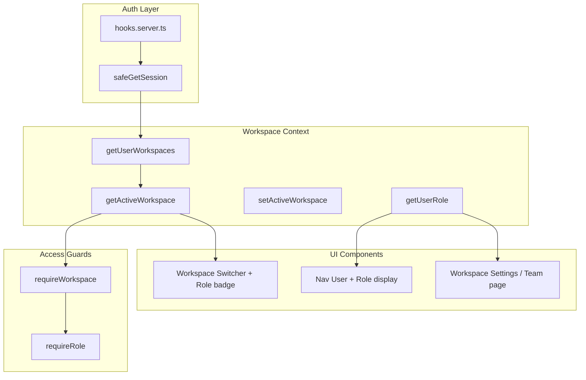

# Workspace & Role-Based Access Control Implementation

## Current State

- **Workspace table** exists but UI uses hardcoded fake data
- `**workspaces_users**` junction table has roles: `owner`, `admin`, `sales`
- **Data filtering is inconsistent**: Deals filter by workspace, Formations don't
- **No RBAC**: All authenticated users see everything
- **Clients** missing `workspace_id` in Drizzle schema (migration exists)

## French Role Names (DB enum stays English, display in French)

| DB value    | French label (UI)          |
| ----------- | -------------------------- |
| `owner`     | Directeur                  |
| `admin`     | Gestionnaire               |
| `sales`     | Commercial                 |
| `secretary` | Coordinateur administratif |

Create `src/lib/i18n/roles.ts` with a `ROLE_LABELS` map for consistent display across the app.

## Role Matrix

| Feature                    | Directeur / Gestionnaire | Commercial       | Coordinateur admin   |
| -------------------------- | ------------------------ | ---------------- | -------------------- |
| Dashboard                  | Full stats               | Sales stats only | Formation stats only |
| Deals                      | Full access              | Full access      | No access            |
| Clients                    | Full access              | Full access      | No access            |
| Formations                 | Full access              | No access        | Full access          |
| Qualiopi                   | Full access              | No access        | Full access          |
| Formateurs                 | Full access              | No access        | Full access          |
| Messagerie                 | Full access              | Full access      | Full access          |
| Paramètres espace / Équipe | Full access              | No access        | No access            |

Only Directeur/Gestionnaire can manage workspace settings and team. Commercial and Secretary can view the team list (optional).

---

## 1. Role Visibility for the User

**Where the user sees their role:**

- **Workspace switcher dropdown**: Below the workspace name when the dropdown is open, show a badge or subtitle: e.g. `"Acme Formations"` with `"Commercial"` underneath
- **User menu (nav-user.svelte)**: Add a line below the email showing `"Rôle : Commercial"` or similar, so the user always knows their role in the current workspace
- **Workspace settings / Team page**: Each member's role is shown; the current user can see their own role in the list

**Implementation:**

- Add `role` and `ROLE_LABELS[role]` to layout data
- Pass to `workspace-switcher.svelte` and `nav-user.svelte`
- Update workspace switcher to show workspace name + role label
- Update nav-user to show role in the dropdown label section

---

## 2. Team System & Workspace Settings (Notion-style)

**UX flow:**

- User clicks the workspace name/block at the top of the sidebar
- Dropdown opens with:
  - List of workspaces to switch
  - Separator
  - "Paramètres de l'espace" → navigates to workspace settings
- Workspace settings lives at `/parametres/workspace` or `/workspace/[id]/parametres` (workspace in URL for consistency)

**Workspace settings page structure:**

- **Équipe (Team) tab**:
  - Table of members: Avatar, name, email, role (French label), actions
  - For Directeur/Gestionnaire: **invite/add members** (by email), change roles, remove members
  - Invite flow: Add by email — if user exists in system, add to workspace with selected role; if not, show "L'utilisateur doit d'abord s'inscrire" or implement Supabase Auth invite (TBD)
  - For others: view-only
- **Général tab** (optional later):
  - Workspace name
  - Other workspace-level settings

**Sidebar integration:**

- Workspace switcher becomes a combined component:
  - Top: Workspace name + chevron
  - On click: Dropdown with workspace list + "Paramètres de l'espace"
  - Each workspace row shows name + user's role in that workspace
- "Paramètres de l'espace" visible only if user has `owner` or `admin` role (or show for all with read-only team view)

---

## 3. Architecture Overview



---

## 4. Implementation Steps

### Phase 1: Database Schema Updates

1. Add `secretary` role to `workspace_role` enum (migration)
2. Add `last_active_workspace_id` to `users` table
3. Sync schema.ts with existing migrations (clients.workspaceId, workspace_formateurs)

### Phase 2: Workspace Context System

Create `src/lib/server/workspace.ts`:

- `getUserWorkspaces(userId)` – all workspaces with roles
- `getActiveWorkspace(userId)` – last active or first
- `setActiveWorkspace(userId, workspaceId)`
- `getUserRoleInWorkspace(userId, workspaceId)`

### Phase 3: Role Labels & Guards

Create `src/lib/i18n/roles.ts`:

- `ROLE_LABELS` map (owner → Directeur, etc.)

Create `src/lib/server/guards.ts`:

- `requireWorkspace(locals)`
- `requireRole(locals, permission)`

### Phase 4: Layout & Role Visibility

- Update `(app)/+layout.server.ts` to load workspace, workspaces, role
- Pass `role`, `roleLabel` to layout
- Update `workspace-switcher.svelte`: real data, role badge per workspace
- Update `nav-user.svelte`: show role below email

### Phase 5: Workspace Switcher + Settings Entry

- Add "Paramètres de l'espace" to workspace dropdown
- Create route `/parametres/workspace` (or `/workspace/[id]/parametres`)
- Guard: only owner/admin can access (or all can view Team in read-only)

### Phase 6: Team Page

- Create `src/routes/(app)/parametres/workspace/+page.svelte` and `+page.server.ts`
- Fetch `workspaces_users` for current workspace with user details
- Display table: avatar, name, email, role (French)
- For owner/admin: invite flow, edit role, remove member (future enhancement)

### Phase 7: API & Data Filtering

- Create `src/routes/api/workspace/switch/+server.ts`
- Add workspace filtering to all page loaders (formations, clients, etc.)
- Add role guards per page

### Phase 8: Sidebar Navigation

- Update `app-sidebar.svelte` and `sitemap` with role-based visibility
- Show/hide nav items based on permission

### Phase 9: RLS Migration & Scoped DB

- Create migration with RLS policies (see Section 7)
- Create `src/lib/db/scoped.ts` and migrate all workspace-scoped queries to use it

---

## 5. Files to Create

- `src/lib/db/scoped.ts` – Scoped DB wrapper for RLS (injects `auth.uid()` before queries)
- `src/lib/server/workspace.ts` – Workspace context
- `src/lib/server/guards.ts` – RBAC guards
- `src/lib/server/permissions.ts` – Permission definitions
- `src/lib/i18n/roles.ts` – French role labels
- `src/routes/api/workspace/switch/+server.ts` – Switch workspace API
- `src/routes/(app)/parametres/workspace/+page.svelte` – Workspace settings / Team
- `src/routes/(app)/parametres/workspace/+page.server.ts`

---

## 6. Row-Level Security (RLS) & Defense in Depth

**Current situation:** The app uses **Drizzle + direct Postgres connection** (`DATABASE_URL`). All tables have `isRLSEnabled: false`. There is no database-level enforcement — security relies entirely on application code.

**Risk:** A bug in app-layer filtering, or future use of Supabase client/realtime from the frontend, could expose cross-workspace data.

### 6.1 Strategy

**Defense in depth:** Application guards + RLS. The app continues to filter by workspace and check roles. RLS adds a second layer so the database rejects rows the user must not see.

### 6.2 Making RLS Work with Drizzle

Drizzle uses a direct Postgres connection (no JWT). Supabase RLS policies use `auth.uid()`, which reads `request.jwt.claim.sub`. We must inject that before each request:

1. **Create a scoped DB helper** that wraps queries with `set_config`:

- At the start of each request/transaction: `SELECT set_config('request.jwt.claim.sub', '${userId}', true)`
- Run the Drizzle queries
- RLS policies using `auth.uid()` will then apply

1. **Pattern** (from [drizzle-supabase-rls](https://github.com/rphlmr/drizzle-supabase-rls)):

- `db.withUser(userId, () => db.query.deals.findMany(...))` or
- A transaction wrapper that sets the JWT claims before executing

1. **Implementation:** Create `src/lib/db/scoped.ts` — a function that runs a callback inside a transaction after setting `request.jwt.claim.sub` and `request.jwt.claims` from the session. All page loaders that query workspace-scoped data must use this scoped client.

### 6.3 RLS Policies to Create

Create a migration that:

1. **Helper function** (optional but cleaner):

```sql
 CREATE OR REPLACE FUNCTION user_workspace_ids(p_user_id uuid)
 RETURNS SETOF uuid AS $$
   SELECT workspace_id FROM workspaces_users WHERE user_id = p_user_id;
 $$ LANGUAGE sql SECURITY DEFINER STABLE;
```

1. **Enable RLS** on: `workspaces`, `workspaces_users`, `deals`, `formations`, `clients`, `workspace_formateurs`, `conversations`, `conversation_participants`, `messages`
2. **Policies per table** (workspace-scoped tables):

- **deals**: `workspace_id IN (SELECT * FROM user_workspace_ids(auth.uid()))`
- **formations**: same
- **clients**: same (once `workspace_id` added)
- **workspace_formateurs**: `workspace_id IN (SELECT * FROM user_workspace_ids(auth.uid()))`
- **conversations**: same
- **messages**: via `conversation_id` → `conversations.workspace_id` (join in policy)

1. **workspaces**: `id IN (SELECT workspace_id FROM workspaces_users WHERE user_id = auth.uid())`
2. **workspaces_users**: Users can SELECT rows where `workspace_id` is in their workspaces; only owner/admin can INSERT/UPDATE/DELETE (policy with role check).
3. **Related tables** (modules, seances, formation_workflow_steps, apprenants): Policies that join through parent to workspace, or restrict via `created_by = auth.uid()` where appropriate. (Some may need `SECURITY DEFINER` helpers.)

### 6.4 Tables Needing Special Handling

- **modules** → via `course_id` → formations.workspace_id
- **seances** → via module_id → formations.workspace_id
- **formation_workflow_steps** → via formation_id → formations.workspace_id
- **apprenants** → via `is_trainee_of` → clients.workspace_id
- **thematiques**, **sousthematiques** → reference data, may stay readable by all authenticated users or get workspace-scoped if needed

### 6.5 Implementation Order

1. Add the `user_workspace_ids` helper (or inline subqueries)
2. Enable RLS + policies on workspace-scoped tables
3. Create the scoped DB wrapper and migrate page loaders to use it
4. Test: queries without proper user context should return no rows

### 6.6 Supabase Client / Realtime (Future)

If the app later uses Supabase client from the frontend (e.g. realtime subscriptions), RLS will protect those requests automatically — no extra work once policies are in place.

---

## 7. Files to Modify

- `src/lib/db/index.ts` – Export scoped helper or integrate with existing db
- `src/lib/db/schema.ts`
- `src/routes/(app)/+layout.server.ts`
- `src/lib/components/app-sidebar.svelte`
- `src/lib/components/workspace-switcher.svelte`
- `src/lib/components/nav-user.svelte` – add role display
- `src/lib/settings/config.ts` – add roles to nav items
- All `+page.server.ts` under `(app)`
- `src/app.d.ts`
