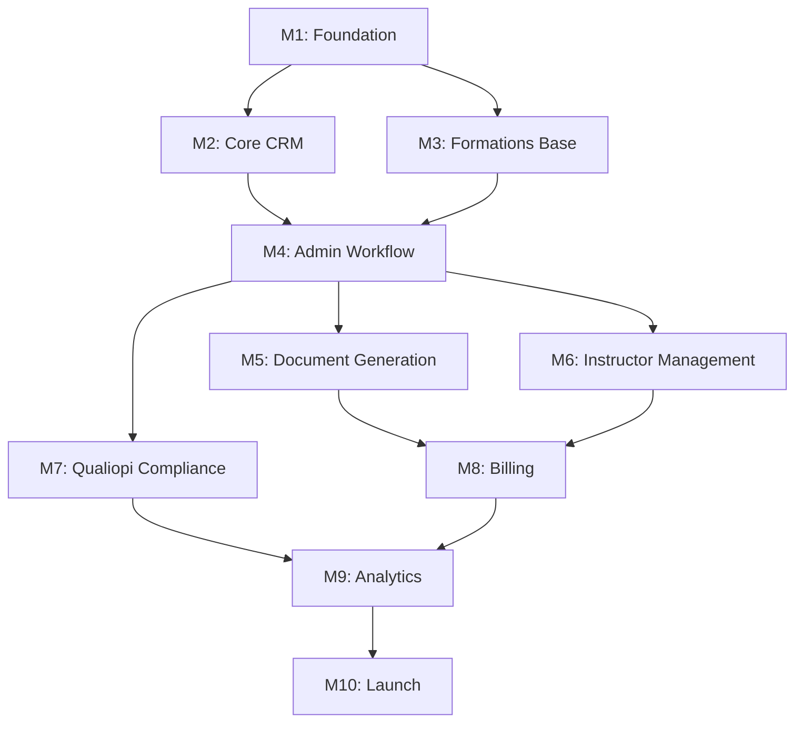

# Mentore Manager - Project Roadmap

This document outlines the development roadmap, milestones, and feature priorities for Mentore Manager.

## Current Status

**Version**: 0.3.0  
**Last Updated**: February 2026  
**Stage**: MVP Development

## Milestones Overview

| Milestone | Target | Status | Description |
|-----------|--------|--------|-------------|
| M1: Foundation | Week 1-2 | ✅ Complete | Auth, workspace, basic RBAC |
| M2: Core CRM | Week 3-4 | ✅ Complete | Deals, clients, contacts |
| M3: Formations Base | Week 5-6 | ✅ Complete | Formations CRUD, views, workflow schema |
| M4: Admin Workflow | Week 7-10 | 🔄 In Progress | 10-step workflow implementation |
| M5: Document Generation | Week 11-12 | ⏳ Planned | PDF generation for all documents |
| M6: Instructor Management | Week 13-14 | ⏳ Planned | Formateur matching and assignment |
| M7: Qualiopi Compliance | Week 15-16 | ⏳ Planned | Full Qualiopi criteria tracking |
| M8: Billing & Invoicing | Week 17-18 | ⏳ Planned | Financial management |
| M9: Analytics & Reporting | Week 19-20 | ⏳ Planned | KPIs and dashboards |
| M10: Polish & Launch | Week 21-22 | ⏳ Planned | Final QA, performance, launch |

---

## Milestone 1: Foundation ✅

**Goal**: Establish core infrastructure and authentication

### Completed Features
- [x] SvelteKit project setup with Svelte 5 Runes
- [x] Supabase integration with Drizzle ORM
- [x] Authentication (email/password, Google, GitHub)
- [x] Multi-tenant workspace system
- [x] Role-based access control (owner, admin, sales, secretary)
- [x] Workspace switcher with role display
- [x] Theme switcher (System/Light/Dark)
- [x] Basic navigation and layout

---

## Milestone 2: Core CRM ✅

**Goal**: Implement sales pipeline and client management

### Completed Features
- [x] Deals schema and database migration
- [x] Deals Kanban board with drag-and-drop
- [x] Deal stages (Lead → Gagné/Perdu)
- [x] Deal creation form
- [x] Deal detail page
- [x] Clients table with workspace relationship
- [x] Client type enum (Entreprise/Particulier)

---

## Milestone 3: Formations Base ✅

**Goal**: Core formations management functionality

### Completed Features
- [x] Formations schema with all enums
- [x] Formations list with multiple views (Kanban/Grid/List)
- [x] Sort and filter functionality
- [x] Formation creation form (3-step: Bases, Programme, Qualiopi)
- [x] Formation detail page
- [x] Status management (En attente/En cours/Terminée)
- [x] Workflow steps schema (`formation_workflow_steps` table)
- [x] Modules and séances tables

---

## Milestone 4: Admin Workflow 🔄

**Goal**: Implement the 10-step administrative workflow

### Step 1: Information Verification
- [ ] Information display section with edit capability
- [ ] Learner CSV import with validation
- [ ] Manual learner entry form (prénom, nom, fonction, groupe, email)
- [ ] Registered learners list display
- [ ] Oral audit contacts management
- [ ] Step validation logic

### Step 2: Convention & Program
- [ ] Convention generation trigger
- [ ] Convention modification interface
- [ ] Program entry form
- [ ] Document download functionality
- [ ] Step validation

### Step 3: Needs Analysis
- [ ] Digital needs analysis scheduling
- [ ] Instructor needs analysis scheduling
- [ ] Participants list management
- [ ] Step validation

### Step 4: Convocation
- [ ] Bulk convocation generation
- [ ] Scheduled email sending
- [ ] Learner list display
- [ ] Step validation

### Step 5: Mission Order
- [ ] Mission order generation
- [ ] Positioning test upload
- [ ] Document download
- [ ] Step validation

### Step 6: End of Mission Certificate
- [ ] Certificate generation for all learners
- [ ] Learner source tracking (listing vs attendance)
- [ ] Scheduled sending
- [ ] Step validation

### Step 7: Satisfaction Questionnaires
- [ ] Hot questionnaire (immediate) management
- [ ] Cold questionnaire (follow-up) management
- [ ] Learner import from attendance/admin listing
- [ ] Scheduling interface
- [ ] Step validation

### Step 8: Instructor Documents
- [ ] Document upload interface for each type:
  - Interview sheet
  - CV
  - Diploma
  - URSSAF certificate
  - NDA certificate
  - Signed provider contract
- [ ] Admin comments
- [ ] Step validation

### Step 9: Billing
- [ ] Financing mode selection
- [ ] Payment method selection
- [ ] Company invoice status tracking (sent/paid)
- [ ] Instructor invoice status tracking
- [ ] Step validation

### Step 10: Complete File
- [ ] Attendance data summary
- [ ] Instructor documents review
- [ ] Final validation and file closure

### Workflow Infrastructure
- [ ] Workflow step navigation sidebar
- [ ] Step completion indicators
- [ ] Progress tracking
- [ ] Step dependency enforcement (optional)

---

## Milestone 5: Document Generation ⏳

**Goal**: PDF generation for all administrative documents

### Features
- [ ] PDF generation service setup
- [ ] Convention de formation template
- [ ] Programme de formation template
- [ ] Convocation template
- [ ] Ordre de mission template
- [ ] Attestation de fin de formation template
- [ ] Feuille d'émargement template
- [ ] Document versioning
- [ ] Bulk document generation
- [ ] Document storage in Supabase Storage

---

## Milestone 6: Instructor Management ⏳

**Goal**: Full formateur matching and management

### Features
- [ ] Enhanced formateur profiles
- [ ] Skills and experience tracking
- [ ] Availability management
- [ ] Formation-formateur matching algorithm
- [ ] Instructor suggestion for formations
- [ ] Mission proposal workflow
- [ ] Instructor acceptance flow
- [ ] Rating and review system

---

## Milestone 7: Qualiopi Compliance ⏳

**Goal**: Complete Qualiopi criteria tracking

### Features
- [ ] All 32 Qualiopi criteria defined
- [ ] Criteria checklist per formation
- [ ] Evidence document upload
- [ ] Compliance score calculation
- [ ] Audit preparation reports
- [ ] Non-conformity tracking
- [ ] Corrective action management

---

## Milestone 8: Billing & Invoicing ⏳

**Goal**: Financial management functionality

### Features
- [ ] Invoice generation
- [ ] Payment tracking
- [ ] Multiple payment methods support
- [ ] Financing type handling (CPF, OPCO, etc.)
- [ ] Instructor payment management
- [ ] Financial reporting
- [ ] Export for accounting

---

## Milestone 9: Analytics & Reporting ⏳

**Goal**: Business intelligence and KPIs

### Features
- [ ] Dashboard with key metrics
- [ ] Formation completion rates
- [ ] Revenue tracking
- [ ] Instructor performance metrics
- [ ] Client satisfaction scores
- [ ] Qualiopi compliance overview
- [ ] Custom report builder
- [ ] Export functionality

---

## Milestone 10: Polish & Launch ⏳

**Goal**: Production readiness

### Features
- [ ] Performance optimization
- [ ] Accessibility audit (WCAG 2.1)
- [ ] Security audit
- [ ] Error handling improvements
- [ ] Loading states and skeletons
- [ ] Mobile responsiveness polish
- [ ] User onboarding flow
- [ ] Help documentation
- [ ] Production deployment
- [ ] Monitoring and alerting setup

---

## Schema Updates Required

Based on Bubble analysis, the following schema additions are needed:

### Formations Table
- `subject` (matière enseignée) - Text
- `secondarySkills` (compétences secondaires) - Text array
- `desiredExperienceYears` - Range/Text
- `desiredLanguages` - Text array
- `endDate` (date de fin) - Date
- `schedule` (horaires) - Text
- `formationMode` (mode de formation) - Enum
- `maxBudget` - Numeric

### Clients Table
- `phone` (téléphone de l'entreprise) - Text
- `representativeName` (nom du représentant) - Text
- `address` - Text
- `city`, `postalCode`, `country` - Text

### Apprenants Table
- `fonction` (function/role) - Text
- `groupe` (group) - Text

### New Tables Needed
- `formation_documents` - Track generated documents
- `scheduled_emails` - Email scheduling queue
- `questionnaire_responses` - Satisfaction survey data
- `instructor_documents` - Formateur document uploads
- `invoices` - Billing records

---

## Priority Matrix

| Priority | Features |
|----------|----------|
| P0 (Critical) | Admin workflow Steps 1-4, Learner management, Document generation |
| P1 (High) | Admin workflow Steps 5-10, Instructor matching |
| P2 (Medium) | Qualiopi compliance, Billing, Questionnaires |
| P3 (Low) | Analytics, Reporting, Polish |

---

## Dependencies

---

## How to Use This Document

### For Developers
1. Check current milestone status
2. Pick tasks from the current active milestone
3. Reference related Bubble analysis docs for feature details
4. Update task status as you complete work

### For Code Agents
1. Read this document to understand project scope
2. Check GitHub Issues for assigned tasks
3. Follow the milestone order for dependencies
4. Update issue status when completing work

### For Product/Management
1. Track milestone completion for timeline
2. Use priority matrix for scope decisions
3. Reference for stakeholder updates
