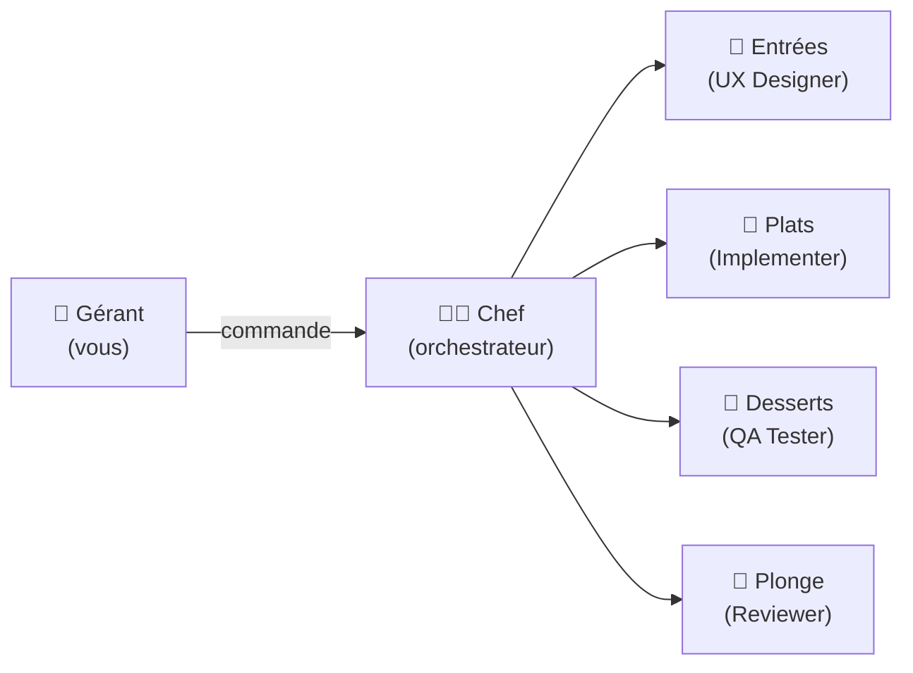
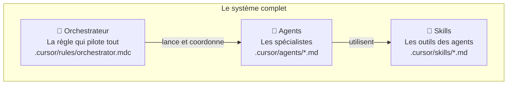
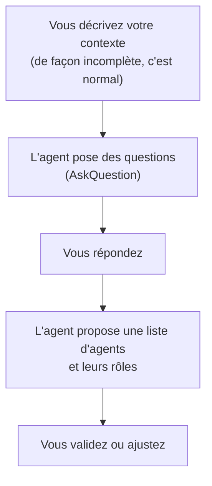
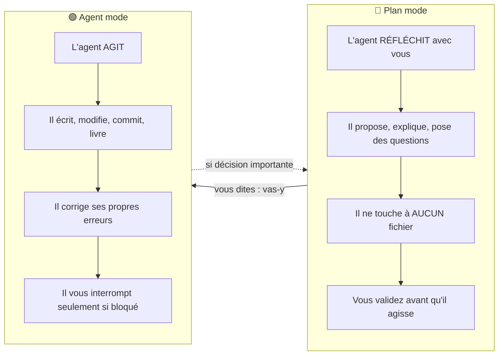
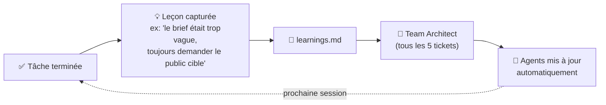
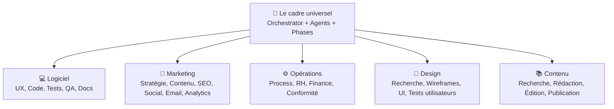
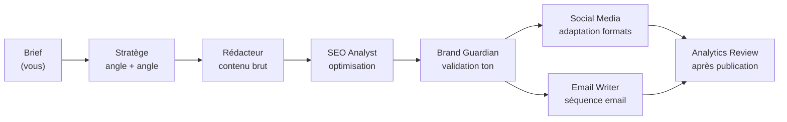
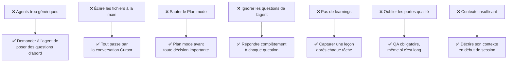
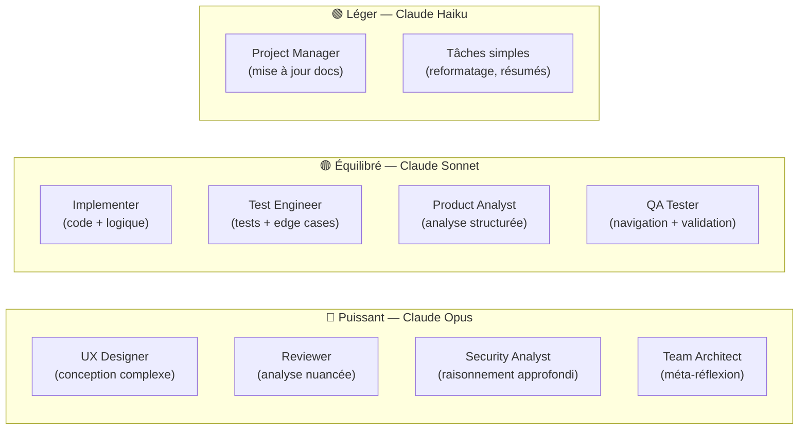

# Guide pratique : Construire une équipe IA avec Cursor

> Ce guide vous explique comment reproduire un système d'équipe IA orchestrée — et l'adapter à n'importe quel domaine : logiciel, marketing, ops, design.
> Aucune ligne de code à écrire. Tout se fait en conversation.

---

## 1. C'est quoi ?

Imaginez une **cuisine de restaurant**.

- Vous êtes le **gérant** : vous commandez les plats, vous validez la qualité.
- Le **chef cuisinier** (l'orchestrateur) reçoit votre commande et coordonne tout.
- Chaque **cuisinier spécialiste** (les agents) fait sa partie : entrées, plats, desserts, plonge.

Vous ne cuisinez rien. Vous parlez, l'équipe exécute.

Dans Cursor, ce "restaurant" s'appelle une **équipe d'agents orchestrés**.

---

## 2. Les 3 composantes

| Composante        | C'est quoi                                               | Exemple                                        |
| ----------------- | -------------------------------------------------------- | ---------------------------------------------- |
| **Orchestrateur** | La règle principale. Décide qui fait quoi et quand.      | "Phase 1 : lancer UX Designer, puis Architect" |
| **Agents**        | Des spécialistes avec un rôle précis et un prompt dédié. | UX Designer, Reviewer, QA Tester...            |
| **Skills**        | Des guides que les agents lisent avant d'agir.           | "Comment écrire une migration de BDD"          |

> **Important** : vous ne rédigez aucun de ces fichiers à la main. Cursor les génère pour vous, en conversation.

---

## 3. Prérequis

- **Cursor IDE** — téléchargeable sur [cursor.com](https://cursor.com). Utiliser le mode Agent (pas Composer simple).
- **Un compte Claude** — via Cursor Max ou une clé API Anthropic. Pas besoin d'être développeur.
- **Un dossier projet** avec un dépôt git (même vide, même non-technique).
- **Mindset** : vous parlez à Cursor comme à un consultant. Vous décrivez, il construit.

**Ce qu'il ne faut PAS faire** :

- Ouvrir un fichier `.md` et taper dedans manuellement.
- Copier-coller des templates depuis internet.
- Essayer de "coder" quoi que ce soit.

---

## 4. La recette : créer votre équipe en 5 étapes

> Chaque étape se passe **en conversation dans Cursor**. Aucune ouverture de fichier requise.

---

### Étape 1 — Définir votre domaine et vos rôles

Ouvrez une conversation Cursor en **Plan mode** et dites :

> *"Je veux créer une équipe d'agents IA pour [votre domaine]. Pose-moi des questions pour bien comprendre mon contexte avant de proposer quoi que ce soit."*

L'agent va vous poser des questions :

- Quel est votre objectif principal ?
- Quelles tâches répétitives voulez-vous déléguer ?
- Qui est l'utilisateur final de ce que l'équipe produit ?
- Quelles contraintes (budget, délais, qualité) ?

**Répondez en détail.** Plus vous êtes précis, plus les agents générés seront pertinents.

---

### Étape 2 — Générer les agents

Une fois les rôles validés, dites :

> *"Génère les fichiers agents dans `.cursor/agents/`. Un fichier par spécialiste."*

Cursor crée automatiquement les fichiers. Vous ne tapez rien. Si un agent ne vous convient pas, dites-le en conversation : *"Le rôle du Content Writer est trop générique, affine-le pour du contenu B2B SaaS."*

---

### Étape 3 — Générer l'orchestrateur

Dites :

> *"Maintenant, génère la règle d'orchestration dans `.cursor/rules/`. Elle doit coordonner ces agents selon les phases qu'on a définies."*

L'orchestrateur est une règle Cursor (fichier `.mdc`) qui s'applique automatiquement à chaque conversation. Il contient :

- Les **phrases de déclenchement** (ex: "next", "let's go", "travaille sur T-5")
- Les **phases** dans l'ordre
- Les **règles de saut** (si le plan existe déjà, on saute la conception)
- Les **portes qualité** (ex: QA obligatoire avant livraison)

---

### Étape 4 — Définir vos phases en Plan mode

Passez en **Plan mode** et dites :

> *"Propose-moi un cycle de vie des tâches adapté à mon équipe. Combien de phases ? Dans quel ordre ? Quelles portes qualité ?"*

L'agent va proposer un plan. Vous lisez. Vous pouvez dire :

- *"Retire la phase de tests, on n'en a pas besoin."*
- *"Ajoute une phase de validation humaine avant publication."*
- *"La phase de revue doit se faire en parallèle avec l'audit SEO."*

Une fois satisfait, dites **"c'est bon, applique ça"** — l'agent passe en mode Exécution et met à jour l'orchestrateur.

---

### Étape 5 — Tester et affiner

Créez un premier ticket (une tâche simple) et dites :

> *"Let's go."*

L'orchestrateur prend le relais. Observez comment l'équipe travaille. Après la première tâche complète, notez ce qui ne s'est pas passé comme prévu et dites-le en conversation : *"L'agent X a été trop verbeux, simplifie son output."*

---

## 5. Plan mode vs Agent mode : quand utiliser quoi

C'est la distinction la plus importante à comprendre.

**Règle d'or** : utilisez Plan mode pour tout ce qui implique une **décision**. Utilisez Agent mode pour tout ce qui implique une **action**.

| Situation                        | Mode à utiliser |
| -------------------------------- | --------------- |
| Concevoir une nouvelle feature   | 🔵 Plan mode    |
| Choisir entre deux architectures | 🔵 Plan mode    |
| Créer ou modifier un agent       | 🔵 Plan mode    |
| Coder, tester, livrer            | 🟢 Agent mode   |
| Corriger un bug connu            | 🟢 Agent mode   |
| Documenter                       | 🟢 Agent mode   |

### Comment déclencher les questions de l'agent

Les agents peuvent vous poser des questions interactives pour affiner leur travail. Pour activer ce comportement :

1. **Décrivez votre besoin de façon intentionnellement incomplète** : *"Je veux une page de campagne email."* → l'agent va demander pour quel public, quel ton, quelle offre, etc.
2. **Ajoutez explicitement** : *"Pose-moi des questions si tu as besoin d'éclaircissements avant de commencer."*
3. **Répondez complètement** à chaque question. Ne résumez pas, ne sautez pas de questions.

> Plus vous répondez précisément aux questions, plus le résultat sera adapté à votre contexte réel.

---

## 6. L'auto-amélioration : une équipe qui apprend

Après chaque tâche terminée, l'orchestrateur capture une **leçon** (une phrase décrivant ce qui a bien ou mal fonctionné). Ces leçons s'accumulent dans un fichier `learnings.md`.

Tous les 5 tickets, le **Team Architect** — lui-même un agent IA — relit les leçons et améliore les définitions des autres agents. L'équipe devient plus performante au fil du temps, sans intervention humaine.

**Vous pouvez aussi déclencher manuellement** : *"Lance le Team Architect pour améliorer l'équipe."*

---

## 7. Adapter à votre contexte

Ce système n'est pas réservé au développement logiciel. Voici comment le transposer.

### Exemple concret : une équipe marketing ambitieuse avec petit budget

**Contexte** : une startup de 3 personnes qui veut produire du contenu premium, lancer des campagnes, et analyser ses résultats — sans recruter.

**L'équipe IA** :

| Agent                    | Rôle                                                               |
| ------------------------ | ------------------------------------------------------------------ |
| **Stratège**             | Analyse le marché, propose les angles de campagne                  |
| **Rédacteur**            | Écrit les articles, emails, accroches social media                 |
| **SEO Analyst**          | Audite le contenu pour le référencement, propose des mots-clés     |
| **Social Media Manager** | Adapte chaque contenu au format du réseau (LinkedIn, X, Instagram) |
| **Email Copywriter**     | Rédige les séquences d'emails avec A/B tests suggérés              |
| **Analytics Reviewer**   | Analyse les métriques, identifie ce qui performe                   |
| **Brand Guardian**       | Vérifie que tout est cohérent avec la charte et le ton de marque   |

**Les phases** :

**Ce que ça remplace** : un content manager (35k€/an), un SEO freelance (500€/mois), un community manager (30k€/an).
**Ce que ça coûte** : voir section suivante.

---

## 8. Ce que ça coûte vraiment

### Temps de mise en place

| Étape                                   | Temps estimé                      |
| --------------------------------------- | --------------------------------- |
| Définir les rôles et générer les agents | 1–2h                              |
| Générer et affiner l'orchestrateur      | 1–2h                              |
| Premier test et corrections             | 1–2h                              |
| **Total**                               | **3–6h** pour une équipe complète |

### Coût en tokens (par session de travail)

Les agents utilisent des modèles IA plus ou moins puissants selon la phase :

| Phase                                      | Modèle utilisé         | Coût relatif |
| ------------------------------------------ | ---------------------- | ------------ |
| Phases de réflexion (Design, Architecture) | Claude Opus (puissant) | $$$          |
| Phases d'exécution (Code, Tests, Docs)     | Claude Sonnet (rapide) | $$           |
| Documentation, tickets                     | Claude Haiku (léger)   | $            |

> Une session complète (1 feature de bout en bout) coûte approximativement **$1–5** en tokens selon la complexité. Comparez à une heure de consultant : $100–300.

### Comparaison

|                     | Équipe humaine   | Équipe IA orchestrée    |
| ------------------- | ---------------- | ----------------------- |
| Coût mensuel        | 10 000–50 000 €  | 50–200 €                |
| Disponibilité       | Heures de bureau | 24h/24, 7j/7            |
| Vitesse             | Jours à semaines | Heures                  |
| Cohérence           | Variable         | Haute (règles strictes) |
| Créativité          | Haute            | Moyenne–haute           |
| Jugement contextuel | Très haut        | Moyen                   |

---

## 9. Avantages et limites

**Avantages**

- Une personne peut faire le travail de 5–10 personnes
- Disponible immédiatement, sans onboarding
- Cohérence garantie par les règles et les agents
- S'améliore automatiquement avec les leçons
- Coût marginal presque nul à l'échelle
- Adaptable à n'importe quel domaine

**Limites**

- Nécessite un setup initial sérieux (3–6h)
- Les agents n'ont pas de mémoire entre les sessions sans fichiers de contexte
- Mauvais à la créativité "hors-cadre" et aux décisions très ambiguës
- Nécessite une supervision humaine pour les décisions stratégiques importantes
- La qualité dépend de la qualité des prompts et des agents écrits
- Cursor et les APIs ont un coût mensuel (voir section précédente)

---

## 10. Pièges à éviter

---

## 11. Quel modèle IA pour quelle phase

Tous les agents ne nécessitent pas le même niveau de puissance. Utiliser le bon modèle au bon moment réduit les coûts sans sacrifier la qualité.

> **Principe** : utilisez le modèle le plus léger qui peut faire le travail correctement. Gardez les modèles puissants pour les phases de réflexion et d'analyse critique.

---

## Pour aller plus loin

- Pour une vue visuelle de cette équipe spécifique : voir `[team-orchestration-visuelle.md](./team-orchestration-visuelle.md)`
- Pour démarrer : ouvrez Cursor, passez en Plan mode, et tapez : *"Je veux construire une équipe IA pour [votre domaine]. Pose-moi des questions pour comprendre mon contexte."*

