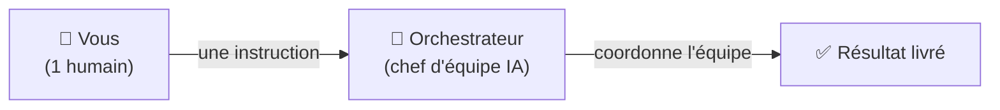
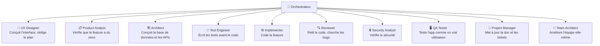
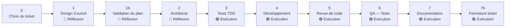
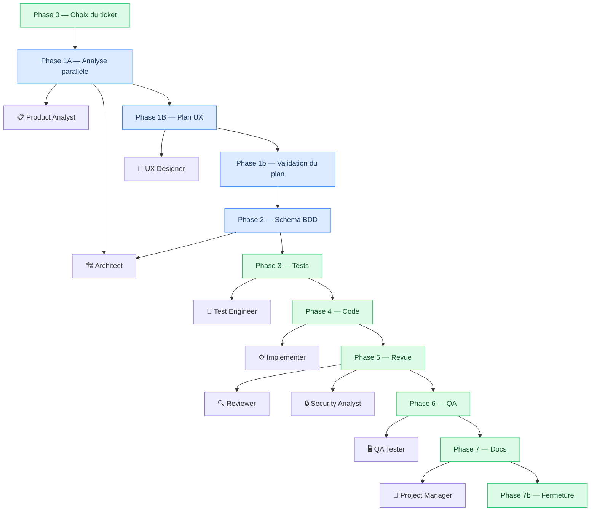
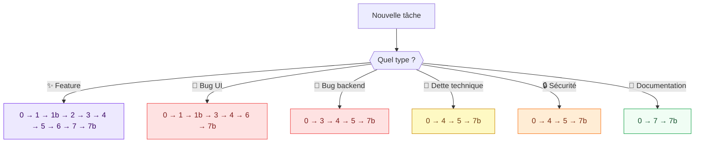
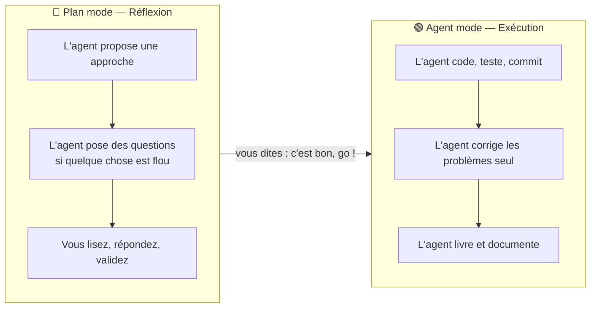
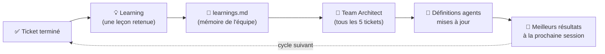
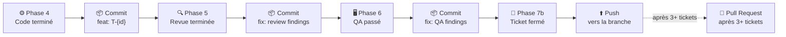

# L'Équipe IA en Images

> Un humain. Un chef d'orchestre. Une équipe de spécialistes IA. Ensemble, ils font le travail d'une équipe entière.

---

## 1. L'idée en une image

Un seul message de votre part déclenche l'ensemble du processus. L'orchestrateur distribue le travail, surveille la qualité, et livre.

---

## 2. L'équipe complète

Chaque spécialiste a un rôle précis. L'orchestrateur décide qui travaille, quand, et dans quel ordre.

---

## 3. Le cycle de vie d'une tâche

Chaque tâche (appelée "ticket") suit un chemin balisé de phases. Certaines phases sont en mode **Réflexion** (l'humain peut valider avant d'aller plus loin), d'autres en mode **Exécution** (l'équipe agit de façon autonome).

> 🔵 **Réflexion** = l'agent propose, vous pouvez intervenir.
> 🟢 **Exécution** = l'équipe avance seule, sans vous interrompre.

---

## 4. Qui fait quoi, et quand

**Phase 1A** : Product Analyst + Architect travaillent **en parallèle** (simultanément).
**Phase 5** : Reviewer + Security Analyst travaillent **en parallèle**.
Toutes les autres phases sont **séquentielles** (l'une après l'autre).

---

## 5. La recette change selon le type de tâche

Toutes les tâches ne passent pas par toutes les phases. L'orchestrateur choisit le chemin le plus court qui garantit la qualité.

> Certaines phases peuvent aussi être **sautées automatiquement** si le travail a déjà été fait (plan existant, schéma déjà approuvé, etc.).

---

## 6. Plan mode vs Agent mode

L'orchestrateur sait quand vous impliquer et quand avancer seul.

| Phase                                  | Mode recommandé |
| -------------------------------------- | --------------- |
| Phase 1 — Design Council               | 🔵 Plan mode    |
| Phase 1b — Validation du plan          | 🔵 Plan mode    |
| Phase 2 — Architecture                 | 🔵 Plan mode    |
| Phase 3 à 7b — Build, Review, QA, Docs | 🟢 Agent mode   |

> **Astuce** : pour déclencher des questions de l'agent, ajoutez à votre message : *"pose-moi des questions si tu as besoin d'éclaircissements avant de commencer."*

---

## 7. Le moteur d'auto-amélioration

L'équipe apprend de chaque tâche terminée. Avec le temps, elle devient plus rapide et plus précise.

Le **Team Architect** est lui-même un agent IA. Il lit les leçons accumulées et améliore les définitions des autres agents — sans intervention humaine.

---

## 8. Git et livraison automatiques

L'équipe gère aussi le versioning du code, de façon autonome.

Aucune action manuelle requise. L'orchestrateur commit, push, et crée les Pull Requests selon des règles prédéfinies.