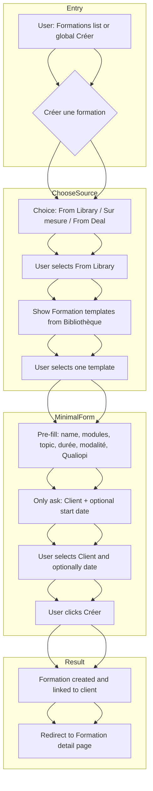
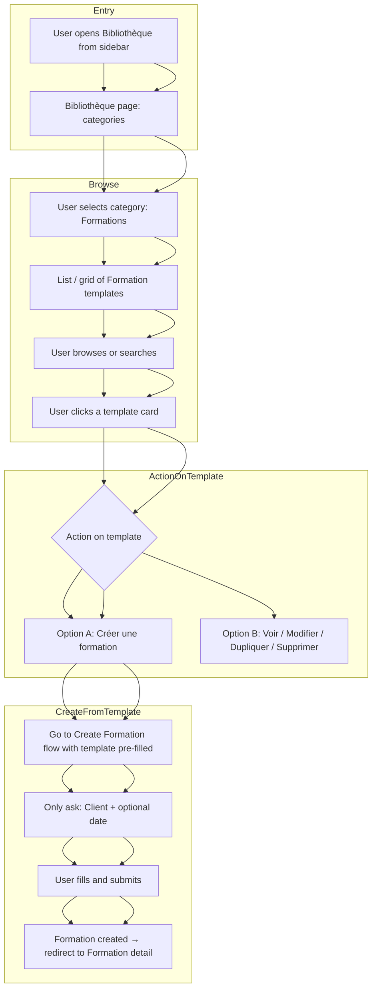
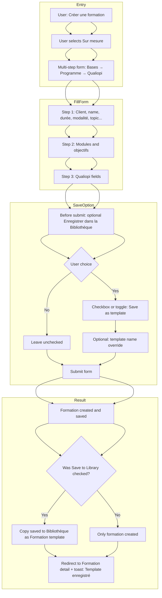
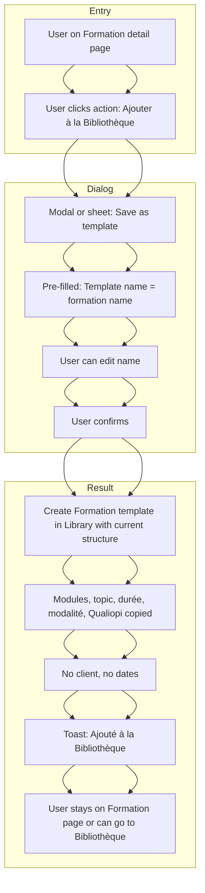
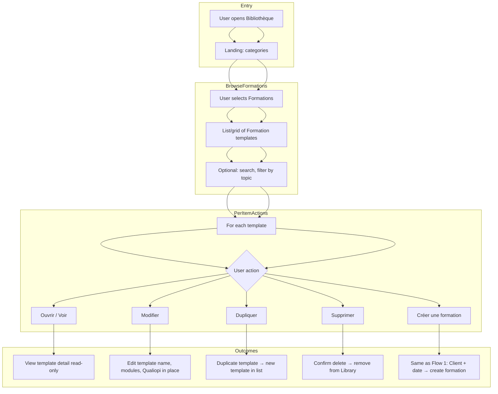
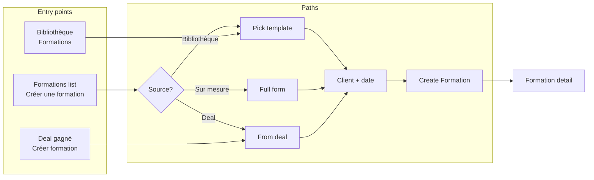

# Bibliothèque × Formation — User Flow Diagrams

This document describes user flows for the **Library (Bibliothèque)** with a **Formation** category: how users create formations from templates, save formations to the Library, and browse the Library. Use these flows to translate into UI (screens, buttons, steps).

---

## Concepts

- **Bibliothèque (Library)**: A place to browse and manage reusable items: **Document templates**, **Formations** (formation templates), and later other types.
- **Formation (template) in Library**: A saved blueprint (name, modules, topic, durée, modalité, Qualiopi fields). No client, no dates. Used to create new **Formations** (the real administrative dossier) in one click + client choice.
- **Formation (instance)**: The actual formation linked to a client, with workflow steps, formateurs, séances — what admins work on daily.

---

## Flow 1 — Create a new Formation from the Library (start from “Créer une formation”)

User wants to create a formation and **starts from the creation entry point** (e.g. Formations list → “Créer une formation”, or a single “Create” CTA). They choose “From Library” and pick a template.

**UI implications:**
- On “Créer une formation”, first screen = **source choice**: “À partir de la Bibliothèque” | “Sur mesure” | “À partir d’un deal gagné” (if applicable).
- If “From Library”: show list/cards of Formation templates (from Bibliothèque). Filter/search by name or topic.
- After selecting a template: single step or small form with **Client** (required) and **Date de début** (optional). Then one “Créer la formation” button.

---

## Flow 2 — Create a new Formation from the Library (start from Bibliothèque)

User is on the **Bibliothèque** page, browses the **Formations** category, and chooses “Use this template to create a formation”.

**UI implications:**
- Bibliothèque: top-level **categories** (e.g. Documents, Formations). Click “Formations” → list of saved Formation templates.
- Each template card: name, topic, duration, module count. Actions: **“Créer une formation”** (main CTA), and optionally “Modifier”, “Dupliquer”, “Supprimer”.
- “Créer une formation” → same as Flow 1 tail: pre-filled formation, only Client (+ date) step, then create.

---

## Flow 3 — Save a new Formation to the Library while creating (Sur mesure)

User creates a formation **from scratch** (Sur mesure) and optionally **saves a copy as a template** to the Library so they can reuse it later.

**UI implications:**
- On the last step (Qualiopi) of “Sur mesure”, add an optional **“Enregistrer aussi dans la Bibliothèque”** (checkbox or toggle). If checked, optionally show a field “Nom du modèle” (default = formation name).
- On submit: create the formation as today; if option checked, also create a Library Formation template (same name, modules, topic, Qualiopi — no client, no dates).
- Toast or message: “Formation créée. Modèle enregistré dans la Bibliothèque.”

---

## Flow 4 — Save an existing Formation to the Library

User is on a **Formation detail** page (existing formation) and wants to save this formation’s structure as a **reusable template** in the Library.

**UI implications:**
- Formation detail: header or actions menu: **“Ajouter à la Bibliothèque”** (or “Enregistrer comme modèle”).
- Opens a small modal/sheet: “Nom du modèle” (default = formation name), button “Enregistrer”. On confirm, create Library item (Formation template) from current formation (copy structure only). Toast: “Modèle ajouté à la Bibliothèque.”

---

## Flow 5 — Browse and manage Formation templates in the Library

User opens the **Bibliothèque** to view, search, edit, or delete Formation templates (no “create formation” in this flow).

**UI implications:**
- Bibliothèque → Formations: list or grid. Each item: **“Créer une formation”** (primary), “Modifier”, “Dupliquer”, “Supprimer” (with confirmation).
- “Modifier”: inline or separate page to edit the template (name, modules, topic, Qualiopi). No client/dates.
- “Créer une formation” from here = Flow 1 tail (client + date → create).

---

## Flow 6 — High-level overview: all entry points to “Formation created”

Single diagram showing how a **Formation (instance)** can be created from different entry points and how the Library is involved.

---

## Summary table for UI

| Flow | Entry | Main screens/steps | Key UI elements |
|------|--------|--------------------|------------------|
| **1** | Formations → Créer | Source choice → Pick template → Client + date → Create | Source selector; template list; client picker |
| **2** | Bibliothèque → Formations | Category → Template list → “Créer une formation” on card | Category tabs; template cards; primary CTA |
| **3** | Formations → Créer (Sur mesure) | Steps 1–3 + “Save to Library” option → Submit | Checkbox/toggle on last step; optional template name |
| **4** | Formation detail | “Ajouter à la Bibliothèque” → Modal (name) → Confirm | Header/menu action; modal |
| **5** | Bibliothèque → Formations | Browse/search → Per-template: Voir, Modifier, Dupliquer, Supprimer, Créer formation | List/grid; action menu or buttons |

Use these flows to design screens, copy, and navigation; the Formation category in the Bibliothèque stays consistent with “reusable Formation templates” and a single mental model (Formation instance vs template in Library).
